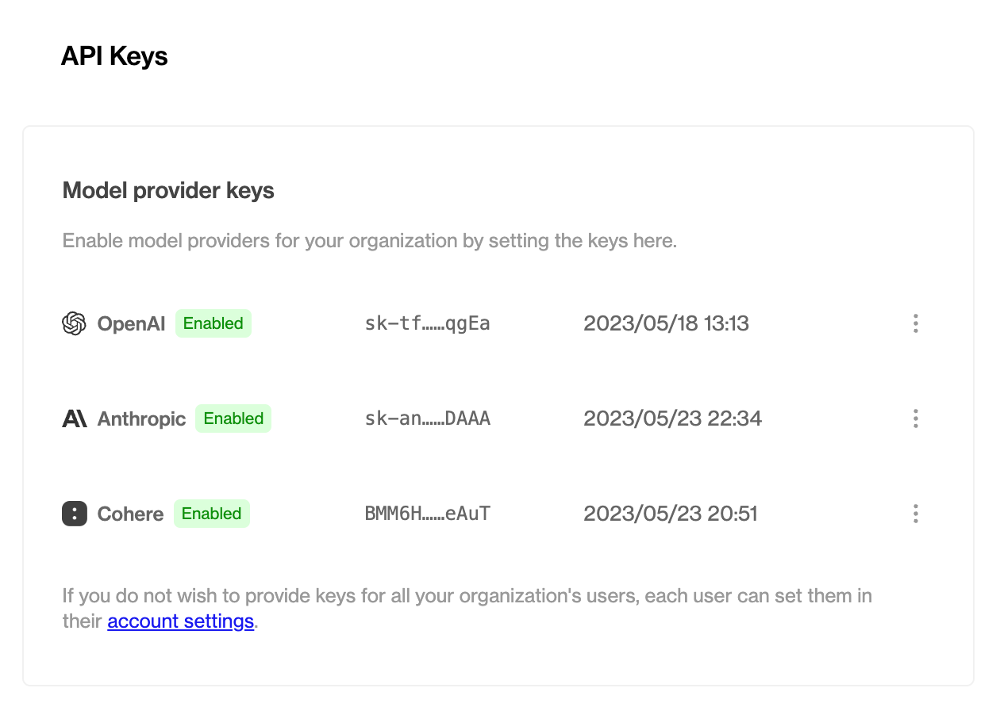
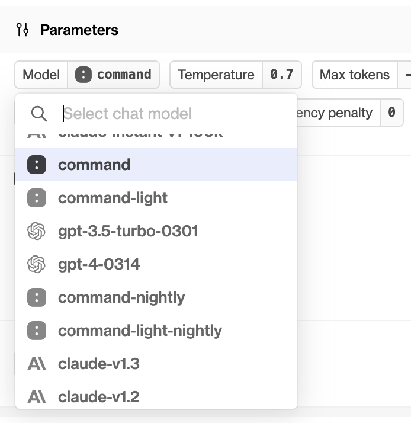

## Cohere

We've just added support for Cohere to Humanloop!


This update adds Cohere models to the playground and your projects - just add your Cohere API key in your [organization's settings](https://app.humanloop.com/account/api-keys). As with other providers, each user in your organization can also set a personal override API key, stored locally in the browser, for use in Cohere requests from the Playground.

### Enabling Cohere for your organization



### Working with Cohere models

Once you've successfully enabled Cohere for your organization, you'll be able to access it through the [playground](https://app.humanloop.com/playground) and in your projects, in exactly the same way as your existing OpenAI and/or Anthropic models.



### REST API and Python / TypeScript support

As with other model providers, once you've set up a Cohere-backed model config, you can call it with the Humanloop [REST API or our SDKs](/docs/reference/sdks).

```typescript
import { Humanloop } from "humanloop";

const humanloop = new Humanloop({
  apiKey: "API_KEY",
});

const chatResponse = await humanloop.chat({
  project: "project_example",
  messages: [
    {
      role: "user",
      content: "Write me a song",
    },
  ],
  provider_api_keys: {
    cohere: COHERE_API_KEY,
  },
  model_config: {
    model: "command",
    temperature: 1,
  },
});

console.log(chatResponse);
```

If you don't provide a Cohere API key under the `provider_api_keys` field, the request will fall back on the stored organization level key you configured above.
