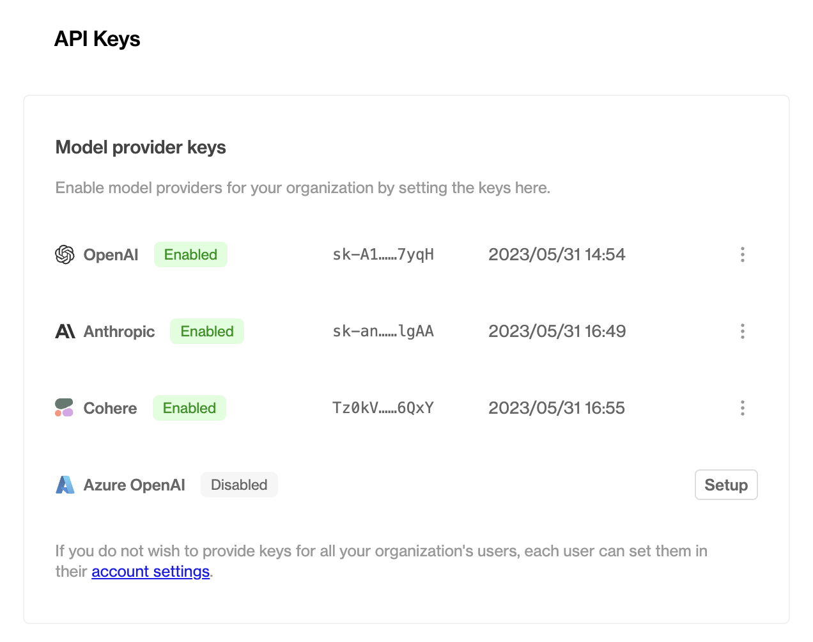
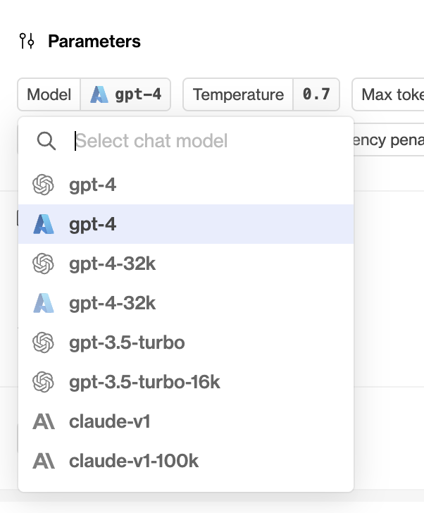

## Improved Python SDK streaming response

We've improved our Python SDK's streaming response to contain the datapoint ID. Using the ID, you can now provide feedback to datapoints created through streaming.

The `humanloop.chat_stream()` and `humanloop.complete_stream()` methods now yield a dictionary with `output` and `id`.

```python
{'output': '...', 'id': 'data_...'}
```

Install the updated SDK with

```shell
pip install --upgrade humanloop
```

### Example snippet

```
import asyncio
from humanloop import Humanloop

humanloop = Humanloop(
    api_key="YOUR_API_KEY",
    openai_api_key="YOUR_OPENAI_API_KEY",
)

async def main():
    response = await humanloop.chat_stream(
        project="sdk-example",
        messages=[
            {
                "role": "user",
                "content": "Explain asynchronous programming.",
            }
        ],
        model_config={
            "model": "gpt-3.5-turbo",
            "max_tokens": -1,
            "temperature": 0.7,
            "chat_template": [
                {
                    "role": "system",
                    "content": "You are a helpful assistant who replies in the style of {{persona}}.",
                },
            ],
        },
        inputs={
            "persona": "the pirate Blackbeard",
        },
    )
    async for token in response.content:
        print(token)  # E.g. {'output': 'Ah', 'id': 'data_oun7034jMNpb0uBnb9uYx'}

asyncio.run(main())
```

## OpenAI Azure support

We've just added support for Azure deployments of OpenAI models to Humanloop!

This update adds the ability to target Microsoft Azure deployments of OpenAI models to the playground and your projects. To set this up, visit your [organization's settings](https://app.humanloop.com/account/api-keys). 

### Enabling Azure OpenAI for your organization

As a prerequisite, you will need to already be setup with Azure OpenAI Service. See the [Azure OpenAI docs](https://learn.microsoft.com/en-us/azure/cognitive-services/openai/how-to/create-resource?pivots=web-portal) for more details. At the time of writing, access is granted by application only.



Click the Setup button and provide your Azure OpenAI endpoint and API key.

Your endpoint can be found in the Keys & Endpoint section when examining your resource from the Azure portal. Alternatively, you can find the value in Azure OpenAI Studio > Playground > Code View. An example endpoint is: docs-test-001.openai.azure.com.

Your API keys can also be found in the Keys & Endpoint section when examining your resource from the Azure portal. You can use either KEY1 or KEY2.

### Working with Azure OpenAI models

Once you've successfully enabled Azure OpenAI for your organization, you'll be able to access it through the [playground](https://app.humanloop.com/playground) and in your projects in exactly the same way as your existing OpenAI and/or Anthropic models.




### REST API and Python / Typescript support

As with other model providers, once you've set up an Azure OpenAI-backed model config, you can call it with the Humanloop [REST API or our SDKs](/reference/sdks). 

```typescript
import { Humanloop } from "humanloop"

const humanloop = new Humanloop({
    apiKey: 'API_KEY',
})


const chatResponse = await humanloop.chat({
        "project": "project_example",
        "messages": [
            {
                "role": "user",
                "content": "Write me a song",
            }
        ],
        "provider_api_keys": {
          "openai_azure": OPENAI_AZURE_API_KEY,
          "openai_azure_endpoint": OPENAI_AZURE_ENDPOINT,
        },
        "model_config": {
            "model": "my-azure-deployed-gpt-4",
            "temperature": 1,
        },
    })

console.log(chatResponse)
```

In the `model_config.model` field, provide the name of the model that you deployed from the Azure portal (see note below for important naming conventions when setting up your deployment in the Azure portal).

The request will use the stored organization level key and endpoint you configured above, unless you override this on a per-request basis by passing both the endpoint and API key in the `provider_api_keys` field, as shown in the example above.

### Note: Naming Model Deployments

When you deploy a model through the Azure portal, you'll have the ability to provide your deployment with a unique name. For instance, if you choose to deploy an instance of `gpt-35-turbo` in your OpenAI Service, you may choose to give this an arbitrary name like `my-orgs-llm-model`. 

In order to use all Humanloop features with your Azure model deployment, you must ensure that your deployments are named either with an unmodified base model name like `gpt-35-turbo`, or the base model name with a custom prefix like `my-org-gpt-35-turbo`.  If your model deployments use arbitrary names which do not prefix a base model name, you may find that certain features such as setting `max_tokens=-1` in your model configs fail to work as expected.