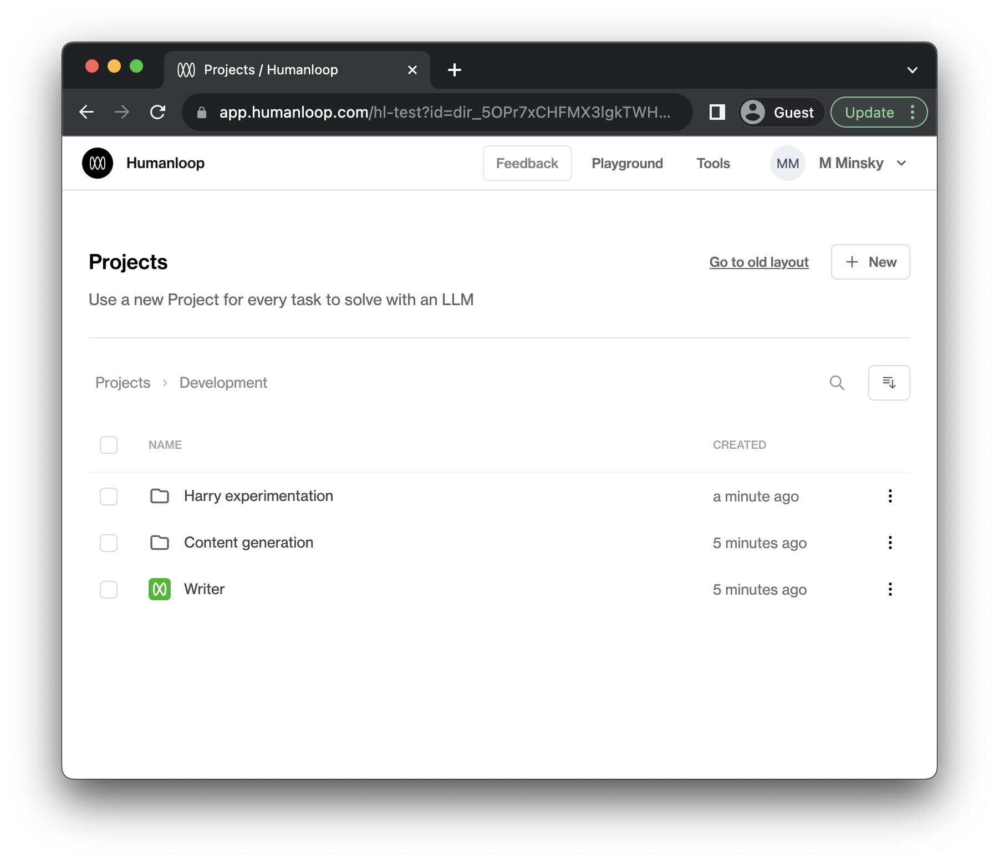
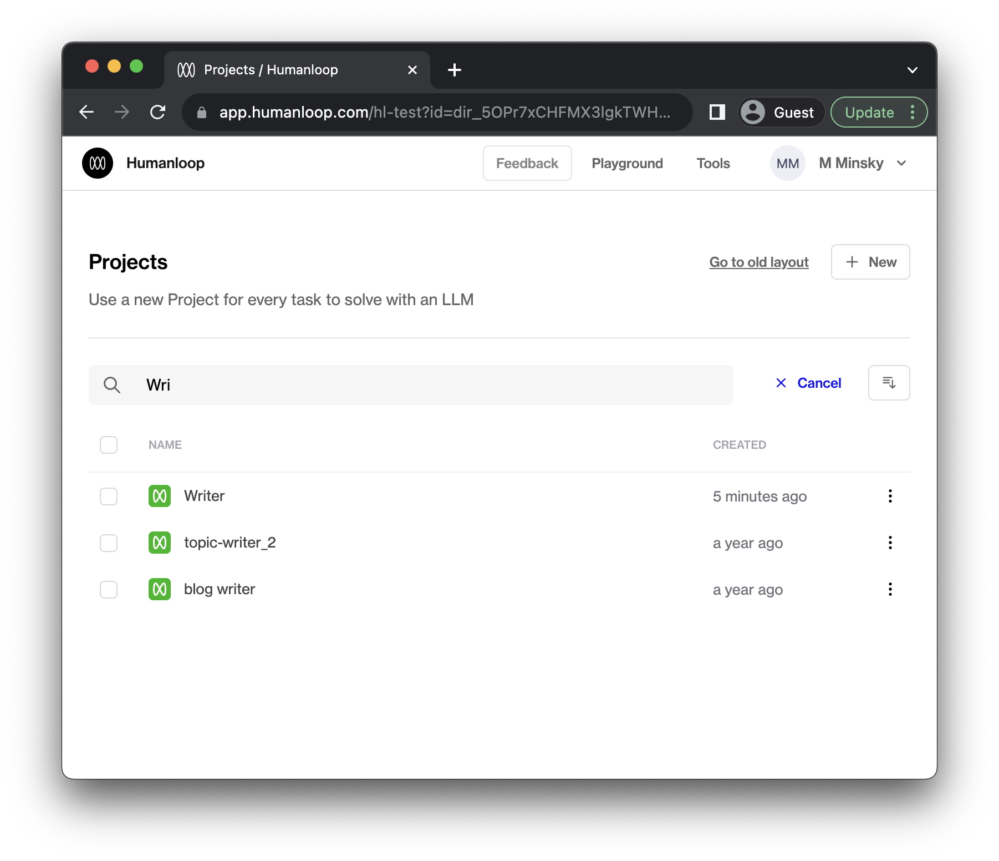
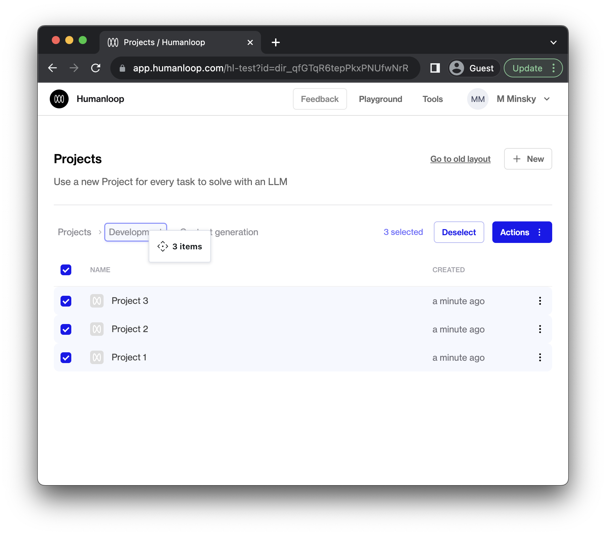
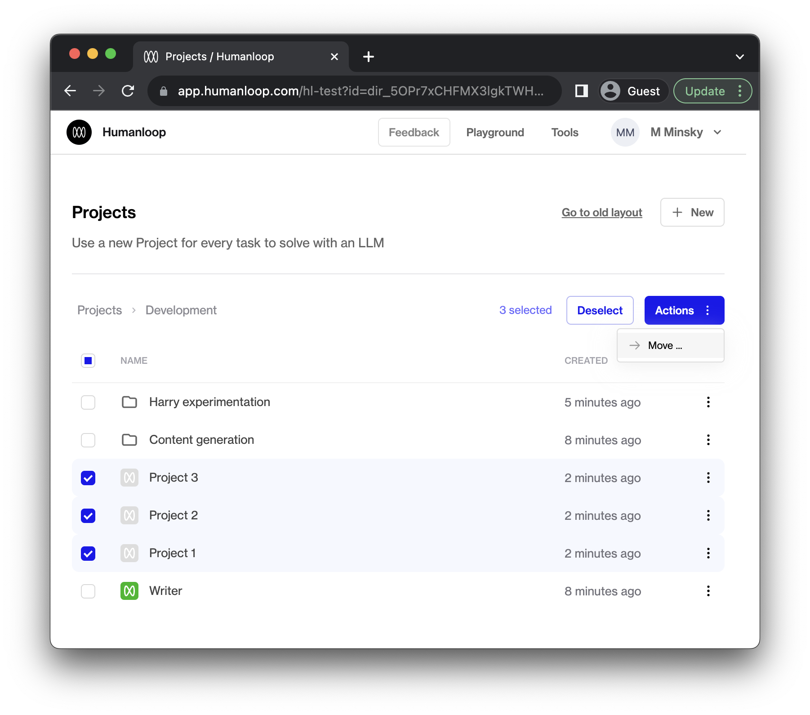
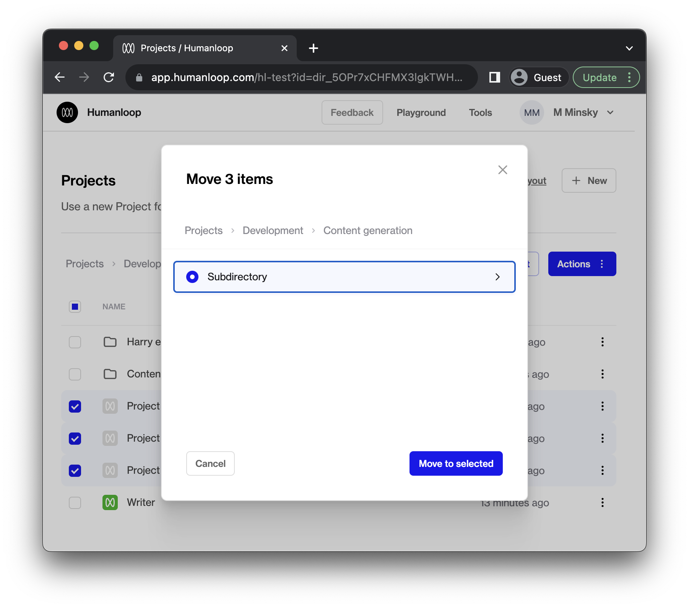
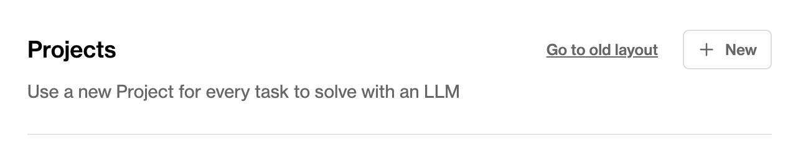

## Project folders

You can now organize your projects into folders! 

Logging in to Humanloop will bring you to the new page where you can start arranging your projects.

Navigate into folders and open projects by clicking on the row. To go back to a parent folder, click on the displayed breadcrumbs (e.g. "Projects" or "Development" in the above screenshot).

***

### Search

Searching will give you a list of directories and projects with a matching name.

### Moving multiple projects

You can move a group of projects and directories by selecting them and moving them together.

1. Select the projects you want to move.  
   Tip: Put your cursor on a project row and press [x] to select the row.
2. To move the selected projects into a folder, drag and drop them into the desired folder.

To move projects out of a folder and into a parent folder, you can drag and drop them onto the parent folder breadcrumbs:

To move projects into deeply nested folders, it might be easier to select your target directory manually. To do so, select the projects you wish to move and then click the blue **Actions** button and then click **Move ...** to bring up a dialog allowing you to move the selected projects.

***

If you prefer the old view, we've kept it around for now. Let us know what you're missing from the new view so we can improve it.

