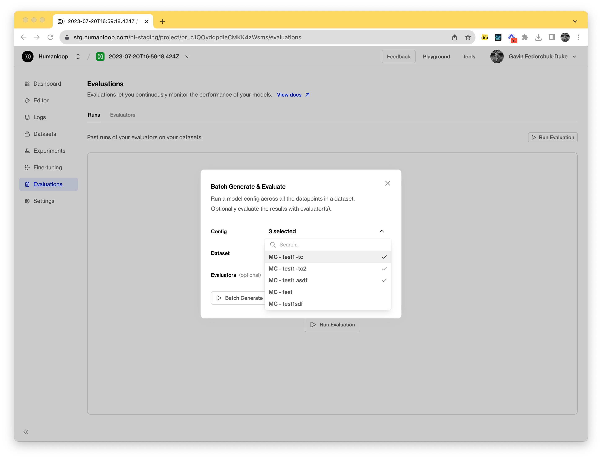
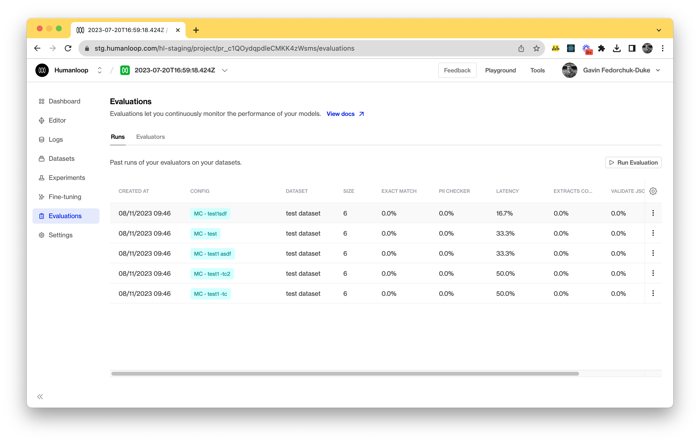
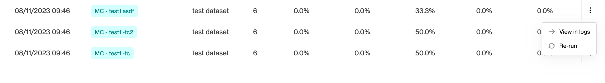
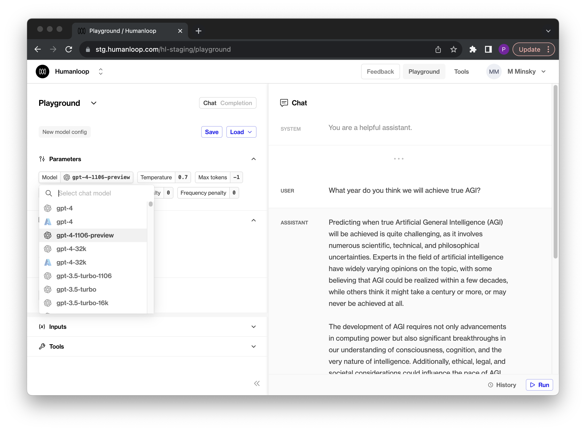

## Improved evaluation runs

You can now trigger runs against multiple model configs simultaneously. 

This improves your ability to compare and evaluate changes  across your prompts. We've also removed the summary cards. In their place, we've added a table that supports sorting and rearranging of columns to help you better interrogate results.

### Multiple model configs

To run evaluations against multiple model configs it's as simple as selecting the targeted model configs in the run dialog, similar to before, but multiple choices are now supported. This will trigger multiple evaluation runs at once, with each model config selected as a target.

### Evaluation table

We've updated our evaluation runs with a table to help view the outcomes of runs in a more condensed form. It also allows you to sort results and trigger re-runs easier. As new evaluators are included, a column will be added automatically to the table. 

### Re-run previous evaluations

We've exposed the re-run option in the table to allow you to quickly trigger runs again, or use older runs as a way to preload the dialog and change the parameters such as the target dataset or model config. 

## New OpenAI turbos

Off the back of OpenAI's [dev day](https://devday.openai.com/) we've added support for the new turbo [models](https://platform.openai.com/docs/models/gpt-4-and-gpt-4-turbo) that were announced:

- **gpt-4-1106-preview**
- **gpt-3.5-turbo-1106**

Both of these models add a couple of nice capabilities: 

- Better instruction following performance
- JSON mode that forces the model to return valid JSON
- Can call multiple tools at once
- Set a seed for reproducible outputs

You can now access these in your Humanloop Editor and via the API.

