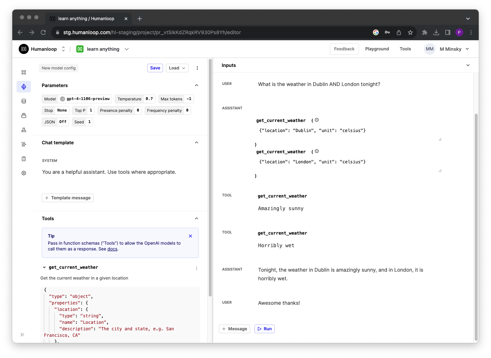
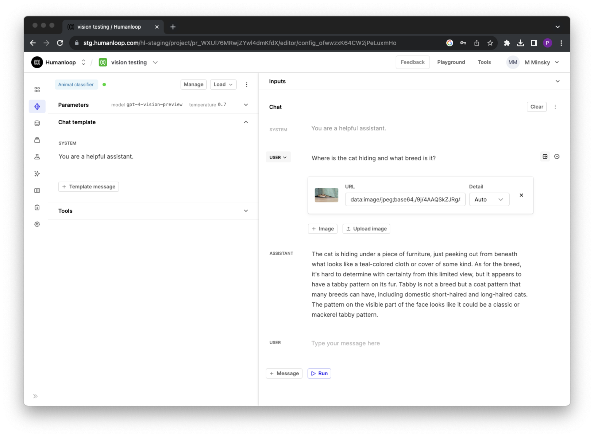
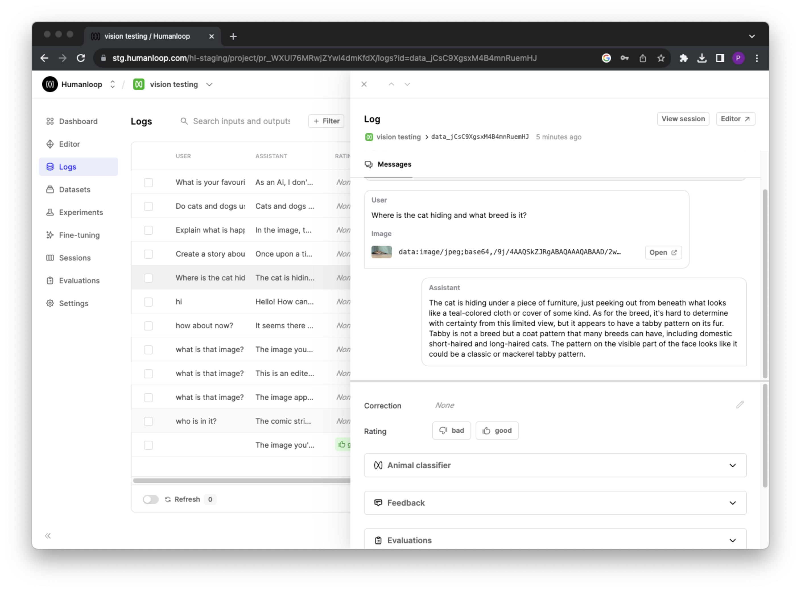
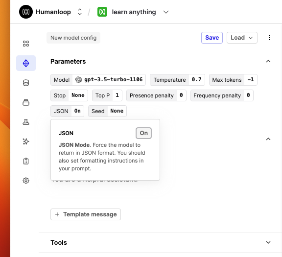

## Parallel tool calling

We've added support for parallel tool calls in our Editor and API.

With the release of the latest OpenAI turbo models, the model can choose to respond with more than one tool call for a given query; this is referred to as [parallel tool calling](https://platform.openai.com/docs/guides/function-calling/parallel-function-calling).

### Editor updates

You can now experiment with this new feature in our Editor:

- Select one of the [new turbo models](/api-reference/changelog#new-openai-turbos) in the model dropdown.
- Specify a tool in your model config on the left hand side.
- Make a request that would require multiple calls to answer correctly.
- As shown here for a weather example, the model will respond with multiple tool calls in the same message



### API implications

We've added an additional field `tool_calls` to our chat endpoints response model that contains the array of tool calls returned by the model. The pre-existing `tool_call` parameter remains but is now marked as deprecated.

Each element in the `tool_calls` array has an id associated to it. When providing the tool response back to the model for one of the tool calls, the `tool_call_id` must be provided, along with `role=tool` and the `content` containing the tool response.

```python
from humanloop import Humanloop

# Initialize the Humanloop SDK with your API Keys
humanloop = Humanloop(api_key="<YOUR Humanloop API KEY>")

# form of message when providing the tool response to the model
chat_response = humanloop.chat_deployed(
    project_id="<YOUR PROJECT ID>",
  	messages: [
      {
        "role": "tool",
        "content": "Horribly wet"
        "tool_call_id": "call_dwWd231Dsdw12efoOwdd"
      }
   ]
)
```

## Python SDK improvements

We've improved the response models of our [Python SDK](https://github.com/humanloop/humanloop-python#raw-http-response) and now give users better control over HTTPs timeout settings.

### Improved response model types

As of **versions >= 0.6.0**, our Python SDK methods now return [Pydantic](https://docs.pydantic.dev/latest/) models instead of typed dicts. This improves developer ergonomics around typing and validations.

- Previously, you had to use the [...] syntax to access response values:

```python
chat_response = humanloop.chat(
        # parameters
    )
print(chat_response.body["project_id"])
```

- With Pydantic-based response values, you now can use the . syntax to access response values. To access existing response model from \< 0.6.0, use can still use the .raw namespace as specified in the [Raw HTTP Response section](https://github.com/humanloop/humanloop-python#raw-http-response).

```python
chat_response = humanloop.chat(
        # parameters
    )
print(chat_response.project_id)
```

> 🚧 Breaking change
>
> Moving to >= 0.6.0 does represent a breaking change in the SDK. The underlying API remains unchanged.

### Support for timeout parameter

The default timeout used by [aiohttp](https://docs.aiohttp.org/en/stable/), which our SDK uses is 300 seconds. For very large prompts and the latest models, this can cause timeout errors to occur.

In the latest version of Python SDKs, we've increased the default timeout value to 600 seconds and you can update this configuration if you are still experiencing timeout issues by passing the new timeout argument to any of the SDK methods. For example passing`timeout=1000` will override the timeout to 1000 seconds.

## Multi-modal models

We've introduced support for multi-modal models that can take both text and images as inputs!

We've laid the foundations for multi-modal model support as part of our Editor and API. The first model we've configured is OpenAI's [GPT-4 with Vision (GPT-4V)](https://platform.openai.com/docs/guides/vision/vision). You can now select `gpt-4-vision-preview` in the models dropdown and add images to your chat messages via the API.

Let us know what other multi-modal models you would like to see added next!

### Editor quick start

To get started with GPT-4V, go to the Playground, or Editor within your project.

- Select `gpt-4-vision-preview` in the models dropdown.
- Click the **Add images** button within a user's chat message.
- To add an image, either type a URL into the Image URL textbox or select "Upload image" to upload an image from your computer. If you upload an image, it will be converted to a Base64-encoded data URL that represents the image.
- Note that you can add multiple images



To view the images within a log, find the log within the logs table and click on it to open it in a drawer. The images in each chat message be viewed within this drawer.



### API quick start

Assuming you have deployed your `gpt-4-vision-preview` based model config, you can now also include images in messages via the API.

```python
from humanloop import Humanloop

# Initialize the Humanloop SDK with your API Keys
humanloop = Humanloop(api_key="<YOUR Humanloop API KEY>")

# humanloop.chat_deployed(...) will call the active model config on your project.
chat_response = humanloop.chat_deployed(
    project_id="<YOUR PROJECT ID>",
  	messages: [
      {
        "role": "user",
        "content": [
          {
            "type": "image_url",
            "image_url": {
              "detail": "high",
              "url": "https://www.acomaanimalclinictucson.com/wp-content/uploads/2020/04/AdobeStock_288690671-scaled.jpeg"
            }
          }
        ]
)
```

Any generations made will also be viewable from within your projects logs table.

### Limitations

There are some know limitations with the current preview iteration of OpenAI's GPT-4 model to be aware of:

- Image messages are only supported by the `gpt-4-vision-preview` model in chat mode.
- GPT-4V model does not support tool calling or JSON mode.
- You cannot add images to the first `system` message.

## JSON mode and seed parameters

We've introduced new model config parameters for **JSON mode** and **Seed** in our Editor and API.

With the introduction of the new [OpenAI turbo models](https://docs.humanloop.com/changelog/gpt4-turbo-preview) you can now set additional properties that impact the behaviour of the model; `response_format` and `seed`.

<Note title="Further details"> 
> 
See further guidance from OpenAI on the JSON response format [here](https://platform.openai.com/docs/guides/text-generation/json-mode) and reproducing outputs using the seed parameter [here](https://platform.openai.com/docs/guides/text-generation/reproducible-outputs).
</Note>

These new parameters can now optionally contribute to your model config in our Editor and API. Updated values for `response_format` or `seed` will constitute new versions of your model on Humanloop.



<Warning title="JSON mode prompts">
When using JSON mode with the new turbo models, you should still include formatting instructions in your prompt.

In fact, if you do not include the word 'json' anywhere in your prompt, OpenAI will return a validation error currently.
</Warning>
