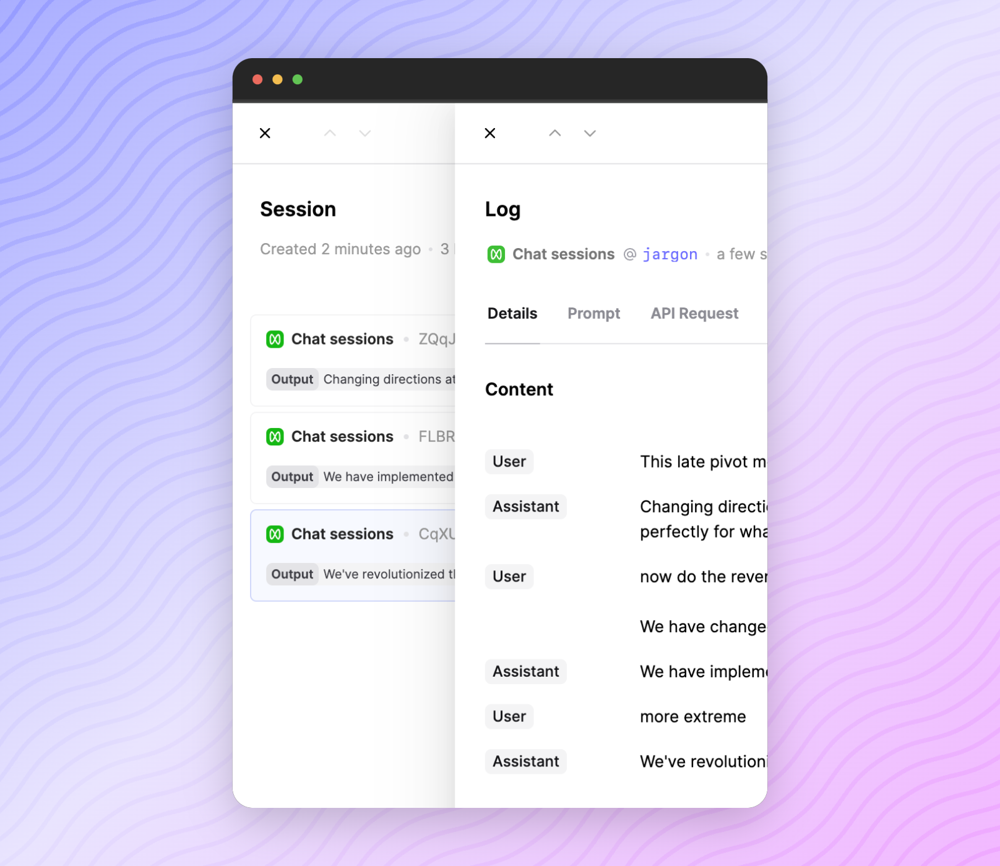

## Chat sessions in Editor

Your chat messages in Editor are now recorded as part of a session so you can more easily keep track of conversations.

After chatting with a saved prompt, go to the sessions tab and your messages will be grouped together.

If you want to do this with the API, it can be as simple as setting the `session_reference_id`– see [docs on sessions](docs/logging-session-traces).