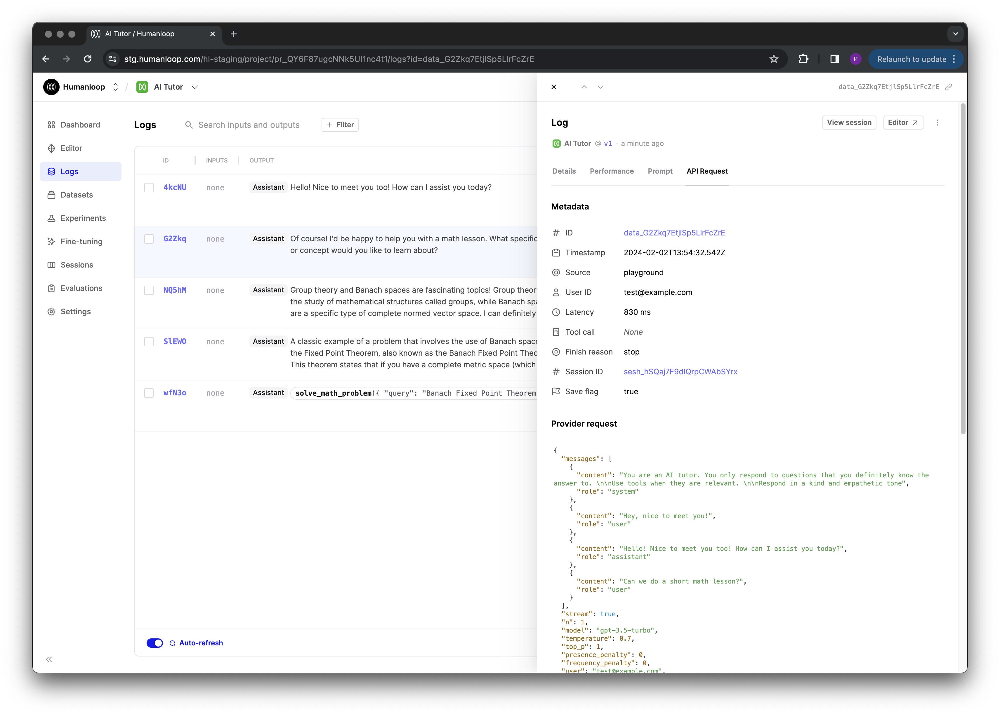

## Control logging level

We've added a `save` flag to all of our endpoints that generate logs on Humanloop so that you can control whether the request and response payloads that may contain sensitive information are persisted on our servers or not.

If `save` is set to `false` then no `inputs`, `messages` our `outputs` of any kind (including the raw provider request and responses) are stored on our servers. This can be helpful for sensitive use cases where you can't for example risk PII leaving your system.

Details of the model configuration and any metadata you send are still stored. Therefore you can still benefit from certain types of evaluators such as human feedback, latency and cost, as well as still track important metadata over time that may not contain sensitive information.

This includes all our [chat](/docs/reference/chats/create) and [completion](/docs/reference/completions/create) endpoint variations, as well as our explicit [log](/docs/reference/logs/log) endpoint.

```python
from humanloop import Humanloop

# You need to initialize the Humanloop SDK with your API Keys
humanloop = Humanloop(api_key="<YOUR Humanloop API KEY>")

# humanloop.complete_deployed(...) will call the active model config on your project.
# You can optionally set the save flag to False
complete_response = humanloop.complete_deployed(
  	save=False,
    project="<YOUR UNIQUE PROJECT NAME>",
    inputs={"question": "I have inquiry about by life insurance policy. Can you help?"},
)

# You can still retrieve the data_id and output as normal
data_id = complete_response.body["data"][0]["id"]
output = complete_response.body["data"][0]["output"]

# And log end user feedback that will still be stored
humanloop.feedback(data_id=data_id, type="rating", value="good")


```

## Logging provider request

We're now capturing the raw provider request body alongside the existing provider response for all logs generated from our [deployed endpoints](/docs/guides/chat-using-the-sdk).

This provides more transparency into how we map our provider agnostic requests to specific providers. It can also effective for helping to troubleshoot the cases where we return well handled provider errors from our API.


