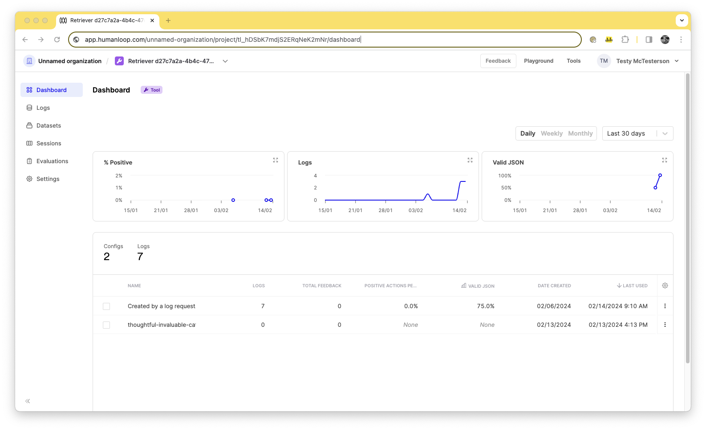
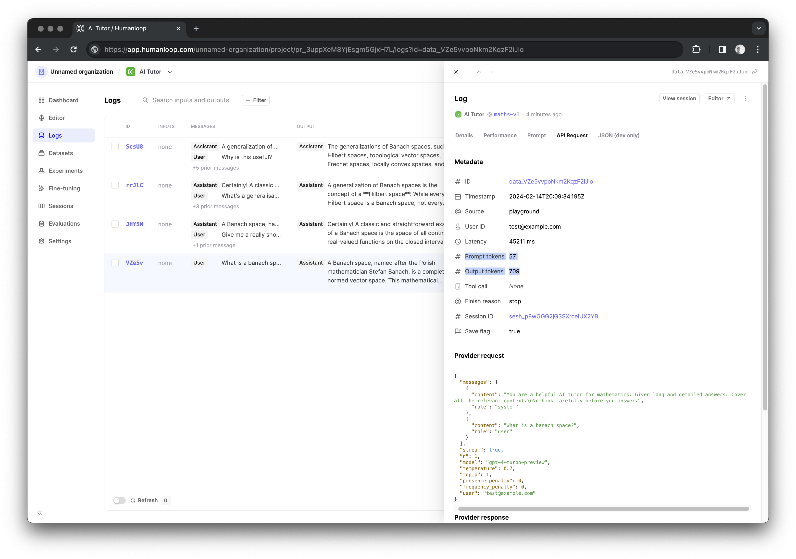

## Online evaluators for monitoring Tools

You can now use your online evaluators for monitoring the logs sent to your Tools. The results of this can be seen in the graphs on the Tool dashboard as well as on the Logs tab of the Tool. 

To enable Online Evaluations follow the steps seen in our [Evaluate models online](/docs/evaluate-models-online) guide.

## Logging token usage

We're now computing and storing the number of tokens used in both the requests to and responses from the model.

This information is available in the logs table UI and as part of the [log response](/reference/logs/get) in the API. Furthermore you can use the token counts as inputs to your code and LLM based evaluators. 

The number of tokens used in the request is called `prompt_tokens`  and the number of tokens used in the response is called `output_tokens`.

This works consistently across all model providers and whether or not you are you are streaming the responses.  OpenAI, for example, do not return token usage stats when in streaming mode.

