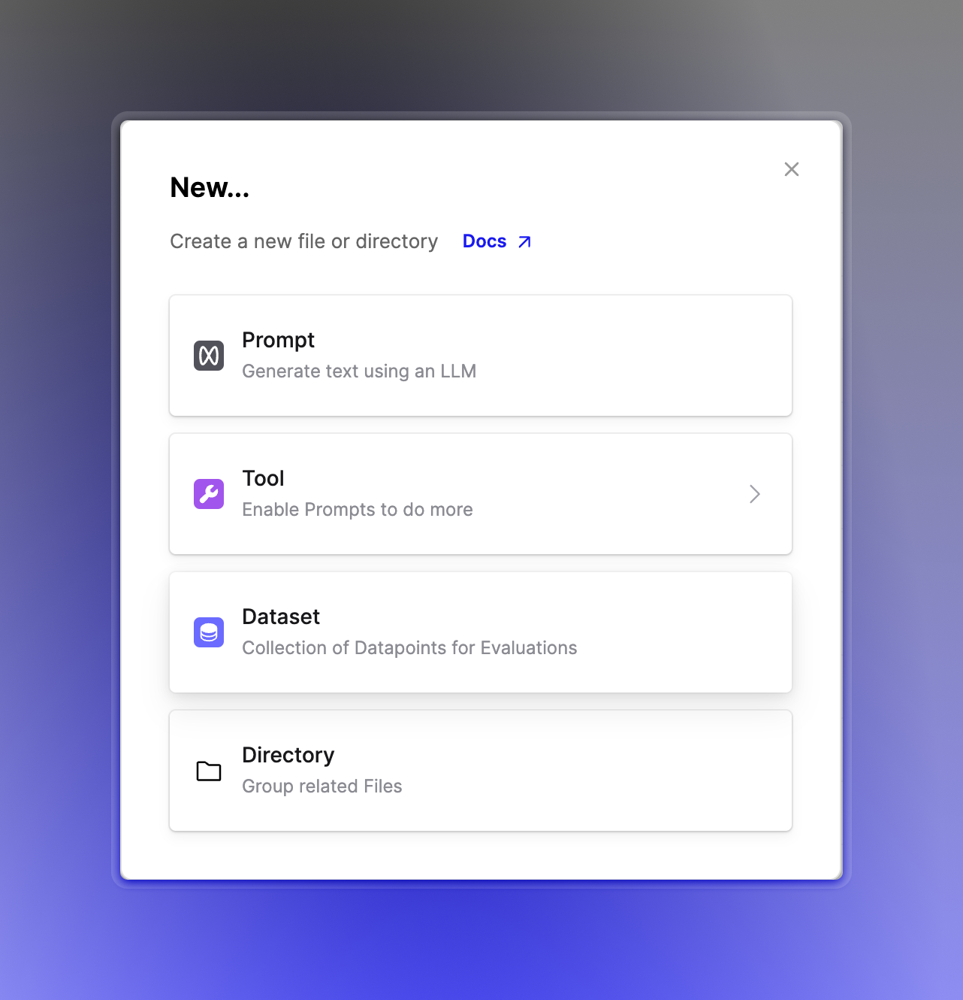
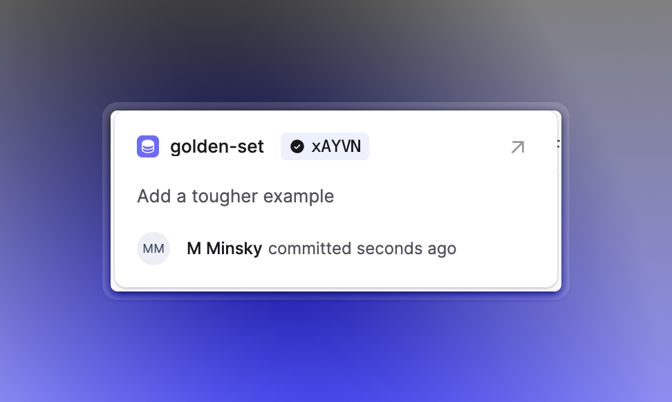

## Dataset Files & Versions

In our recent release, we promoted **Datasets** from being attributes managed within the context of a single Prompt, to a **first-class Humanloop file type** alongside Prompts and Tools.

This means you can curate Datasets and share them for use across any of the Prompts in your organization. It also means you get the full power of our **file versioning system**, allowing you **track and commit every change** you make Datasets and their Datapoints, with attribution and commit messages inspired by Git.

It's now easy to understand which version of a Dataset was used in a given Evaluation run, and whether the most recent edits to the Dataset were included or not.

Read more on how to get started with datasets [here](/docs/guides/datasets).

This change lays the foundation for lots more improvements we have coming to Evaluations in the coming weeks. Stay tuned!
