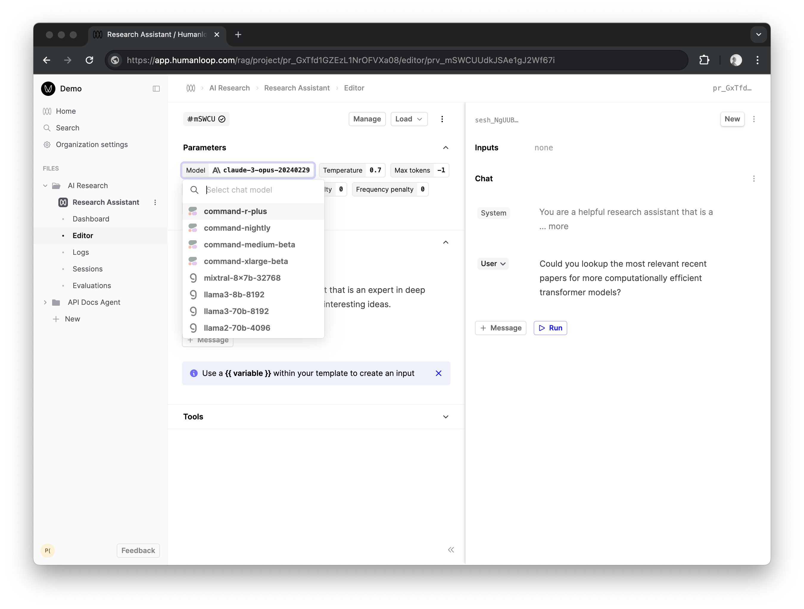

## Cohere Command-r

We've expanded the Cohere models with the latest command-r suite. You can now use these models in our Editor and via our APIs once you have set your Cohere API key.

More details can be found on their [blog post](https://cohere.com/blog/command-r-plus-microsoft-azure).

