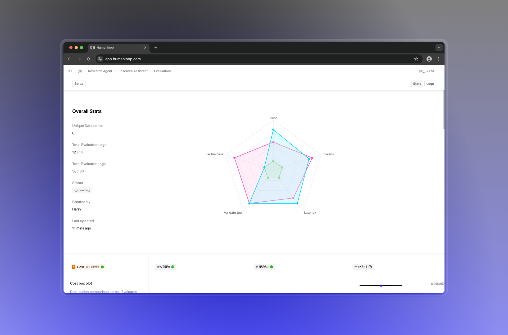
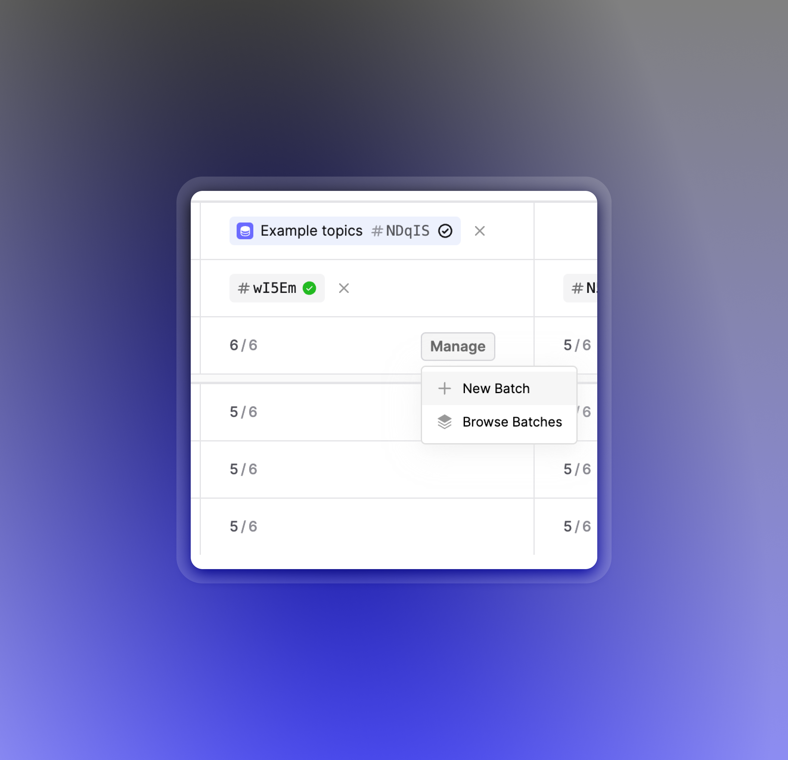
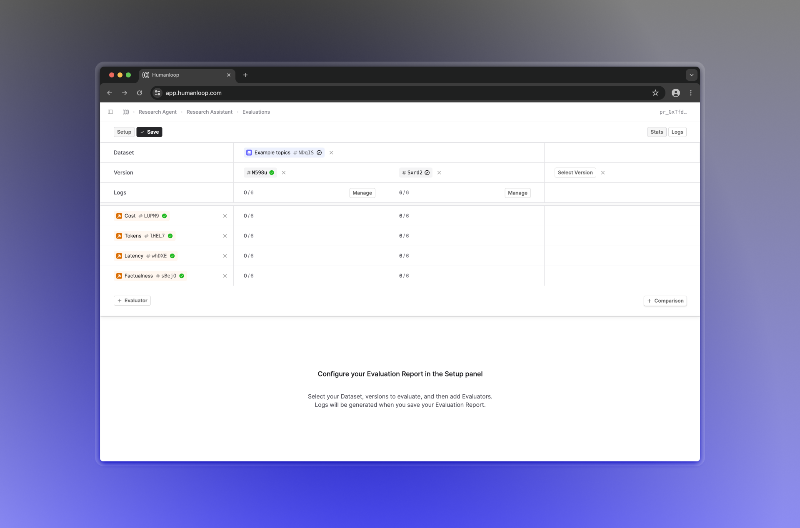

## Evaluation comparison reports

We've released Evaluation reports, which allows you to directly compare the performance of your Prompt/Tool versions with a Dataset.

This replaces the previous concept of Evaluation runs, extending its functionality to allow you to compare multiple versions across multiple different evaluation criteria. (Your previous Evaluation runs have been migrated to Evaluation reports with a single evaluated version.)

### Additional features

The main update is a new stats comparison view, where your evaluated versions are shown in columns, and form a grid with the Evaluators you've selected. This allows you to easily compare the performance of your versions across different metrics.

Evaluation reports also introduce an **automatic deduplication** feature, which utilizes previous Logs to avoid generating new Logs for the same inputs. If a Log already exists for a given evaluated-version-and-datapoint pair, it will automatically be reused.
Note that you can suppress this behavior and force the generation of new Logs by creating a **New Batch**.

### How to use Evaluation reports

To get started, head over to the Evaluations tab of the Prompt you'd like to evaluate, and click **Evaluate** in the top right.

This will bring you to a page where you can set up your Evaluation, choosing a Dataset, some versions to Evaluate and compare, and the Evaluators you'd like to use.

When you click **Save**, the Evaluation report will be created, and any missing Logs will be generated.

### What's next

We're planning on improving the functionality of Evaluation reports by adding a more comprehensive detailed view, allowing you to get a more in-depth look at the generations produced by your Prompt versions. Together with this, we'll also be improving Human evaluators so you can better annotate and aggregate feedback on your generations.
