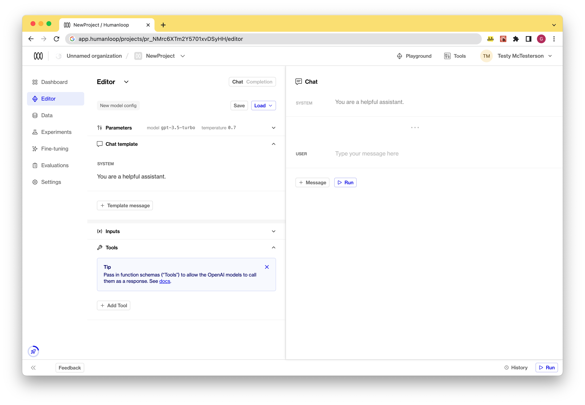
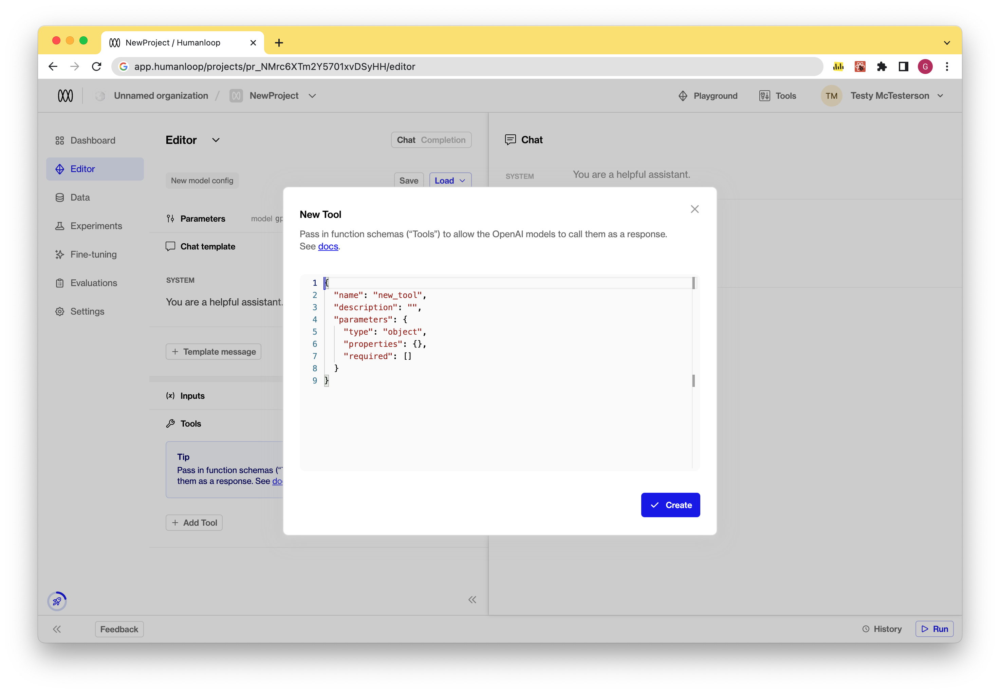
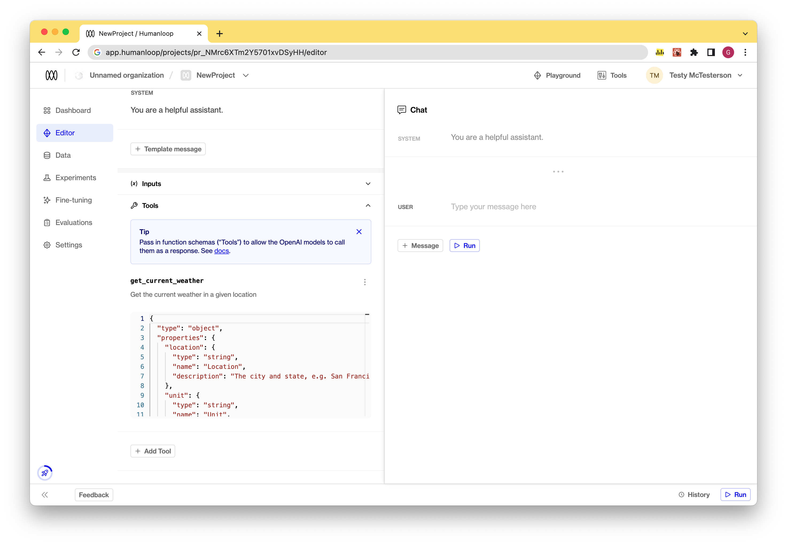
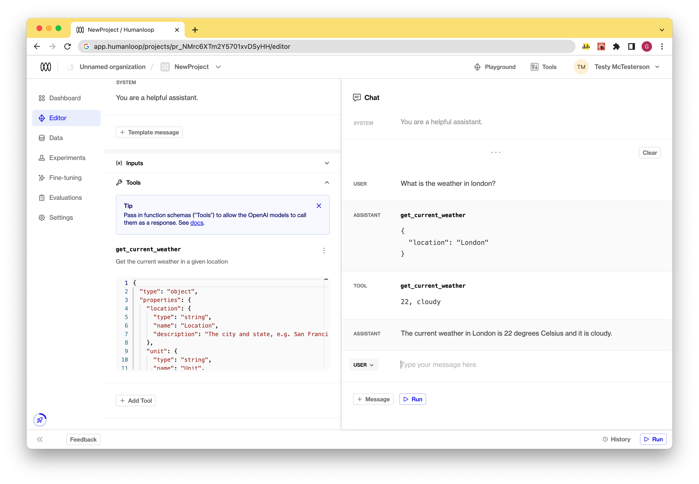

## OpenAI functions in Playground

We've added support for [OpenAI functions](https://platform.openai.com/docs/guides/gpt/function-calling) to our playground!

This builds on our [API support](https://docs.humanloop.com/changelog/openai-functions-as-tools) and allows you to easily experiment with OpenAI functions within our playground UI.

OpenAI functions are implemented as [tools](https://docs.humanloop.com/docs/setup-semantic-search) on Humanloop. Tools follow the same universal [json-schema](https://json-schema.org/) definition as OpenAI functions. You can now define tools as part of your model configuration in the playground. These tools are sent as OpenAI functions when running the OpenAI chat models that support function calling.

The model can choose to return a JSON object containing the arguments needed to call a function. This object is displayed as a special assistant message within the playground. You can then provide the result of the call in a message back to the model to consider, which simulates the function calling workflow.

### Use tools in Playground

Take the following steps to use tools for function calling in the playground:

1. **Find tools:** Navigate to the playground and locate the `Tools` section. This is where you'll be able to manage your tool definitions.

2. **Create a new tool:** Click on the "Add Tool" button. There are two options in the dropdown: create a new tool or to start with one of our examples. You define your tool using the [json-schema](https://json-schema.org/) syntax. This represents the function definition sent to OpenAI.

3. **Edit a tool:** To edit an existing tool, simply click on the tool in the Tools section and make the necessary changes to its json-schema definition. This will result in a new model configuration.

4. **Run a model with tools:** Once you've defined your tools, you can run the model by pressing the "Run" button.
   1. If the model chooses to call a function, an assistant message will be displayed with the corresponding tool name and arguments to use.
   2. A subsequent `Tool` message is then displayed to simulate sending the results of the call back to the model to consider.

5. **Save your model config with tools** by using the **Save** button. Model configs with tools defined can then deployed to [environments](/docs/guides/deploy-to-an-environment) as normal.

### Coming soon

Provide the runtime for your tool under the existing pre-defined [Tools section ](https://app.humanloop.com/tools) of your organization on Humanloop.
