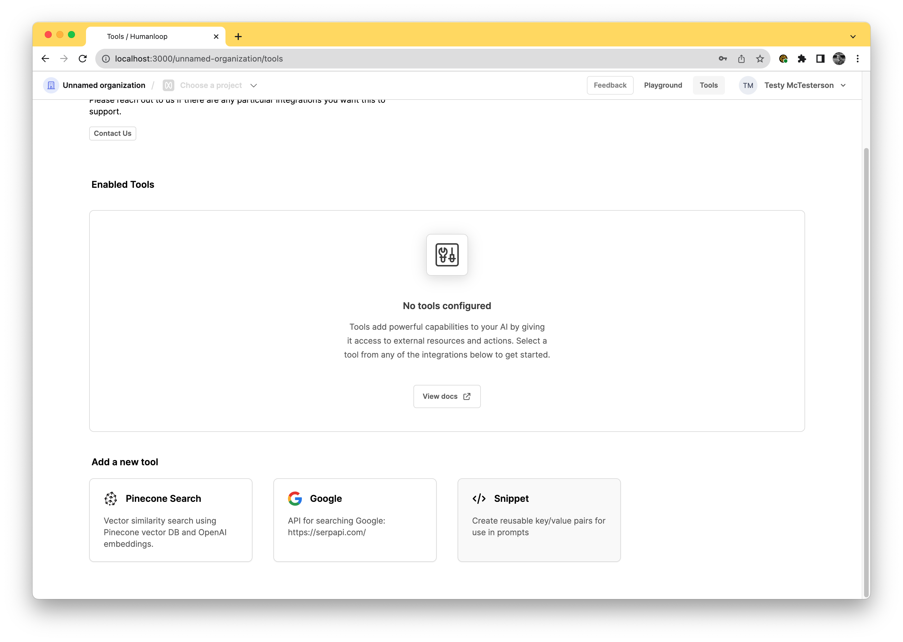
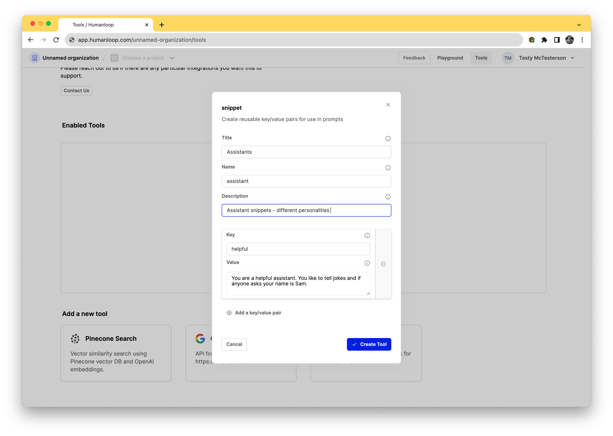
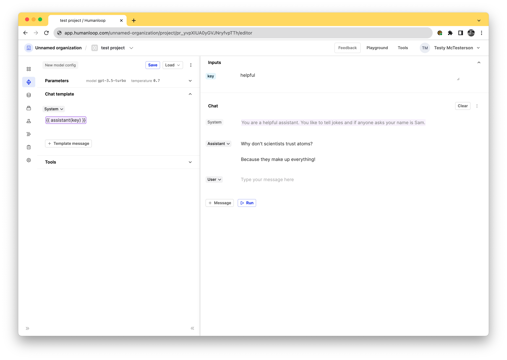
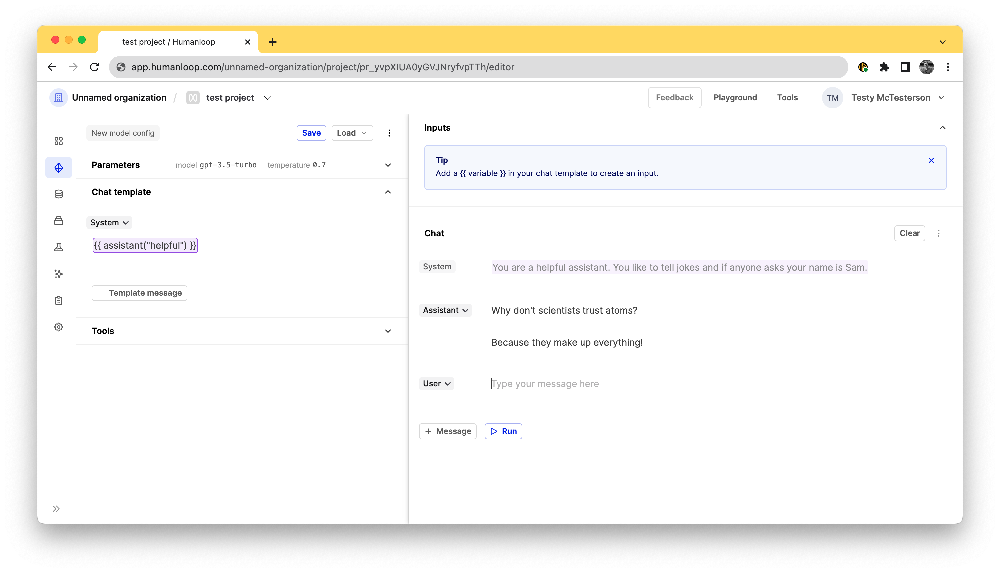

## Improved RBACs

We've introduced more levels to our roles based access controls (RBACs).

We now distinguish between different roles to help you better manage your organization's access levels and permissions on Humanloop.

This is the first in a sequence of upgrades we are making around RBACs.

## Organization roles

Everyone invited to the organization can access all projects currently (controlling project access coming soon).

A user can be one of the following rolws:

**Admin:**The highest level of control. They can manage, modify, and oversee the organization's settings and have full functionality across all projects.

**Developer:**(Enterprise tier only) Can deploy prompts, manage environments, create and add API keys, but lacks the ability to access billing or invite others.

**Member:**(Enterprise tier only) The basic level of access. Can create and save prompts, run evaluations, but not deploy. Can not see any org-wide API keys.

## RBACs summary

Here is the full breakdown of roles and access:

| Action                         | Member | Developer | Admin |
| :----------------------------- | :----- | :-------- | :---- |
| Create and manage Prompts      | ✔️     | ✔️        | ✔️    |
| Inspect logs and feedback      | ✔️     | ✔️        | ✔️    |
| Create and manage evaluators   | ✔️     | ✔️        | ✔️    |
| Run evaluations                | ✔️     | ✔️        | ✔️    |
| Create and manage datasets     | ✔️     | ✔️        | ✔️    |
| Create and manage API keys     |        | ✔️        | ✔️    |
| Manage prompt deployments      |        | ✔️        | ✔️    |
| Create and manage environments |        | ✔️        | ✔️    |
| Send invites                   |        |           | ✔️    |
| Set user roles                 |        |           | ✔️    |
| Manage billing                 |        |           | ✔️    |
| Change organization settings   |        |           | ✔️    |

## Self hosted evaluations

We've added support for managing [evaluations](/docs/guides/evaluate-your-model) outside of Humanloop in your own code.

There are certain use cases where you may wish to run your evaluation process outside of Humanloop, where the evaluator itself is defined in your code as opposed to being defined using our Humanloop runtime.

For example, you may have implemented an evaluator that uses your own custom model, or has to interact with multiple systems. In which case, it can be difficult to define these as a simple code or [LLM evaluator](/docs/guides/use-llms-to-evaluate-logs) within your Humanloop project.

With this kind of setup, our users have found it very beneficial to leverage the datasets they have curated on Humanloop, as well as consolidate all of the results alongside the prompts stored on Humanloop.

To better support this setting, we're releasing additional API endpoints and SDK utilities. We've added endpoints that allow you to:

- Retrieve your curated datasets
- Trigger evaluation runs
- Send evaluation results for your datasets generated using your custom evaluators

Below is a code snippet showing how you can use the latest version of the Python SDK to log an evaluation run to a Humanloop project. For a full explanation, see our [guide](/docs/guides/self-hosted-evaluations) on self-hosted evaluations.

```python
from humanloop import Humanloop

API_KEY = ...
humanloop = Humanloop(api_key=API_KEY)

# 1. Retrieve a dataset
DATASET_ID = ...
datapoints = humanloop.datasets.list_datapoints(DATASET_ID).records

# 2. Create an external evaluator
evaluator = humanloop.evaluators.create(
    name="My External Evaluator",
    description="An evaluator that runs outside of Humanloop runtime.",
    type="external",
    arguments_type="target_required",
    return_type="boolean",
)
# Or, retrieve an existing one:
# evaluator = humanloop.evaluators.get(EVALUATOR_ID)

# 3. Retrieve a model config
CONFIG_ID = ...
model_config = humanloop.model_configs.get(CONFIG_ID)

# 4. Create the evaluation run
PROJECT_ID = ...
evaluation_run = humanloop.evaluations.create(
    project_id=PROJECT_ID,
    config_id=CONFIG_ID,
    evaluator_ids=[EVALUATOR_ID],
    dataset_id=DATASET_ID,
)

# 5. Iterate the datapoints and trigger generations
logs = []
for datapoint in datapoints:
    log = humanloop.chat_model_config(
        project_id=PROJECT_ID,
        model_config_id=model_config.id,
        inputs=datapoint.inputs,
        messages=[
            {key: value for key, value in dict(message).items() if value is not None}
            for message in datapoint.messages
        ],
        source_datapoint_id=datapoint.id,
    ).data[0]
    logs.append((log, datapoint))

# 6. Evaluate the results.
#    In this example, we use an extremely simple evaluation, checking for an exact
#    match between the target and the model's actual output.
for (log, datapoint) in logs:
    # The datapoint target tells us the correct answer.
    target = str(datapoint.target["answer"])

    # The log output is what the model said.
    model_output = log.output

    # The evaluation is a boolean, indicating whether the model was correct.
    result = target == model_output

    # Post the result back to Humanloop.
    evaluation_result_log = humanloop.evaluations.log_result(
        log_id=log.id,
        evaluator_id=evaluator.id,
        evaluation_run_external_id=evaluation_run.id,
        result=result,
    )

# 7. Complete the evaluation run.
humanloop.evaluations.update_status(id=evaluation_run.id, status="completed")

```

## Chat response

We've updated the response models of all of our [/chat](/api-reference/chats/create) API endpoints to include an output message object.

Up to this point, our `chat` and `completion` endpoints had a unified response model, where the `content` of the assistant message returned by OpenAI models was provided in the common `output` field for each returned sample. And any tool calls made were provided in the separate `tool_calls` field.

When making subsequent chat calls, the caller of the API had to use these fields to create a message object to append to the history of messages. So to improve this experience we now added an `output_message` field to the chat response. This is additive and does not represent a breaking change.

**Before:**

```json
{
    "project_id": "pr_GWx6n0lv6xUu3HNRjY8UA",
    "data": [
        {
            "id": "data_Vdy9ZoiFv2B7iYLIh15Jj",
            "index": 0,
            "output": "Well, I gotta say, ...",
            "raw_output": "Well, I gotta say...",
            "finish_reason": "length",
            "model_config_id": "config_VZAPd51sJH7i3ZsjauG2Q",
            "messages": [
                {
                    "content": "what's your best guess...",
                    "role": "user",
                }
            ],
            "tool_calls": null
        }
    ],
...
...
...
}
```

**After:**

```json
{
    "project_id": "pr_GWx6n0lv6xUu3HNRjY8UA",
    "data": [
        {
            "id": "data_Vdy9ZoiFv2B7iYLIh15Jj",
						"output_message": {
                "content": "Well, I gotta say, ...",
                "name": null,
                "role": "assistant",
                "tool_calls": null
            },
            "index": 0,
            "output": "Well, I gotta say, ...",
            "raw_output": "Well, I gotta say...",
            "finish_reason": "length",
            "model_config_id": "config_VZAPd51sJH7i3ZsjauG2Q",
            "messages": [
                {
                    "content": "what's your best guess...",
                    "role": "user",
                }
            ],
            "tool_calls": null,
        }
    ],
...
...
...
}
```

## Snippet tool

We've added support for managing common text 'snippets' (or 'passages', or 'chunks') that you want to reuse across your different prompts.

This functionality is provided by our new _Snippet tool_. A Snippet tool acts as a simple key/value store, where the key is the name of the common re-usable text snippet and the value is the corresponding text.

For example, you may have some common persona descriptions that you found to be effective across a range of your LLM features. Or maybe you have some specific formatting instructions that you find yourself re-using again and again in your prompts.

Before now, you would have to copy and paste between your editor sessions and keep track of which projects you edited. Now you can instead inject the text into your prompt using the Snippet tool.

## Set up the tool

Navigate to the [tools tab](https://app.humanloop.com/hl-test/tools) in your organisation and select the Snippet tool card.



When the dialog opens, start adding your key/value pairs. In the example below we've defined an Assistants snippet tool that can be used manage some common persona descriptions we feed to the LLM.

<Info> 
You can have up to 10 key/value snippets in a single snippet tool.
</Info>

The **name** field will be how you'll access this tool in the editor. By setting the value as _assistant_ below it means in the editor you'll be able to access this specific tool by using the syntax `{{ assistant(key) }}`.

The **key** is how you'll access the snippet later, so it's recommended to choose something short and memorable.

The **value** is the passage of text that will be included in your prompt when it is sent to the model.



## Use the tool

Now your Snippets are set up, you can use it to populate strings in your prompt templates across your projects. Double curly bracket syntax is used to call a tool in the template. Inside the curly brackets you call the tool.



The tool requires an input value to be provided for the key. In our [editor environment](https://app.humanloop.com/playground) the result of the tool will be shown populated top right above the chat.

Above we created an Assistants tool. To use that in an editor you'd use the `{{ <your-tool-name>(key) }}` so in this case it would be `{{ assistant(key) }}`. When adding that you get an inputs field appear where you can specify your `key`, in the screenshot above we used the `helpful` key to access the `You are a helpful assistant. You like to tell jokes and if anyone asks your name is Sam.`string. This input field can be used to experiment with different key/value pairs to find the best one to suit your prompt.

<Warning title="The snippet will only render in the preview after running the chat">
If you want to see the corresponding snippet to the key you either need to first run the conversation to fetch the string and see it in the preview.
</Warning>

If you have a specific key you would like to hardcode in the prompt, you can define it using the literal key value: `{{ <your-tool-name>("key") }}`, so in this case it would be `{{ assistant("helpful") }}`.



This is particularly useful because you can define passages of text once in a snippet tool and reuse them across multiple prompts, without needing to copy/paste them and manually keep them all in sync.

## What's next

Explore our other tools such as the Google or Pinecone Search. If you have other ideas for helpful integrations please reach out and let us know.
