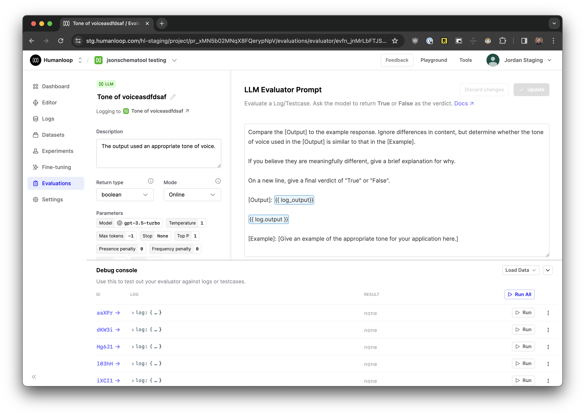
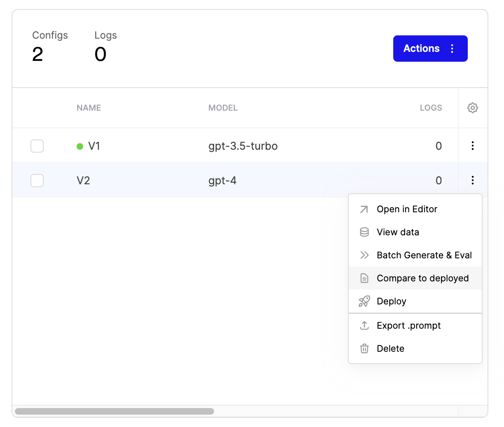
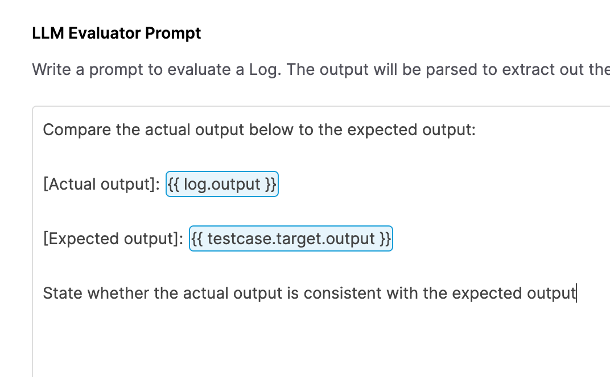

## Improved Evaluator UI

We've improved the experience of creating and debugging your evaluators.

Now that you can [access any property of the objects you're testing](/api-reference/changelog#llm-evals---improved-data-access) we've cleaned up the debug panel to make easier to view the testcases that you load from a dataset or from your projects.

We've also clarified what the return types are expected as you create your evaluators.

## Prompt diffs

Following our recent [introduction of our .prompt file](/docs/guides/prompt-file-format), you can now compare your model configs within a project with our new 'diff' view.

As you modify and improve upon your model configs, you might want to remind yourself of the changes that were made between different versions of your model config. To do so, you can now select 2 model configs in your project dashboard and click **Compare** to bring up a side-by-side comparison between them. Alternatively, open the actions menu and click **Compare to deployed**.

This diff compares the .prompt files representing the two model configs, and will highlight any differences such as in the model, hyperparameters, or prompt template.

## LLM evals - improved data access

In order to help you write better LLM evaluator prompts, you now have finer-grained access to the objects you are evaluating.

It's now possible to access any part of the `log` and `testcase` objects using familiar syntax like `log.messages[0].content`. Use the debug console to help understand what the objects look like when writing your prompts.

