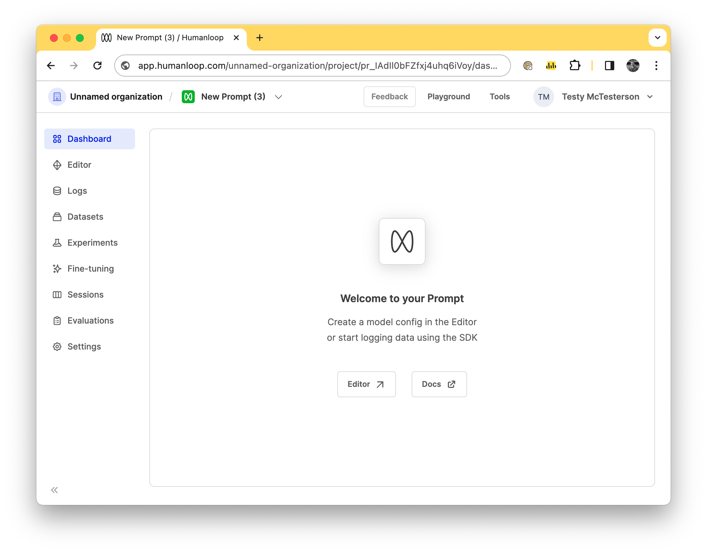
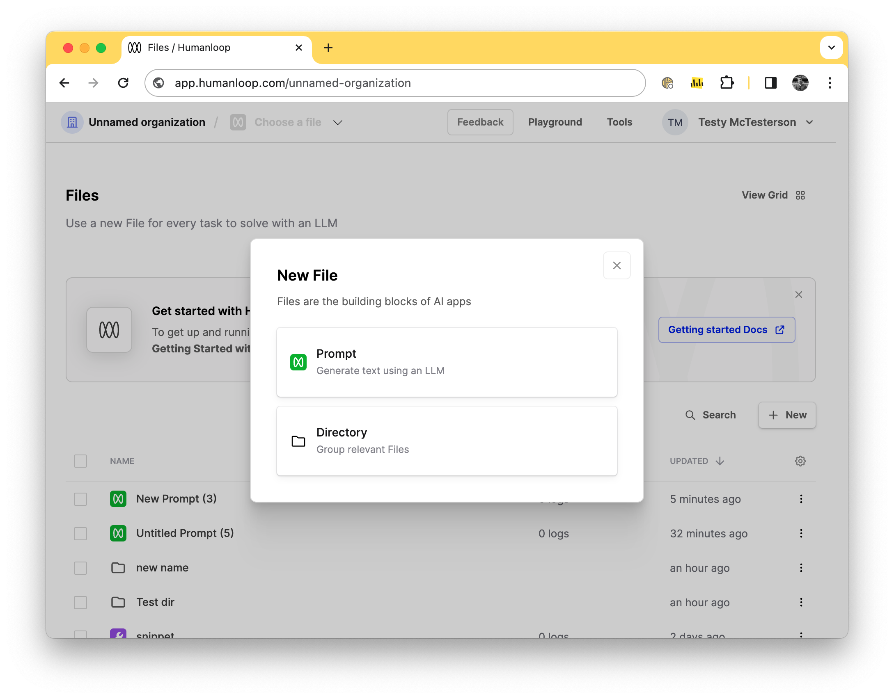

## Projects rename and file creation flow

We've renamed `Projects` to `Prompts` and `Tools` as part of our move towards managing `Prompts`, `Tools`, `Evaluators` and `Datasets` as special-cased and strictly versioned files in your Humanloop directories. 

This is a purely cosmetic change for now. Your Projects (now Prompts and Tools) will continue to behave exactly the same. This is the first step in a whole host of app layout, navigation and API improvements we have planned in the coming weeks. 

If you are curious, please reach out to learn more.

**New creation flow**

We've also updated our file creation flow UI. When you go to create projects you'll notice they are called Prompts now.

