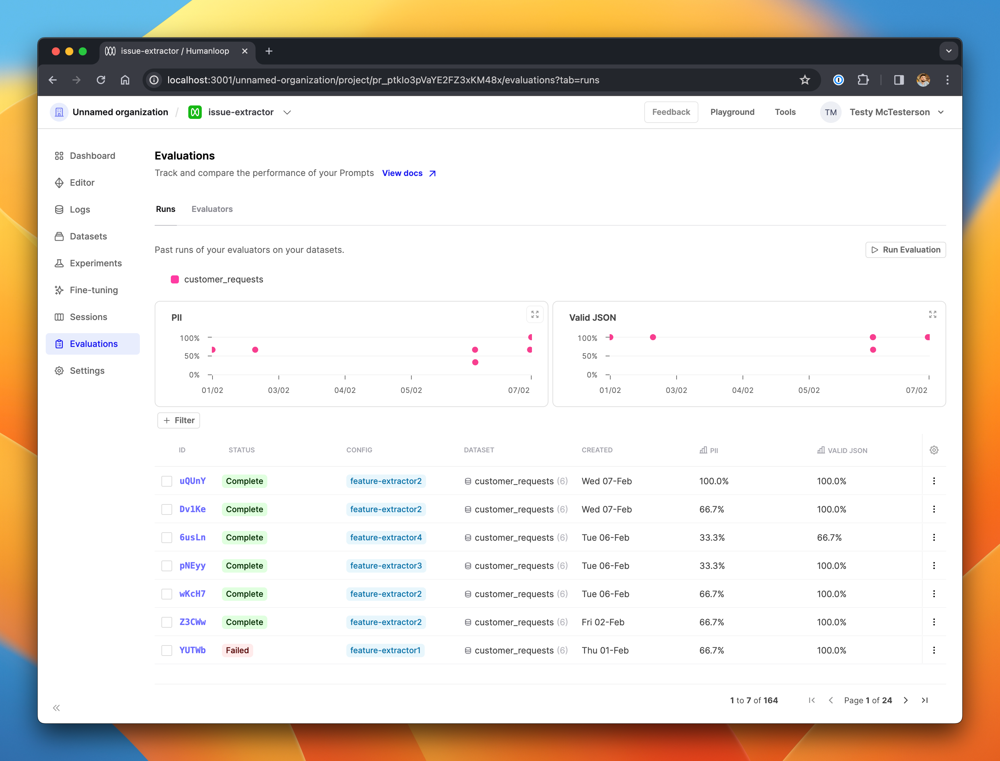

## Filterable and sortable evaluations overview

We've made improvements to the evaluations runs overview page to make it easier for your team to find interesting or important runs.

The charts have been updated to show a single datapoint per run. Each chart represents a single evaluator, and shows the performance of the prompt tested in that run, so you can see at a glance how the performance your prompt versions have evolved through time, and visually spot the outliers. Datapoints are color-coded by the dataset used for the run.

The table is now paginated and does not load your entire project's list of evaluation runs in a single page load. The page should therefore load faster for teams with a large number of runs.

The columns in the table are now filterable and sortable, allowing you to - for example - filter just for the completed runs which test two specific prompt versions on a specific datasets, sorted by their performance under a particular evaluator.

