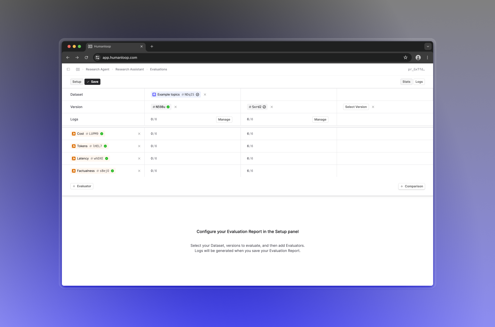

## Evaluation Comparison Reports

We've released Evaluation reports, which allows you to easily compare the performance of your different Prompts or Tools across multiple different [Evaluator](/docs/evaluators) criteria.

This generalises our previous concept of Evaluation runs, extending it with multiple complimentary changes with getting more from your evals. All your existing Evaluation runs have been migrated to Evaluation reports with a single evaluated Prompt or Tool. You can easily extend these existing runs to cover additional Evaluators and Prompts/Tools with out having to regenerate existing logs.

### Feature breakdown

We've introduced a new **stats comparison view**, including a radar chart that gives you a quick overview of how your versions compare across all Evaluators. Below it, your evaluated versions are shown in columns, forming a grid with a row per Evaluator you've selected.

The performance of each version for a given Evaluator is shown in a chart, where bar charts are used for boolean results, while box plots are used for numerical results providing an indication of variance within your Dataset.

Evaluation reports also introduce an **automatic deduplication** feature, which utilizes previous logs to avoid generating new logs for the same inputs. If a log already exists for a given evaluated-version-and-datapoint pair, it will automatically be reused. You can also override this behavior and force the generation of new logs for a report by creating a **New Batch** in the setup panel.

### How to use Evaluation reports

To get started, head over to the Evaluations tab of the Prompt you'd like to evaluate, and click **Evaluate** in the top right.

This will bring you to a page where you can set up your Evaluation, choosing a Dataset, some versions to Evaluate and compare, and the Evaluators you'd like to use.

When you click **Save**, the Evaluation report will be created, and any missing Logs will be generated.

### What's next

We're planning on improving the functionality of Evaluation reports by adding a more comprehensive detailed view, allowing you to get a more in-depth look at the generations produced by your Prompt versions. Together with this, we'll also be improving Human evaluators so you can better annotate and aggregate feedback on your generations.
