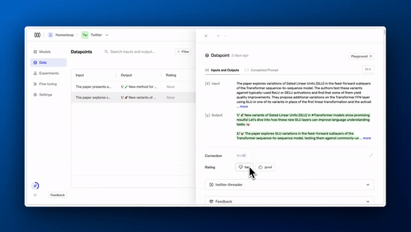
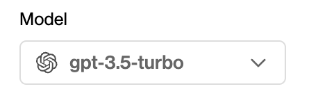

## Keyboard shortcuts and datapoint links

_March 30th, 2023_

We've added keyboard shortcuts to the datapoint viewer

`g` for good  
`b` for bad

and `j` /` k` for next/prev

This should help you for quickly annotating data within your team.

You can also link to specific datapoint in the URL now as well.

---

## ChatGPT support

_March 2nd, 2023_

ChatGPT is here! It's called 'gpt-3.5-turbo'. Try it out today in playground and on the generate endpoint.

Faster and 10x cheaper than text-davinci-003.

