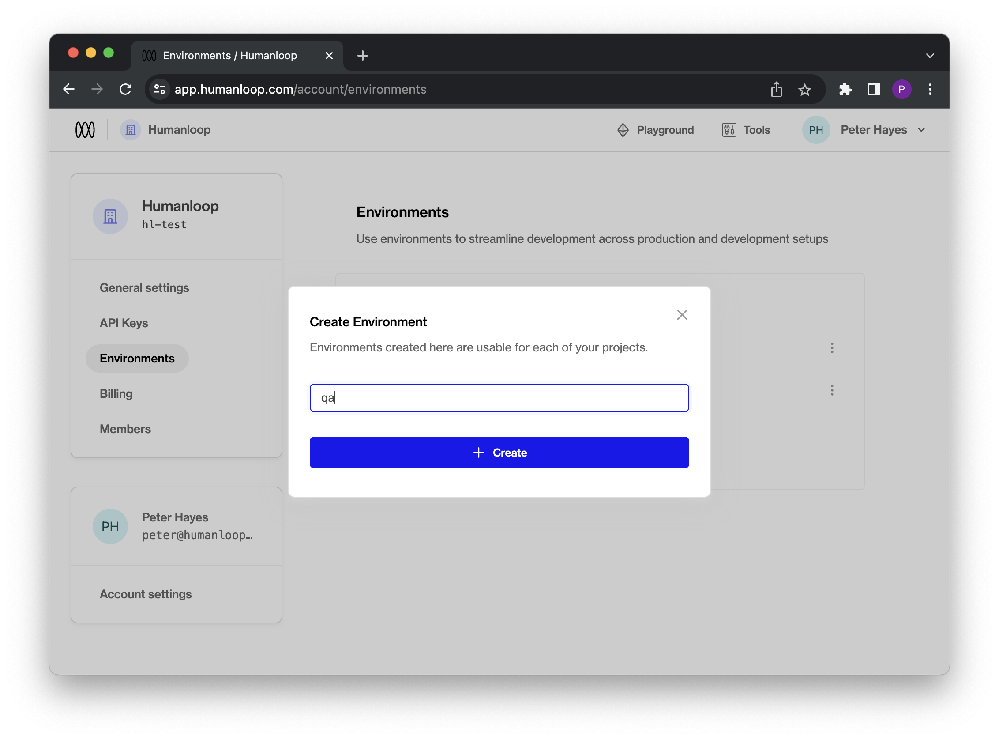
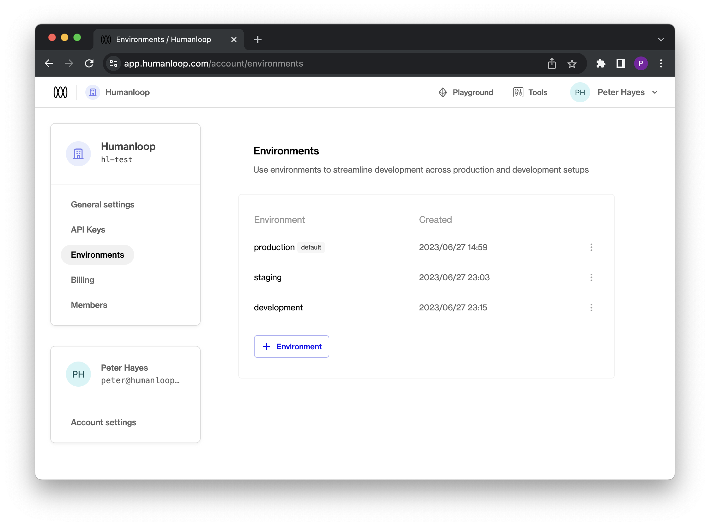
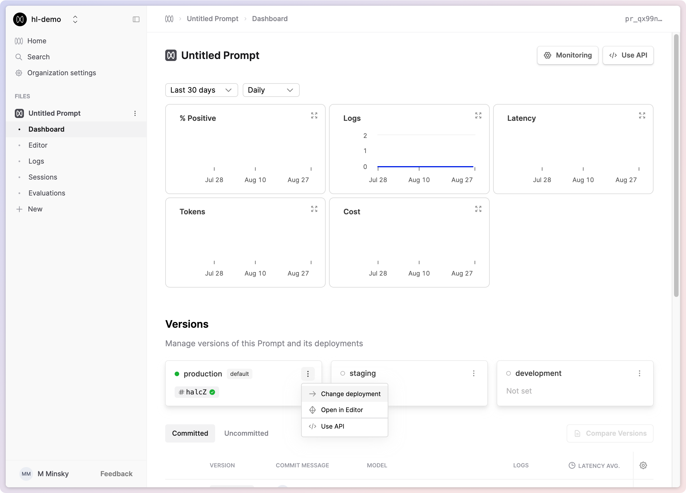
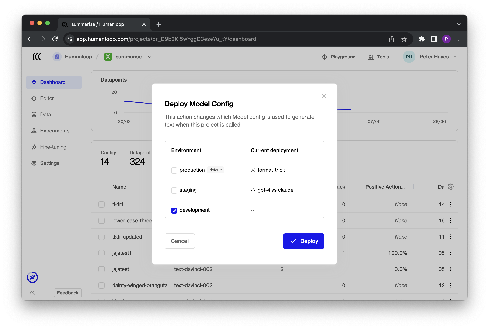
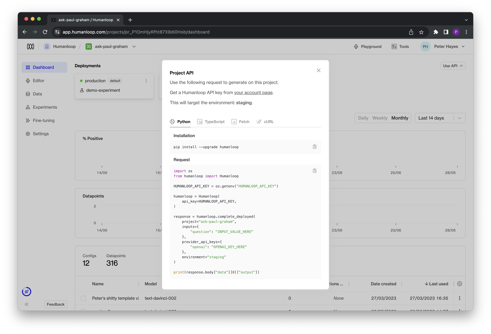
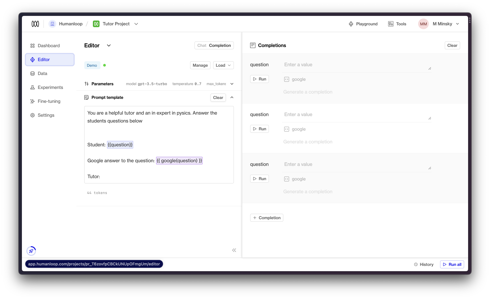

## Deployment environments

_July 27th, 2023_

We've added support for environments to your deployments in Humanloop!

This enables you to deploy your model configurations to specific environments. You'll no longer have to duplicate your projects to manage the deployment workflow between testing and production. With environments, you'll have the control required to manage the full LLM deployment lifecycle.

### Enabling environments for your organisation

Every organisation automatically receives a default production environment. For any of your existing projects that had active deployments define, these have been automatically migrated over to use the default environment with no change in behaviour for the APIs.

You can create additional environments with custom names by visiting your organisation's [environments page](https://app.humanloop.com/account/environments).

#### Creating an environment

Enter a custom name in the create environment dialog. Names have a constraint in that they must be unique within an organisation.



The environments you define for your organisation will be available for each project and can be viewed in the project dashboard once created.



#### The default environment

By default, the production environment is marked as the Default environment. This means that all API calls targeting the "Active Deployment," such as [Get Active Config](/docs/v4/api-reference/projects/getactiveconfig) or [Chat Deployed](/docs/v4/api-reference/chats/createdeployed) will use this environment.

<Warning> 
Renaming environments will take immediate effect, so ensure that this change is planned and does not disrupt your production workflows.
</Warning>

### Using environments

Once created on the environments page, environments can be used for each project and are visible in the respective project dashboards.

You can deploy directly to a specific environment by selecting it in the **Deployments** section.



Alternatively, you can deploy to multiple environments simultaneously by deploying a Model Config from either the Editor or the Model Configs table.

### Using environments via API



For v4.0 API endpoints that support Active Deployments, such as [Get Active Config](/docs/v4/api-reference/projects/getactiveconfig) or [Chat Deployed](/docs/v4/api-reference/chats/createdeployed), you can now optionally point to a model configuration deployed in a specific environment by including an optional additional `environment` field.

You can find this information in our v4.0 API Documentation or within the environment card in the Project Dashboard under the "Use API" option.

Clicking on the "Use API" option will provide code snippets that demonstrate the usage of the `environment` variable in practice.



---

## Improved Python SDK streaming response

_July 20th, 2023_

We've improved our Python SDK's streaming response to contain the datapoint ID. Using the ID, you can now provide feedback to datapoints created through streaming.

The `humanloop.chat_stream()` and `humanloop.complete_stream()` methods now yield a dictionary with `output` and `id`.

```python
{'output': '...', 'id': 'data_...'}
```

Install the updated SDK with

```shell
pip install --upgrade humanloop
```

### Example snippet

```
import asyncio
from humanloop import Humanloop

humanloop = Humanloop(
    api_key="YOUR_API_KEY",
    openai_api_key="YOUR_OPENAI_API_KEY",
)

async def main():
    response = await humanloop.chat_stream(
        project="sdk-example",
        messages=[
            {
                "role": "user",
                "content": "Explain asynchronous programming.",
            }
        ],
        model_config={
            "model": "gpt-3.5-turbo",
            "max_tokens": -1,
            "temperature": 0.7,
            "chat_template": [
                {
                    "role": "system",
                    "content": "You are a helpful assistant who replies in the style of {{persona}}.",
                },
            ],
        },
        inputs={
            "persona": "the pirate Blackbeard",
        },
    )
    async for token in response.content:
        print(token)  # E.g. {'output': 'Ah', 'id': 'data_oun7034jMNpb0uBnb9uYx'}

asyncio.run(main())
```

---

## OpenAI Azure support

_July 20th, 2023_

We've just added support for Azure deployments of OpenAI models to Humanloop!

This update adds the ability to target Microsoft Azure deployments of OpenAI models to the playground and your projects. To set this up, visit your [organization's settings](https://app.humanloop.com/account/api-keys).

### Enabling Azure OpenAI for your organization

As a prerequisite, you will need to already be setup with Azure OpenAI Service. See the [Azure OpenAI docs](https://learn.microsoft.com/en-us/azure/cognitive-services/openai/how-to/create-resource?pivots=web-portal) for more details. At the time of writing, access is granted by application only.


Click the Setup button and provide your Azure OpenAI endpoint and API key.

Your endpoint can be found in the Keys & Endpoint section when examining your resource from the Azure portal. Alternatively, you can find the value in Azure OpenAI Studio > Playground > Code View. An example endpoint is: docs-test-001.openai.azure.com.

Your API keys can also be found in the Keys & Endpoint section when examining your resource from the Azure portal. You can use either KEY1 or KEY2.

### Working with Azure OpenAI models

Once you've successfully enabled Azure OpenAI for your organization, you'll be able to access it through the [playground](https://app.humanloop.com/playground) and in your projects in exactly the same way as your existing OpenAI and/or Anthropic models.


### REST API and Python / TypeScript support

As with other model providers, once you've set up an Azure OpenAI-backed model config, you can call it with the Humanloop [REST API or our SDKs](/docs/api-reference/sdks).

```typescript
import { Humanloop } from "humanloop";

const humanloop = new Humanloop({
  apiKey: "API_KEY",
});

const chatResponse = await humanloop.chat({
  project: "project_example",
  messages: [
    {
      role: "user",
      content: "Write me a song",
    },
  ],
  provider_api_keys: {
    openai_azure: OPENAI_AZURE_API_KEY,
    openai_azure_endpoint: OPENAI_AZURE_ENDPOINT,
  },
  model_config: {
    model: "my-azure-deployed-gpt-4",
    temperature: 1,
  },
});

console.log(chatResponse);
```

In the `model_config.model` field, provide the name of the model that you deployed from the Azure portal (see note below for important naming conventions when setting up your deployment in the Azure portal).

The request will use the stored organization level key and endpoint you configured above, unless you override this on a per-request basis by passing both the endpoint and API key in the `provider_api_keys` field, as shown in the example above.

### Note: Naming Model Deployments

When you deploy a model through the Azure portal, you'll have the ability to provide your deployment with a unique name. For instance, if you choose to deploy an instance of `gpt-35-turbo` in your OpenAI Service, you may choose to give this an arbitrary name like `my-orgs-llm-model`.

In order to use all Humanloop features with your Azure model deployment, you must ensure that your deployments are named either with an unmodified base model name like `gpt-35-turbo`, or the base model name with a custom prefix like `my-org-gpt-35-turbo`. If your model deployments use arbitrary names which do not prefix a base model name, you may find that certain features such as setting `max_tokens=-1` in your model configs fail to work as expected.

---

## Project Editor

_July 13th, 2023_

We've introduced an Editor within each project to help you make it easier to to change prompts and bring in project specific data. 



You can now also bring datapoints directly to the Editor. Select any datapoints you want to bring to Editor (also through `x` shortcut) and you can choose to open them in Editor (or `e` shortcut) 


We think this workflow significantly improves the workflow to go from interesting datapoint to improved model config. As always, let us know if you have other feedback.