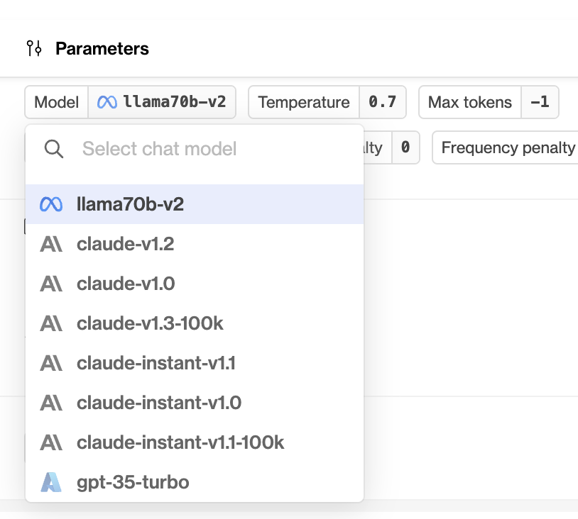
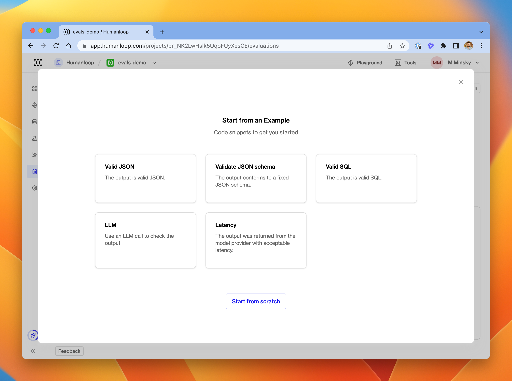
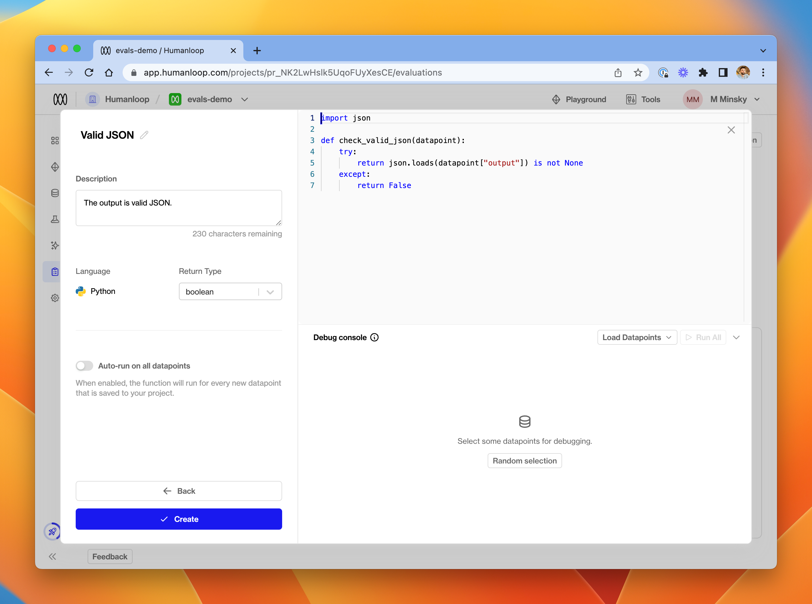
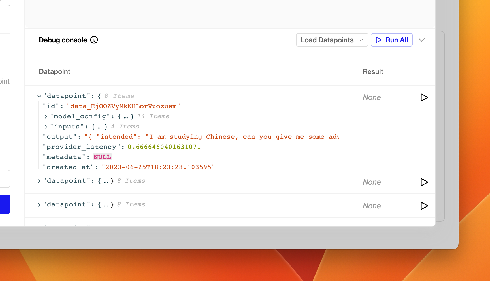
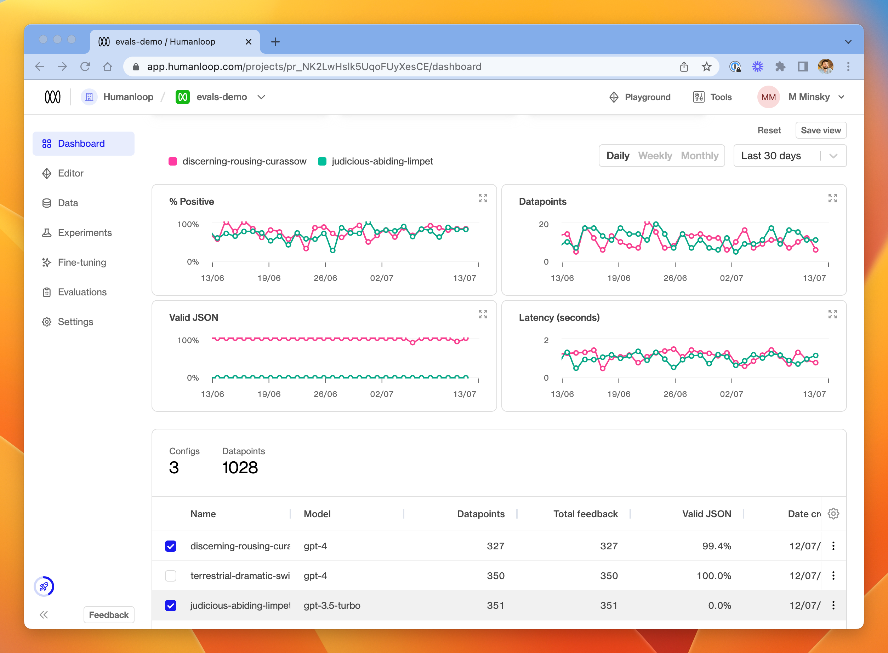
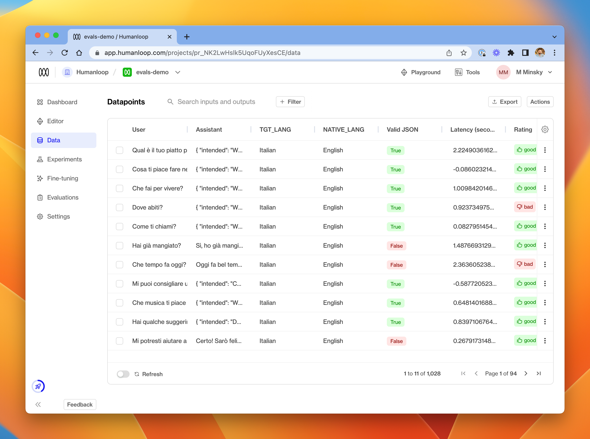
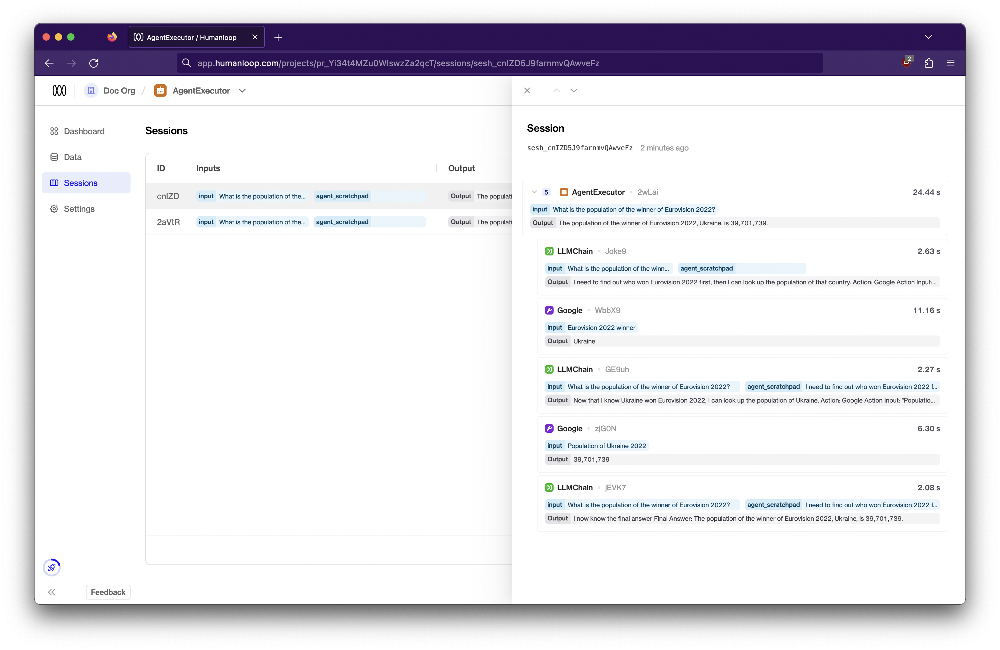
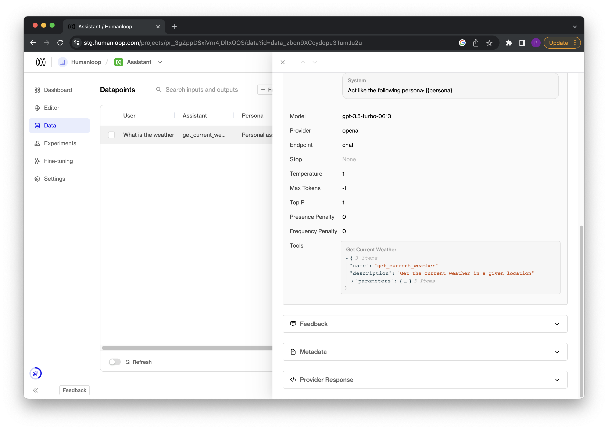

## Improved error handling

_July 30th, 2023_

We've unified how errors returned by model providers are handled and enabled error monitoring using [eval functions](/docs/guides/evaluate-your-model).

A common production pain point we see is that hosted SOTA language models can still be flaky at times, especially at real scale. With this release, Humanloop can help users better understand the extent of the problem and guide them to different models choices to improve reliability.

### Unified errors

Our users integrate the Humanloop `/chat` and `/completion` API endpoints as a unified interface into all the popular model providers including OpenAI, Anthropic, Azure, Cohere, etc. Their Humanloop projects can then be used to manage model experimentation, versioning, evaluation and deployment.

Errors returned by these endpoints may be raised by the model provider's system. With this release we've updated our API to map all the error behaviours from different model providers to a unified set of [error response codes](/docs/api-reference/errors#http-error-codes).

We've also extended our error responses to include more details of the error with fields for `type`, `message`, `code` and `origin`. The `origin` field indicates if the error originated from one of the integrated model providers systems, or directly from Humanloop.

For example, for our `/chat ` endpoint where we attempt to call OpenAI with an invalid setting for `max_tokens`, the message returned is that raised by OpenAI and the origin is set to OpenAI.

```json
{
  "type": "unprocessable_entity_error",
  "message": "This model's maximum context length is 4097 tokens. However, you requested 10000012 tokens (12 in the messages, 10000000 in the completion). Please reduce the length of the messages or completion.",
  "code": 422,
  "origin": "OpenAI"
}
```

### Monitor model reliability with evals

With this release, all errors returned from the different model providers are now persisted with the corresponding input data as datapoints on Humanloop. Furthermore this error data is made available to use within [evaluation functions](/docs/guides/evaluate-your-model).

You can now turn on the **Errors** eval function, which tracks overall error rates of the different model variations in your project. Or you can customise this template to track more specific error behaviour.


---

## OpenAI functions in Playground

_July 25th, 2023_

We've added support for [OpenAI functions](https://platform.openai.com/docs/guides/gpt/function-calling) to our playground!

This builds on our [API support](https://humanloop.com/docs/changelog/2023/7/3) and allows you to easily experiment with OpenAI functions within our playground UI.

OpenAI functions are implemented as [tools](https://humanloop.com/docs/guides/set-up-semantic-search) on Humanloop. Tools follow the same universal [json-schema](https://json-schema.org/) definition as OpenAI functions. You can now define tools as part of your model configuration in the playground. These tools are sent as OpenAI functions when running the OpenAI chat models that support function calling.

The model can choose to return a JSON object containing the arguments needed to call a function. This object is displayed as a special assistant message within the playground. You can then provide the result of the call in a message back to the model to consider, which simulates the function calling workflow.

### Use tools in Playground

Take the following steps to use tools for function calling in the playground:

1. **Find tools:** Navigate to the playground and locate the `Tools` section. This is where you'll be able to manage your tool definitions.


2. **Create a new tool:** Click on the "Add Tool" button. There are two options in the dropdown: create a new tool or to start with one of our examples. You define your tool using the [json-schema](https://json-schema.org/) syntax. This represents the function definition sent to OpenAI.


3. **Edit a tool:** To edit an existing tool, simply click on the tool in the Tools section and make the necessary changes to its json-schema definition. This will result in a new model configuration.


4. **Run a model with tools:** Once you've defined your tools, you can run the model by pressing the "Run" button.
   1. If the model chooses to call a function, an assistant message will be displayed with the corresponding tool name and arguments to use.
   2. A subsequent `Tool` message is then displayed to simulate sending the results of the call back to the model to consider.


5. **Save your model config with tools** by using the **Save** button. Model configs with tools defined can then deployed to [environments](/docs/guides/deploy-to-an-environment) as normal.

**Coming soon**

Provide the runtime for your tool under the existing pre-defined [Tools section ](https://app.humanloop.com/tools) of your organization on Humanloop.

---

## Llama 2

_July 24th, 2023_

We've added support for Llama 2!

You can now select `llama70b-v2` from the model dropdown in the Playground and Editor. You don't currently need to provide an API key or any other special configuration to get Llama 2 access via Humanloop. 




Read more about the latest version of Llama [here](https://ai.meta.com/llama/) and in the [original announcement](https://about.fb.com/news/2023/07/llama-2/).

---

## Claude 2

_July 17th, 2023_

We've added support for Anthropic's latest model Claude 2.0!

Read more about the latest Claude [here](https://www.anthropic.com/index/claude-2).

---

## Evaluators

_July 7th, 2023_

We've added **Evaluators** to Humanloop in beta! 

Evaluators allow you to quantitatively define what constitutes a good or bad output from your models. Once set up, you can configure an Evaluators to run automatically across all new datapoints as they appear in your project; or, you can simply run it manually on selected datapoints from the **Data** tab. 

We're going to be adding lots more functionality to this feature in the coming weeks, so check back for more!

### Create an Evaluator

If you've been given access to the feature, you'll see a new **Evaluations** tab in the Humanloop app. To create your first evaluation function, select **+ New Evaluator**. In the dialog, you'll be presented with a library of example Evaluators, or you can start from scratch.




We'll pick **Valid JSON** for this guide.




In the editor, provide details of your function's name, description and return type. In the code editor, you can provide a function which accepts a `datapoint` argument and should return a value of the chosen type.

Currently, the available return types for an Evaluators are `number` and `boolean`. You should ensure that your function returns the expected data type - an error will be raised at runtime if not.

#### The `Datapoint` argument

The `datapoint` passed into your function will be a Python `dict` with the following structure.

```python
{
    "id":"data_XXXX",          # Datapoint id
    "model_config": {...},     # Model config used to generate the datapoint
    "inputs": {...},           # Model inputs (interpolated into the prompt)
    "output": "...",           # Generated output from the model
    "provider_latency": 0.6,   # Provider latency in seconds
    "metadata": {...},         # Additional metadata attached to the logged datapoint
    "created_at": "...",       # Creation timestamp
    "feedback": [...]          # Array of feedback provided on the datapoint
}
```

To inspect datapoint dictionaries in more detail, click **Random selection** in the debug console at the bottom of the window. This will load a random set of five datapoints from your project, exactly as they will be passed into the Evaluation Function. 




For this demo, we've created a prompt which asks the model to produce valid JSON as its output. The Evaluator uses a simple `json.loads` call to determine whether the output is validly formed JSON - if this call raises an exception, it means that the output is not valid JSON, and we return `False`.

```python
import json
    
def check_valid_json(datapoint):
    try:
        return json.loads(datapoint["output"]) is not None
    except:
        return False
```

#### Debugging

Once you have drafted a Python function, try clicking the run button next to one of the debug datapoints in the debug console. You should shortly see the result of executing your function on that datapoint in the table.


If your Evaluator misbehaves, either by being invalid Python code, raising an unhandled exception or returning the wrong type, an error will appear in the result column. You can hover this error to see more details about what went wrong - the exception string is displayed in the tooltip. 

Once you're happy with your Evaluator, click **Create** in the bottom left of the dialog.

### Activate / Deactivate an Evaluator

Your Evaluators are available across all your projects. When you visit the **Evaluations** tab from a specific project, you'll see all Evaluators available in your organisation.

Each Evaluator has a toggle. If you toggle the Evaluator **on**, it will run on every new datapoint that gets logged to **that** project. (Switch to another project and you'll see that the Evaluator is not yet toggled on if you haven't chosen to do so).

You can deactivate an Evaluator for a project by toggling it back off at any time.

### Aggregations and Graphs

At the top of the **Dashboard** tab, you'll see new charts for each activated Evaluation Function. These display aggregated Evaluation results through time for datapoints in the project. 

At the bottom of the **Dashboard** tab is a table of all the model configs in your project. That table will display a column for each activated Evaluator in the project. The data displayed in this column is an aggregation of all the Evaluation Results (by model config) for each Evaluator. This allows you to assess the relative performance of your models.




#### Aggregation

For the purposes of both the charts and the model configs table, aggregations work as follows for the different return types of Evaluators:

- `Boolean`: percentage returning `True` of the total number of evaluated datapoints
- `Number`: average value across all evaluated datapoints

### Data logs

In the **Data** tab, you'll also see that a column is visible for each activated Evaluator, indicating the result of running the function on each datapoint.




From this tab, you can choose to re-run an Evaluator on a selection of datapoints. Either use the menu at the far right of a single datapoint, or select multiple datapoints and choose **Run evals** from the **Actions** menu in the top right. 

### Available Modules

The following Python modules are available to be imported in your Evaluation Function:

- `math`
- `random`
- `datetime`
- `json` (useful for validating JSON grammar as per the example above)
- `jsonschema` (useful for more fine-grained validation of JSON output - see the in-app example)
- `sqlglot` (useful for validating SQL query grammar)
- `requests` (useful to make further LLM calls as part of your evaluation - see the in-app example for a suggestion of how to get started).

Let us know if you would like to see more modules available.

---

## Chain LLM calls

_July 5th, 2023_

We've introduced sessions to Humanloop, allowing you to link multiple calls together when building a chain or agent.

Using sessions with your LLM calls helps you troubleshoot and improve your chains and agents.



### Adding a datapoint to a session

To log your LLM calls to a session, you just need to define a unique identifier for the session and pass it into your Humanloop calls with `session_reference_id`.

For example, using `uuid4()` to generate this ID,

```python
import uuid
session_reference_id = str(uuid.uuid4())

response = humanloop.complete(
    project="sessions_example_assistant",
    model_config={
        "prompt_template": "Question: {{user_request}}\nGoogle result: {{google_answer}}\nAnswer:\n",
        "model": "text-davinci-002",
        "temperature": 0,
    },
    inputs={"user_request": user_request, "google_answer": google_answer},
    session_reference_id=session_reference_id,
)
```

Similarly, our other methods such as `humanloop.complete_deployed()`, `humanloop.chat()`, and `humanloop.log()` etc. support `session_reference_id`.

If you're using our API directly, you can pass `session_reference_id` within the request body in your `POST /v4/completion` etc. endpoints.

### Further details

For a more detailed walkthrough on how to use `session_reference_id`, check out [our guide](/docs/guides/logging-session-traces) that runs through how to record datapoints to a session in an example script.

---

## Introducing Tools

_July 3rd, 2023_

Today we’re announcing Tools as a part of Humanloop.

Tools allow you to connect an LLM to any API and to an array of data sources to give it extra capabilities and access to private data. Under your organization settings on Humanloop you can now configure and manage tools in a central place.

Read more on [our blog](https://humanloop.com/blog/announcing-tools) and see an example of setting up a [tool for semantic search](/docs/guides/set-up-semantic-search).

---

## OpenAI functions API

_July 3rd, 2023_

We've updated our APIs to support [OpenAI function calling](https://platform.openai.com/docsgpt/function-calling).

OpenAI functions are now supported as tools on Humanloop. This allows you to pass tool definitions as part of the model configuration when calling our `chat` and `log` endpoints. For the latest OpenAI models `gpt-3.5-turbo-0613` and `gpt-4-0613` the model can then choose to output a JSON object containing arguments to call these tools.

This unlocks getting more reliable structured data back from the model and makes it easier to create useful agents.

### Recap on OpenAI functions

As described in the [OpenAI documentation](https://platform.openai.com/docsgpt/function-calling), the basic steps for using functions are:

1. Call one of the models `gpt-3.5-turbo-0613` and `gpt-4-0613` with a user query and a set of function definitions described using the universal [json-schema](https://json-schema.org/) syntax.
2. The model can then choose to call one of the functions provided. If it does, a stringified JSON object adhering to your json schema definition will be returned.
3. You can then parse the string into JSON in your code and call the chosen function with the provided arguments (**NB:** the model may hallucinate or return invalid json, be sure to consider these scenarios in your code).
4. Finally call the model again by appending the function response as a new message. The model can then use this information to respond to the original use query.

OpenAI have provided a simple example in their docs for a `get_current_weather` function that we will show how to adapt to use with Humanloop:

```python
import openai
import json


# Example dummy function hard coded to return the same weather
# In production, this could be your backend API or an external API
def get_current_weather(location, unit="fahrenheit"):
    """Get the current weather in a given location"""
    weather_info = {
        "location": location,
        "temperature": "72",
        "unit": unit,
        "forecast": ["sunny", "windy"],
    }
    return json.dumps(weather_info)


def run_conversation():
    # Step 1: send the conversation and available functions to GPT
    messages = [{"role": "user", "content": "What's the weather like in Boston?"}]
    functions = [
        {
            "name": "get_current_weather",
            "description": "Get the current weather in a given location",
            "parameters": {
                "type": "object",
                "properties": {
                    "location": {
                        "type": "string",
                        "description": "The city and state, e.g. San Francisco, CA",
                    },
                    "unit": {"type": "string", "enum": ["celsius", "fahrenheit"]},
                },
                "required": ["location"],
            },
        }
    ]
    response = openai.ChatCompletion.create(
        model="gpt-3.5-turbo-0613",
        messages=messages,
        functions=functions,
        function_call="auto",  # auto is default, but we'll be explicit
    )
    response_message = response["choices"][0]["message"]

    # Step 2: check if GPT wanted to call a function
    if response_message.get("function_call"):
        # Step 3: call the function
        # Note: the JSON response may not always be valid; be sure to handle errors
        available_functions = {
            "get_current_weather": get_current_weather,
        }  # only one function in this example, but you can have multiple
        function_name = response_message["function_call"]["name"]
        fuction_to_call = available_functions[function_name]
        function_args = json.loads(response_message["function_call"]["arguments"])
        function_response = fuction_to_call(
            location=function_args.get("location"),
            unit=function_args.get("unit"),
        )

        # Step 4: send the info on the function call and function response to GPT
        messages.append(response_message)  # extend conversation with assistant's reply
        messages.append(
            {
                "role": "function",
                "name": function_name,
                "content": function_response,
            }
        )  # extend conversation with function response
        second_response = openai.ChatCompletion.create(
            model="gpt-3.5-turbo-0613",
            messages=messages,
        )  # get a new response from GPT where it can see the function response
        return second_response


print(run_conversation())
```

### Using with Humanloop tools

OpenAI functions are treated as tools on Humanloop. Tools conveniently follow the same universal json-schema definition as OpenAI functions.

We've expanded the definition of our model configuration to also include tool definitions. Historically the model config is made up of the chat template, choice of base model and any hyper-parameters that change the behaviour of the model.

In the cases of OpenAIs `gpt-3.5-turbo-0613` and `gpt-4-0613` models, any tools defined as part of the model config are passed through as functions for the model to use.

You can now specify these tools when using the Humanloop chat endpoint (as a replacement for OpenAI's ChatCompletion), or when using the Humanloop log endpoint in addition to the OpenAI calls:

#### Chat endpoint

We show here how to update the `run_conversation()` method from the OpenAI example to instead use the Humanloop chat endpoint with tools:

```python
from humanloop import Humanloop

hl = Humanloop(
  	# get your API key here: https://app.humanloop.com/account/api-keys
    api_key="YOUR_API_KEY",
)

def run_conversation():
    # Step 1: send the conversation and available functions to GPT
    messages = [{"role": "user", "content": "What's the weather like in Boston?"}]
    # functions are referred to as tools on Humanloop, but follows the same schema
		tools = [
        {
            "name": "get_current_weather",
            "description": "Get the current weather in a given location",
            "parameters": {
                "type": "object",
                "properties": {
                    "location": {
                        "type": "string",
                        "description": "The city and state, e.g. San Francisco, CA",
                    },
                    "unit": {"type": "string", "enum": ["celsius", "fahrenheit"]},
                },
                "required": ["location"],
            },
        }
    ]
    response = hl.chat(
      project="Assistant",
      model_config={
        "model": "gpt-3.5-turbo-0613",
      	"tools": tools
      },
      messages=messages
    )
    response = response.body.data[0]

    # Step 2: check if GPT wanted to call a tool
    if response.get("tool_call"):
        # Step 3: call the function
        # Note: the JSON response may not always be valid; be sure to handle errors
        available_functions = {
            "get_current_weather": get_current_weather,
        }  # only one function in this example, but you can have multiple
        function_name = response_message["function_call"]["name"]
        fuction_to_call = available_functions[function_name]
        function_args = json.loads(response["tool_call"]["arguments"])
        function_response = fuction_to_call(
            location=function_args.get("location"),
            unit=function_args.get("unit"),
        )

        # Step 4: send the response back to the model
        messages.append(response_message)
        messages.append(
            {
                "role": "tool",
                "name": function_name,
                "content": function_response,
            }
        )
        second_response = hl.chat(
          project="Assistant",
          model_config={
            "model": "gpt-3.5-turbo-0613",
            "tools": tools
          },
          messages=messages
        )
        return second_response
```

After running this snippet, the model configuration recorded on your project in Humanloop will now track what tools were provided to the model and the logged datapoints will provide details of the tool called to inspect:



#### Log endpoint

Alternatively, you can also use the explicit Humanloop log alongside your existing OpenAI calls to achieve the same result:

```python
from humanloop import Humanloop

hl = Humanloop(
  	# get your API key here: https://app.humanloop.com/account/api-keys
    api_key="YOUR_API_KEY",
)

def run_conversation():
    # Step 1: send the conversation and available functions to GPT
    messages = [{"role": "user", "content": "What's the weather like in Boston?"}]
    functions = [
        {
            "name": "get_current_weather",
            "description": "Get the current weather in a given location",
            "parameters": {
                "type": "object",
                "properties": {
                    "location": {
                        "type": "string",
                        "description": "The city and state, e.g. San Francisco, CA",
                    },
                    "unit": {"type": "string", "enum": ["celsius", "fahrenheit"]},
                },
                "required": ["location"],
            },
        }
    ]
    response = openai.ChatCompletion.create(
        model="gpt-3.5-turbo-0613",
        messages=messages,
        functions=functions,
        function_call="auto",  # auto is default, but we'll be explicit
    )
    response_message = response["choices"][0]["message"]

		# log the result to humanloop
    log_response = hl.log(
       project="Assistant",
          model_config={
            "model": "gpt-3.5-turbo-0613",
            "tools": tools,
          },
          messages=messages,
      		tool_call=response_message.get("function_call")
    )

    # Step 2: check if GPT wanted to call a function
    if response_message.get("function_call"):
        # Step 3: call the function
        # Note: the JSON response may not always be valid; be sure to handle errors
        available_functions = {
            "get_current_weather": get_current_weather,
        }  # only one function in this example, but you can have multiple
        function_name = response_message["function_call"]["name"]
        fuction_to_call = available_functions[function_name]
        function_args = json.loads(response_message["function_call"]["arguments"])
        function_response = fuction_to_call(
            location=function_args.get("location"),
            unit=function_args.get("unit"),
        )

        # Step 4: send the info on the function call and function response to GPT
        messages.append(response_message)  # extend conversation with assistant's reply
        messages.append(
            {
                "role": "function",
                "name": function_name,
                "content": function_response,
            }
        )  # extend conversation with function response
        second_response = openai.ChatCompletion.create(
            model="gpt-3.5-turbo-0613",
            messages=messages,
        )  # get a new response from GPT where it can see the function response

        log_response = hl.log(
          project="Assistant",
          model_config={
                  "model": "gpt-3.5-turbo-0613",
                  "tools": tools,
          },
          messages=messages,
          output=second_response["choices"][0]["message"]["content"],
    )
    return second_response


print(run_conversation())
```

### Coming soon

Support for defining tools in the playground!
