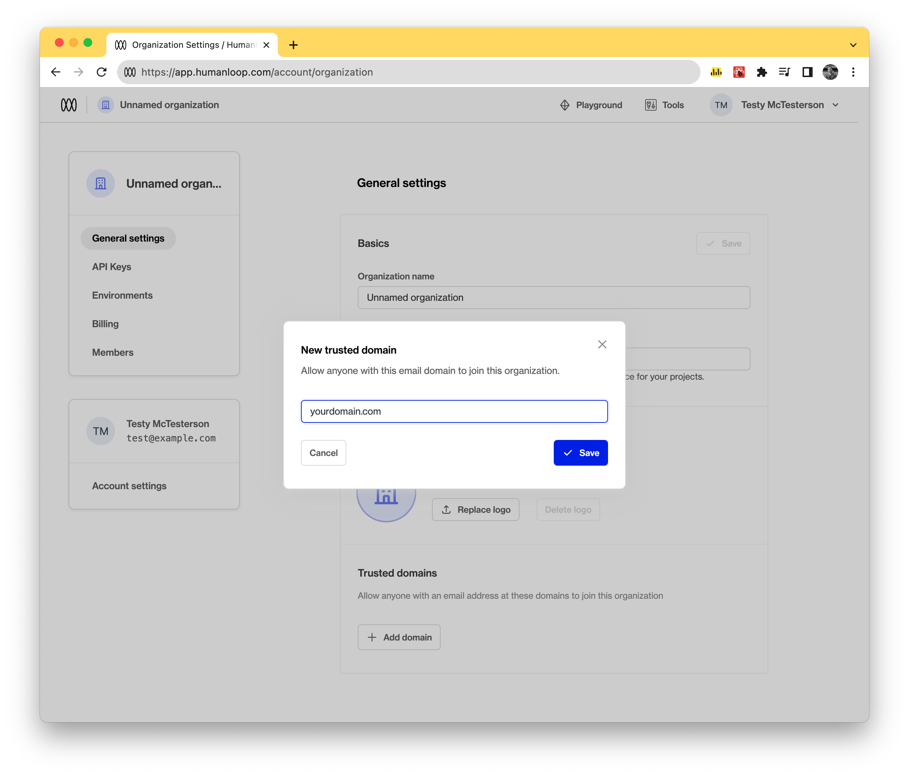
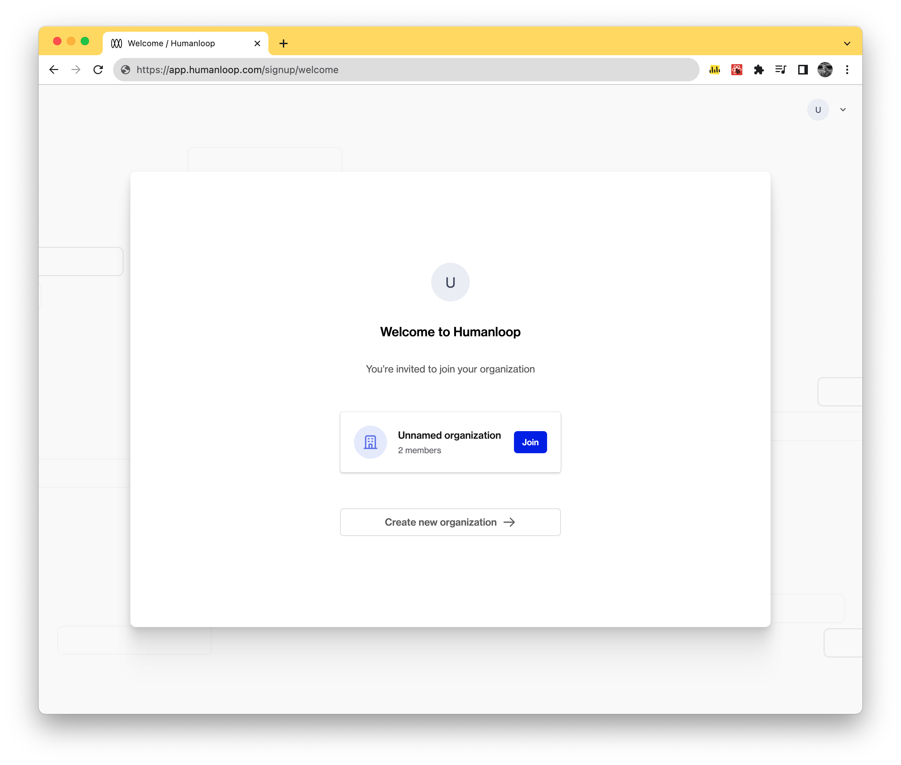
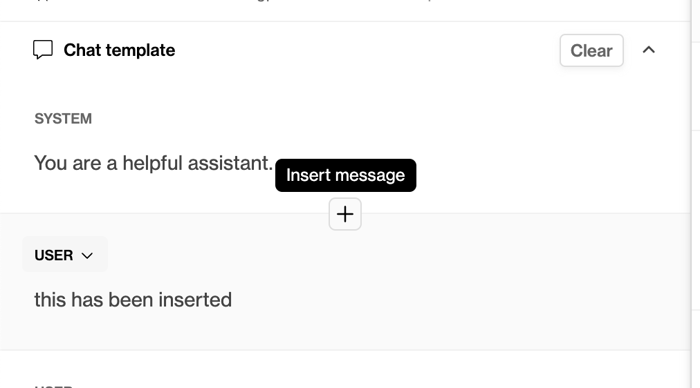
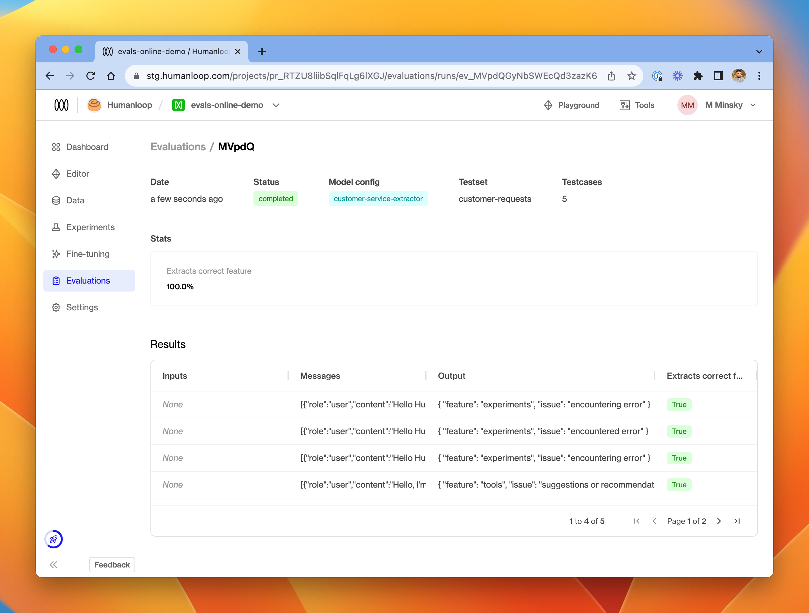

## Allow trusted email domains

_August 31st, 2023_

You can now add **trusted email domains** to your organization. Adding trusted email domains allows new users, when creating an account with a matching email, to join your organization without requiring an invite.

### Managing trusted domains

Adding and removing trusted email domains is controlled from your organizations [General settings](https://app.humanloop.com/account/organization) page.

<Info> 
Only Admins can manage trusted domains for an organization.
</Info>

To add a new trusted domain press the **Add domain** button and enter the domains trusted by your organization. The domains added here will check against new users signing up to Humanloop and if there is a match those users will be given the option to join your organization. 

### Signup for new users

New users signing up to Humanloop will see the following screen when they signup with an email that matches and organizations trusted email domain. By pressing Join they will be added to the matching organization. 

---

## Editor - insert new message within existing chat

_August 21st, 2023_

You can now insert a new message within an existing chat in our Editor. Click the plus button that appears between the rows.

---

## Claude Instant 1.2

_August 15th, 2023_

We've added support for Anthropic's latest model Claude instant 1.2! Claude Instant is the faster and lower-priced yet still very capable model from Anthropic, great for use cases where low latency and high throughput are required. 

You can use Claude instant 1.2 directly within the Humanloop playground and deployment workflows.

Read more about the latest Claude instant model [here](https://www.anthropic.com/index/releasing-claude-instant-1-2).

---

## Offline evaluations with testsets

_August 14th, 2023_

We're continuing to build and release more functionality to Humanloop's evaluations framework!

Our first release provided the ability to run **online evaluators** in your projects. Online evaluators allow you to monitor the performance of your live deployments by defining functions which evaluate all new datapoints in real time as they get logged to the project.

Today, to augment online evaluators, we are releasing **offline evaluators** as the second part of our evaluations framework.

Offline evaluators provide the ability to test your prompt engineering efforts rigorously in development and CI. Offline evaluators test the performance of your model configs against a pre-defined suite of **testcases** - much like unit testing in traditional programming.

With this framework, you can use test-driven development practices to iterate and improve your model configs, while monitoring for regressions in CI.

To learn more about how to use online and offline evaluators, check out the [Evaluate your model](/docs/guides/evaluate-your-model) section of our guides.

