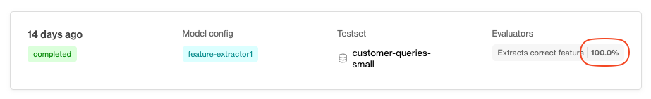
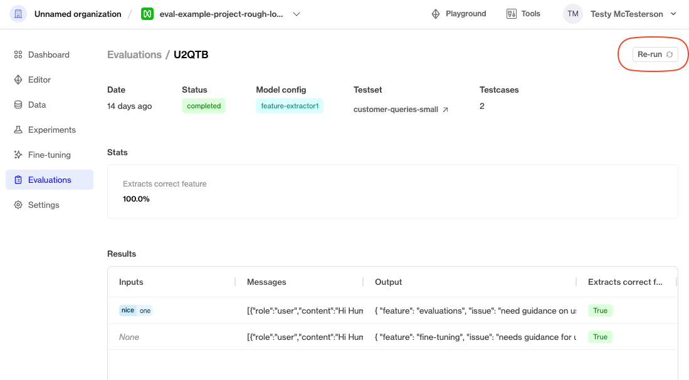
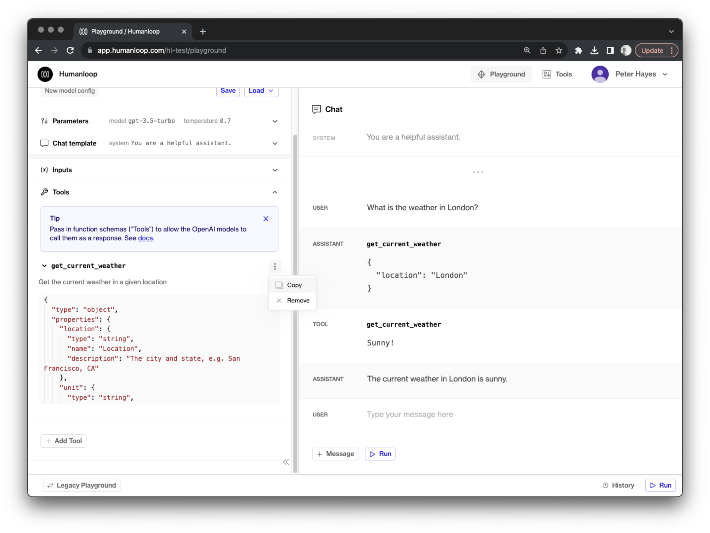
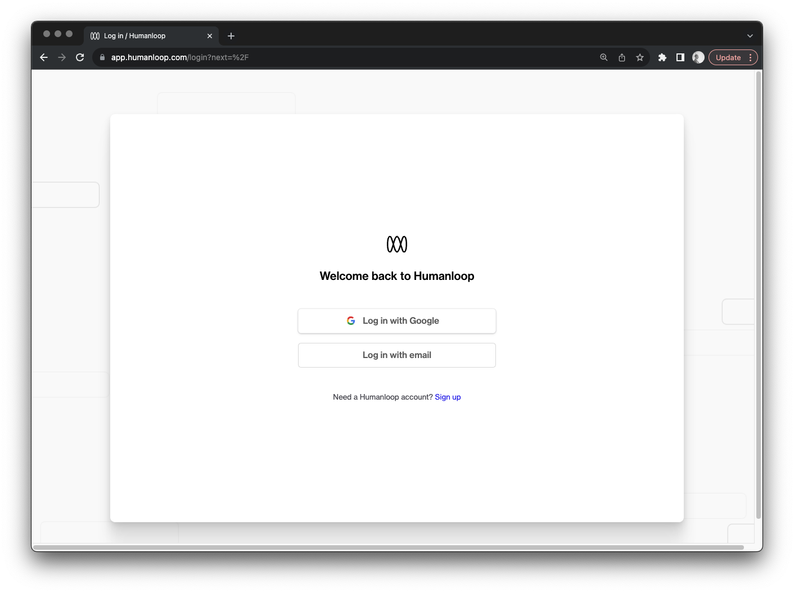

## Evaluations improvements

_September 15th, 2023_

We've released a couple of minor useability improvements in the evaluations workflow.

### Summary statistics for evaluation runs

When reviewing past runs of evaluations, you can now see summary statistics for each evaluator before clicking into the detail view, allowing for easier comparison between runs.



### Re-running evaluations

To enable easier re-running of past evaluations, you can now click the **Re-run** button in the top-right of the evaluation detail view.



---

## Editor - copy tools

_September 15th, 2023_

Our Editor environment let's users incorporate [OpenAI function calling](https://openai.com/blog/function-calling-and-other-api-updates) into their prompt engineering workflows by defining tools. Tools are made available to the model as functions to call using the same universal JSON schema format. 

As part of this process it can be helpful to copy the full JSON definition of the tool for quickly iterating on new versions, or copy and pasting it into code. You can now do this directly from the tool definition in Editor:




Selecting the Copy button adds the full JSON definition of the tool to your clipboard:

```json
{
  "name": "get_current_weather",
  "description": "Get the current weather in a given location",
  "parameters": {
    "type": "object",
    "properties": {
      "location": {
        "type": "string",
        "name": "Location",
        "description": "The city and state, e.g. San Francisco, CA"
      },
      "unit": {
        "type": "string",
        "name": "Unit",
        "enum": [
          "celsius",
          "fahrenheit"
        ]
      }
    },
    "required": [
      "location"
    ]
  }
}
```

---

## Single sign on (SSO)

_September 15th, 2023_

We've added support for SOO to our signup, login and invite flows. By default users can now use their Gmail accounts to access Humanloop. 

For our enterprise customers, this also unlocks the ability for us to more easily support their SAML-based single sign-on (SSO) set ups.  



---

## Organization slug in URLs

_September 13th, 2023_

We have altered routes specific to your organization to include the organization slug. The organization slug is a unique value that was derived from your organization name when your organization was created.

For project paths we've dropped the `projects` label in favour of a more specific `project` label. 

An example of what this looks like can be seen below:


<Check title="Existing bookmarks and links will continue to work">
When a request is made to one of the legacy URL paths, we'll redirect it to the corresponding new path. Although the legacy routes are still supported, we encourage you to update your links and bookmarks to adopt the new naming scheme.
</Check>

### Updating your organization slug

The organization slug can be updated by organization administrators. This can be done by navigating to the [general settings](https://app.humanloop.com/account/organization) page. Please exercise caution when changing this, as it will affect the URLs across the organization. 

