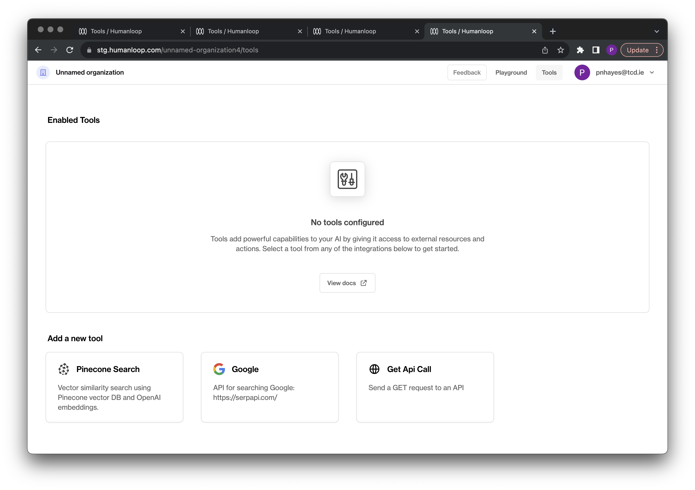
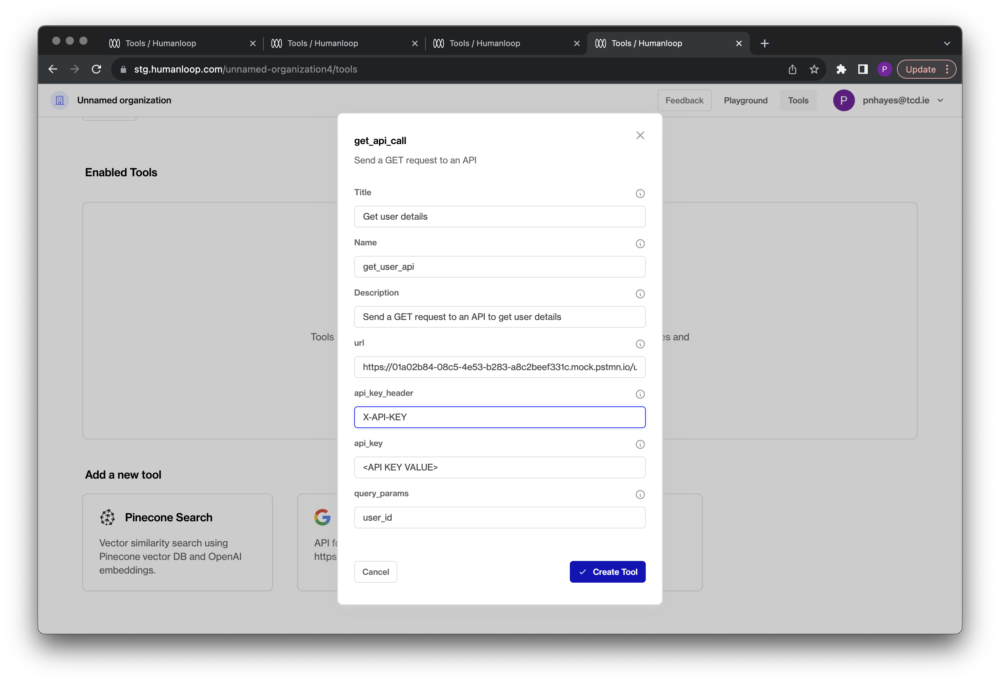
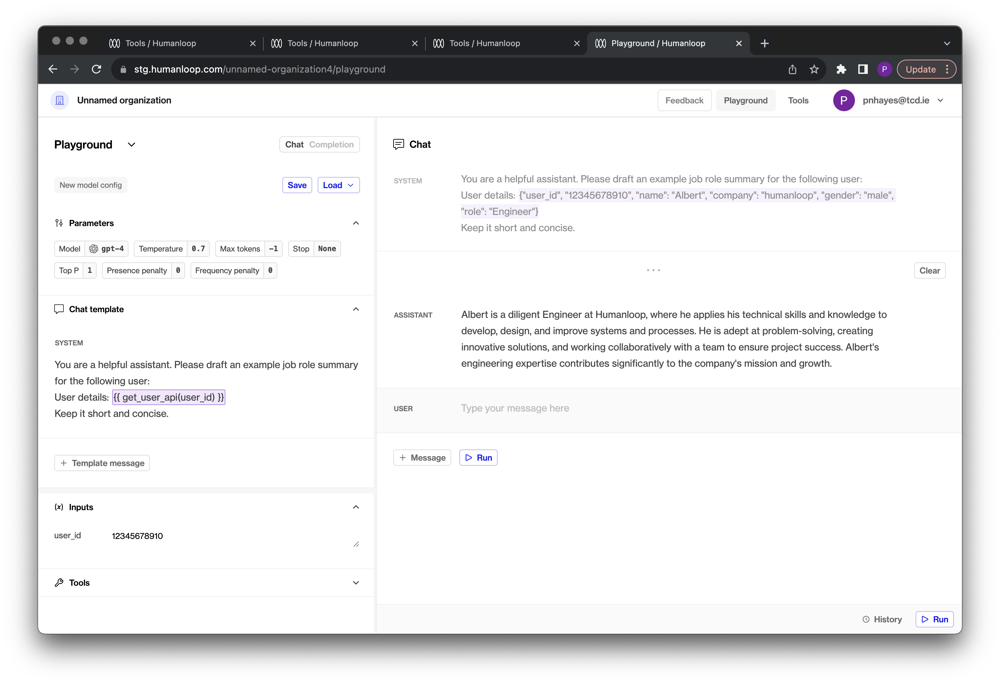

## Local editor history

_October 30th, 2023_

The Humanloop playground and editor now save history locally as you make edits, giving you complete peace of mind that your precisely-crafted prompts will not be lost due to an accidental page reload or navigating away.


Local history entries will be saved as you use the playground (e.g. as you modify your model config, make generations, or add messages). These will be visible under the **Local** tab within the history side panel. Local history is saved to your browser and is only visible to you.

Our shared history feature, where all playground generations are saved, has now been moved under the **Shared** tab in the history side panel.

---

## Project folders

_October 17th, 2023_

You can now organize your projects into folders! 

Logging in to Humanloop will bring you to the new page where you can start arranging your projects.


Navigate into folders and open projects by clicking on the row. To go back to a parent folder, click on the displayed breadcrumbs (e.g. "Projects" or "Development" in the above screenshot).

***

### Search

Searching will give you a list of directories and projects with a matching name.


### Moving multiple projects

You can move a group of projects and directories by selecting them and moving them together.

1. Select the projects you want to move.  
   Tip: Put your cursor on a project row and press [x] to select the row.
2. To move the selected projects into a folder, drag and drop them into the desired folder.


To move projects out of a folder and into a parent folder, you can drag and drop them onto the parent folder breadcrumbs:


To move projects into deeply nested folders, it might be easier to select your target directory manually. To do so, select the projects you wish to move and then click the blue **Actions** button and then click **Move ...** to bring up a dialog allowing you to move the selected projects.


***

If you prefer the old view, we've kept it around for now. Let us know what you're missing from the new view so we can improve it.


---

## Datasets

_October 16th, 2023_

We've introduced **Datasets** to Humanloop. Datasets are collections of **Datapoints**, which represent input-output pairs for an LLM call.

We recently released **Datasets** in our Evaluations beta, by the name **Evaluation Testsets**. We're now promoting the concept to a first-class citizen within your projects. If you've previously been using testsets in the evaluations beta, you'll see that your testsets have now automatically migrated to datasets.

Datasets can be created via CSV upload, converting from existing Logs in your project, or by API requests.

See our [guides on datasets](/docs/guides/datasets), which show how to upload from CSV and perform a batch generation across the whole dataset.


Clicking into a dataset, you can explore its datapoints.


A dataset contains a collection of prompt variable **inputs** (the dynamic values which are interpolated into your model config prompt template at generation-time), as well as a collection of **messages** forming the chat history, and a **target** output with data representing what we expect the model to produce when it runs on those inputs.

Datasets are useful for evaluating the behaviour of you model configs across a well-defined collection of test cases. You can use datasets to check for regressions as you iterate your model configs, knowing that you are checking behaviour against a deterministic collection of known important examples.

Datasets can also be used as collections of input data for **fine-tuning** jobs.

---

## GET API tool

_October 10th, 2023_

We've added support for a tool that can make GET calls to an external API.

This can be used to dynamically retrieve context for your prompts. For example, you may wish to get additional information about a user from your system based on their ID, or look up additional information based on a query from a user.

To set up the tool you need to provide the following details for your API:

| Tool parameter   | Description                                                                 | Example                            |
| ---------------- | --------------------------------------------------------------------------- | ---------------------------------- |
| Name             | A unique tool name to reference as a call signature in your prompts         | `get_api_tool`                     |
| URL              | The URL for your API endpoint                                               | https://your-api.your-domain.com   |
| API Key Header   | The authentication header required by your endpoint.                        | `X-API-KEY`                        |
| API Key          | The API key value to use in the authentication header.                      | `sk_1234567891011121314`           |
| Query parameters | A comma delimited list of the query parameters to set when making requests. | user_query, client_id              |

### Define your API

First you will need to define your API. For demo purposes, we will create a [mock endpoint in postman](https://learning.postman.com/docs/designing-and-developing-your-api/mocking-data/setting-up-mock/). Our [mock endpoint](https://www.postman.com/humanloop/workspace/humanloop/request/12831443-9c48e591-b7b2-4a17-b56a-8050a133e1b5) simply returns details about a mock user given their `user_id`. 

A call to our Mock API in Python is as follows; note the query parameter `user_id`

```python
import requests

url = "https://01a02b84-08c5-4e53-b283-a8c2beef331c.mock.pstmn.io/users?user_id=01234567891011"
headers = {
  'X-API-KEY': '<API KEY VALUE>'
}
response = requests.request("GET", url, headers=headers)
print(response.text)

```

And returns the response:

```json
{
  "user_id", "012345678910",
  "name": "Albert",
  "company": "Humanloop",
  "role": "Engineer"
}
```

We can now use this tool to inject information for a given user into our prompts.

### Set up the tool

Navigate to the [tools tab](https://app.humanloop.com/hl-test/tools) in your organisation and select the `Get API Call ` tool card:




Configure the tool with your API details:




### Use the tool

Now your API tool is set up, you can use it to populate input variables in your prompt templates. Double curly bracket syntax is used to call a tool in the template. The call signature is the unique tool name with arguments for the query parameters defined when the tool was set up. 

In our mock example, the signature will be:  `get_user_api(user_id)`.

An example prompt template using this tool is: 

```shell
You are a helpful assistant. Please draft an example job role summary for the following user:

User details: {{ get_user_api(user_id) }}
Keep it short and concise.
```

The tool requires an input value to be provided for user_id. In our [playground environment](https://app.humanloop.com/playground) the result of the tool will be shown populated top right above the chat:




### What's next

Explore more complex examples of context stuffing such as defining your own custom RAG service.