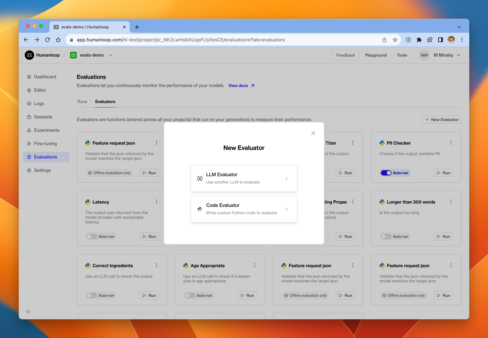
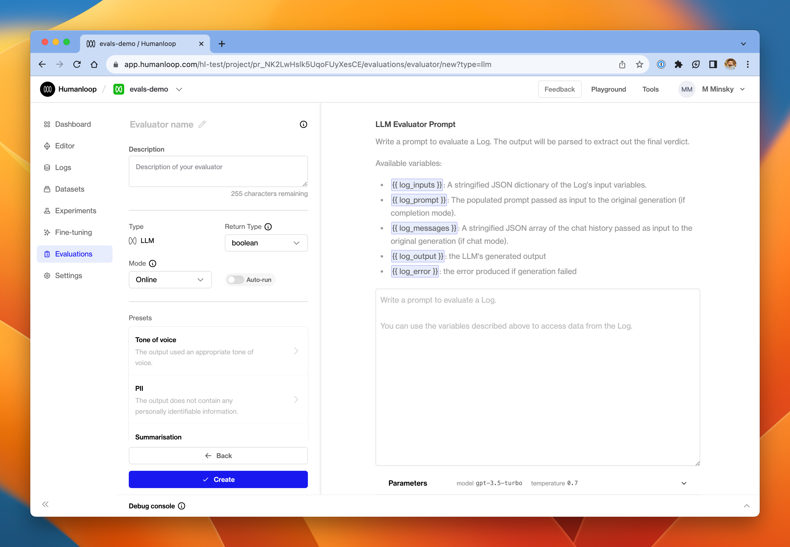
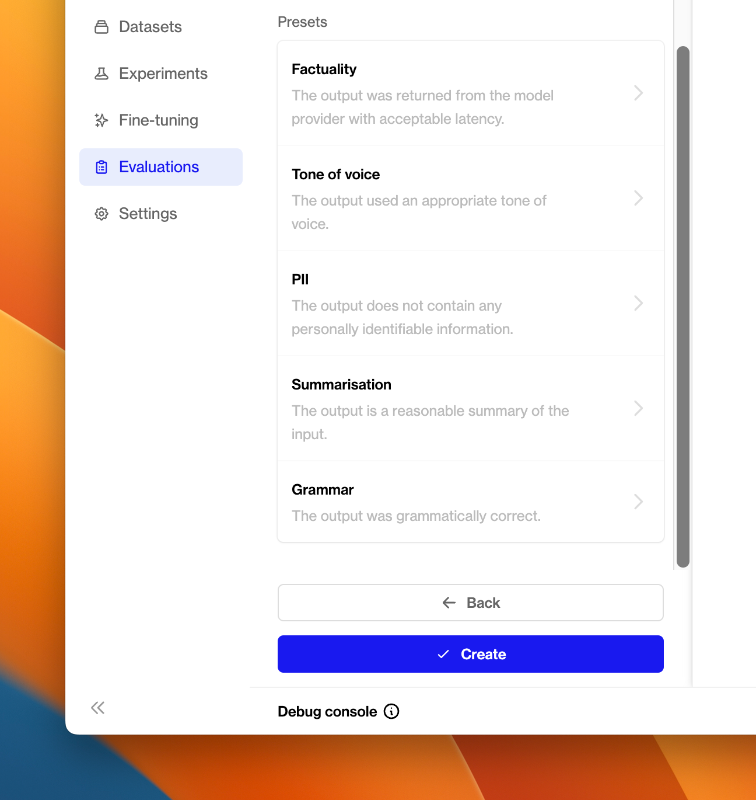
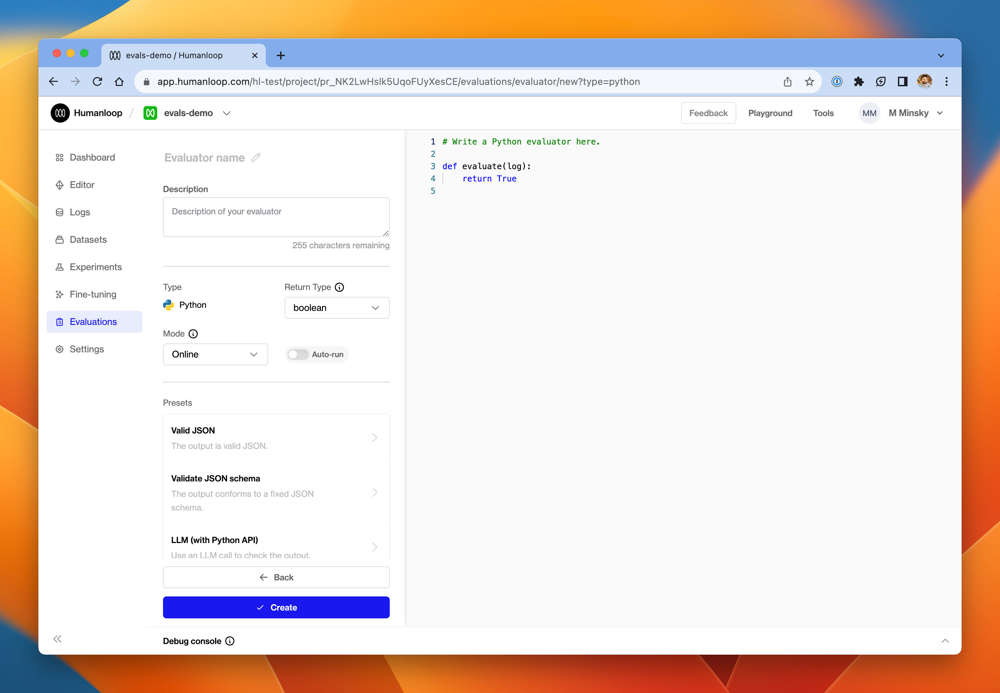
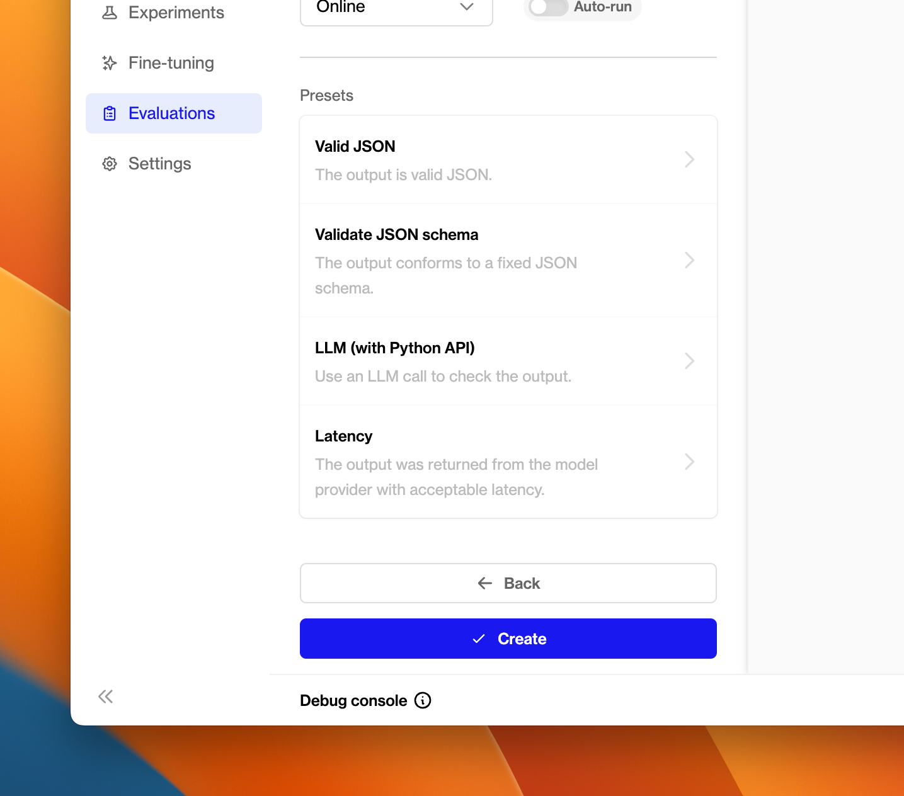

## Improved RBACs

_November 28th, 2023_

We've introduced more levels to our roles based access controls (RBACs).

We now distinguish between different roles to help you better manage your organization's access levels and permissions on Humanloop.

This is the first in a sequence of upgrades we are making around RBACs.

### Organization roles


Everyone invited to the organization can access all projects currently (controlling project access coming soon).

A user can be one of the following rolws:

**Admin:**The highest level of control. They can manage, modify, and oversee the organization's settings and have full functionality across all projects.

**Developer:**(Enterprise tier only) Can deploy prompts, manage environments, create and add API keys, but lacks the ability to access billing or invite others.

**Member:**(Enterprise tier only) The basic level of access. Can create and save prompts, run evaluations, but not deploy. Can not see any org-wide API keys.

### RBACs summary

Here is the full breakdown of roles and access:

| Action                         | Member | Developer | Admin |
| :----------------------------- | :----- | :-------- | :---- |
| Create and manage Prompts      | ✔️     | ✔️        | ✔️    |
| Inspect logs and feedback      | ✔️     | ✔️        | ✔️    |
| Create and manage evaluators   | ✔️     | ✔️        | ✔️    |
| Run evaluations                | ✔️     | ✔️        | ✔️    |
| Create and manage datasets     | ✔️     | ✔️        | ✔️    |
| Create and manage API keys     |        | ✔️        | ✔️    |
| Manage prompt deployments      |        | ✔️        | ✔️    |
| Create and manage environments |        | ✔️        | ✔️    |
| Send invites                   |        |           | ✔️    |
| Set user roles                 |        |           | ✔️    |
| Manage billing                 |        |           | ✔️    |
| Change organization settings   |        |           | ✔️    |

---

## Self hosted evaluations

_November 28th, 2023_

We've added support for managing [evaluations](/docs/guides/evaluate-your-model) outside of Humanloop in your own code.

There are certain use cases where you may wish to run your evaluation process outside of Humanloop, where the evaluator itself is defined in your code as opposed to being defined using our Humanloop runtime.

For example, you may have implemented an evaluator that uses your own custom model, or has to interact with multiple systems. In which case, it can be difficult to define these as a simple code or [LLM evaluator](/docs/guides/use-llms-to-evaluate-logs) within your Humanloop project.

With this kind of setup, our users have found it very beneficial to leverage the datasets they have curated on Humanloop, as well as consolidate all of the results alongside the prompts stored on Humanloop.

To better support this setting, we're releasing additional API endpoints and SDK utilities. We've added endpoints that allow you to:

- Retrieve your curated datasets
- Trigger evaluation runs
- Send evaluation results for your datasets generated using your custom evaluators

Below is a code snippet showing how you can use the latest version of the Python SDK to log an evaluation run to a Humanloop project. For a full explanation, see our [guide](/docs/guides/self-hosted-evaluations) on self-hosted evaluations.

```python
from humanloop import Humanloop

API_KEY = ...
humanloop = Humanloop(api_key=API_KEY)

# 1. Retrieve a dataset
DATASET_ID = ...
datapoints = humanloop.datasets.list_datapoints(DATASET_ID).records

# 2. Create an external evaluator
evaluator = humanloop.evaluators.create(
    name="My External Evaluator",
    description="An evaluator that runs outside of Humanloop runtime.",
    type="external",
    arguments_type="target_required",
    return_type="boolean",
)
# Or, retrieve an existing one:
# evaluator = humanloop.evaluators.get(EVALUATOR_ID)

# 3. Retrieve a model config
CONFIG_ID = ...
model_config = humanloop.model_configs.get(CONFIG_ID)

# 4. Create the evaluation run
PROJECT_ID = ...
evaluation_run = humanloop.evaluations.create(
    project_id=PROJECT_ID,
    config_id=CONFIG_ID,
    evaluator_ids=[EVALUATOR_ID],
    dataset_id=DATASET_ID,
)

# 5. Iterate the datapoints and trigger generations
logs = []
for datapoint in datapoints:
    log = humanloop.chat_model_config(
        project_id=PROJECT_ID,
        model_config_id=model_config.id,
        inputs=datapoint.inputs,
        messages=[
            {key: value for key, value in dict(message).items() if value is not None}
            for message in datapoint.messages
        ],
        source_datapoint_id=datapoint.id,
    ).data[0]
    logs.append((log, datapoint))

# 6. Evaluate the results.
#    In this example, we use an extremely simple evaluation, checking for an exact
#    match between the target and the model's actual output.
for (log, datapoint) in logs:
    # The datapoint target tells us the correct answer.
    target = str(datapoint.target["answer"])

    # The log output is what the model said.
    model_output = log.output

    # The evaluation is a boolean, indicating whether the model was correct.
    result = target == model_output

    # Post the result back to Humanloop.
    evaluation_result_log = humanloop.evaluations.log_result(
        log_id=log.id,
        evaluator_id=evaluator.id,
        evaluation_run_external_id=evaluation_run.id,
        result=result,
    )

# 7. Complete the evaluation run.
humanloop.evaluations.update_status(id=evaluation_run.id, status="completed")

```

## Chat response

We've updated the response models of all of our [/chat](/docs/api-reference/chats/create) API endpoints to include an output message object.

Up to this point, our `chat` and `completion` endpoints had a unified response model, where the `content` of the assistant message returned by OpenAI models was provided in the common `output` field for each returned sample. And any tool calls made were provided in the separate `tool_calls` field.

When making subsequent chat calls, the caller of the API had to use these fields to create a message object to append to the history of messages. So to improve this experience we now added an `output_message` field to the chat response. This is additive and does not represent a breaking change.

**Before:**

```json
{
    "project_id": "pr_GWx6n0lv6xUu3HNRjY8UA",
    "data": [
        {
            "id": "data_Vdy9ZoiFv2B7iYLIh15Jj",
            "index": 0,
            "output": "Well, I gotta say, ...",
            "raw_output": "Well, I gotta say...",
            "finish_reason": "length",
            "model_config_id": "config_VZAPd51sJH7i3ZsjauG2Q",
            "messages": [
                {
                    "content": "what's your best guess...",
                    "role": "user",
                }
            ],
            "tool_calls": null
        }
    ],
...
...
...
}
```

**After:**

```json
{
    "project_id": "pr_GWx6n0lv6xUu3HNRjY8UA",
    "data": [
        {
            "id": "data_Vdy9ZoiFv2B7iYLIh15Jj",
						"output_message": {
                "content": "Well, I gotta say, ...",
                "name": null,
                "role": "assistant",
                "tool_calls": null
            },
            "index": 0,
            "output": "Well, I gotta say, ...",
            "raw_output": "Well, I gotta say...",
            "finish_reason": "length",
            "model_config_id": "config_VZAPd51sJH7i3ZsjauG2Q",
            "messages": [
                {
                    "content": "what's your best guess...",
                    "role": "user",
                }
            ],
            "tool_calls": null,
        }
    ],
...
...
...
}
```

---

## Snippet tool

_November 28th, 2023_

We've added support for managing common text 'snippets' (or 'passages', or 'chunks') that you want to reuse across your different prompts.

This functionality is provided by our new _Snippet tool_. A Snippet tool acts as a simple key/value store, where the key is the name of the common re-usable text snippet and the value is the corresponding text.

For example, you may have some common persona descriptions that you found to be effective across a range of your LLM features. Or maybe you have some specific formatting instructions that you find yourself re-using again and again in your prompts.

Before now, you would have to copy and paste between your editor sessions and keep track of which projects you edited. Now you can instead inject the text into your prompt using the Snippet tool.

### Set up the tool

Navigate to the [tools tab](https://app.humanloop.com/hl-test/tools) in your organisation and select the Snippet tool card.


When the dialog opens, start adding your key/value pairs. In the example below we've defined an Assistants snippet tool that can be used manage some common persona descriptions we feed to the LLM.

<Info> 
You can have up to 10 key/value snippets in a single snippet tool.
</Info>

The **name** field will be how you'll access this tool in the editor. By setting the value as _assistant_ below it means in the editor you'll be able to access this specific tool by using the syntax `{{ assistant(key) }}`.

The **key** is how you'll access the snippet later, so it's recommended to choose something short and memorable.

The **value** is the passage of text that will be included in your prompt when it is sent to the model.


### Use the tool

Now your Snippets are set up, you can use it to populate strings in your prompt templates across your projects. Double curly bracket syntax is used to call a tool in the template. Inside the curly brackets you call the tool.


The tool requires an input value to be provided for the key. In our [editor environment](https://app.humanloop.com/playground) the result of the tool will be shown populated top right above the chat.

Above we created an Assistants tool. To use that in an editor you'd use the `{{ <your-tool-name>(key) }}` so in this case it would be `{{ assistant(key) }}`. When adding that you get an inputs field appear where you can specify your `key`, in the screenshot above we used the `helpful` key to access the `You are a helpful assistant. You like to tell jokes and if anyone asks your name is Sam.`string. This input field can be used to experiment with different key/value pairs to find the best one to suit your prompt.

<Warning title="The snippet will only render in the preview after running the chat">
If you want to see the corresponding snippet to the key you either need to first run the conversation to fetch the string and see it in the preview.
</Warning>

If you have a specific key you would like to hardcode in the prompt, you can define it using the literal key value: `{{ <your-tool-name>("key") }}`, so in this case it would be `{{ assistant("helpful") }}`.


This is particularly useful because you can define passages of text once in a snippet tool and reuse them across multiple prompts, without needing to copy/paste them and manually keep them all in sync.

### What's next

Explore our other tools such as the Google or Pinecone Search. If you have other ideas for helpful integrations please reach out and let us know.

---

## Quality-of-life app improvements

_November 22nd, 2023_

We've been shipping some quality-of-life "little big things" to improve your every day usage of the platform.

### Project switcher throughout the app

We've added the project switcher throughout the app so its easier to jump between Projects from anywhere


### We've tidied up the Editor

With all the new capabilities and changes (tools, images and more) we need to keep a tight ship to stop things from becoming too busy.

We're unifying how we show all your logged generations, in the editor, and in the logs and sessions. We've also changed the font to Inter to be legible at small font sizes. 


### No more accidental blank messages

We've also fixed issues where empty messages would get appended to the chat.

### We've improved keyboard navigation

The keyboard shortcuts have been updated so its now easier to navigate in the log tables (up/down keys), and to run generations in Editor (cmd/ctrl + enter). 

**Thanks for all your requests and tips. Please keep the feedback coming!**

---

## Claude 2.1

_November 21st, 2023_

Today, Anthropic released its latest model, **Claude 2.1**, and we've added support for it in the Humanloop app.


The new model boasts a 200K context window and a reported 2x decrease in hallucination rates.

Additionally, this model introduces tool use to the line-up of Anthropic models. The feature is presently in beta preview, and we'll be adding support for it to Humanloop in the coming days.

Read more about Claude 2.1 in the [official release notes](https://www.anthropic.com/index/claude-2-1).

---

## Parallel tool calling

_November 20th, 2023_

We've added support for parallel tool calls in our Editor and API.

With the release of the latest OpenAI turbo models, the model can choose to respond with more than one tool call for a given query; this is referred to as [parallel tool calling](https://platform.openai.com/docs/guides/function-calling/parallel-function-calling).

### Editor updates

You can now experiment with this new feature in our Editor:

- Select one of the [new turbo models](/changelog/) in the model dropdown.
- Specify a tool in your model config on the left hand side.
- Make a request that would require multiple calls to answer correctly.
- As shown here for a weather example, the model will respond with multiple tool calls in the same message


### API implications

We've added an additional field `tool_calls` to our chat endpoints response model that contains the array of tool calls returned by the model. The pre-existing `tool_call` parameter remains but is now marked as deprecated.

Each element in the `tool_calls` array has an id associated to it. When providing the tool response back to the model for one of the tool calls, the `tool_call_id` must be provided, along with `role=tool` and the `content` containing the tool response.

```python
from humanloop import Humanloop

# Initialize the Humanloop SDK with your API Keys
humanloop = Humanloop(api_key="<YOUR Humanloop API KEY>")

# form of message when providing the tool response to the model
chat_response = humanloop.chat_deployed(
    project_id="<YOUR PROJECT ID>",
  	messages: [
      {
        "role": "tool",
        "content": "Horribly wet"
        "tool_call_id": "call_dwWd231Dsdw12efoOwdd"
      }
   ]
)
```

---

## Python SDK improvements

_November 20th, 2023_

We've improved the response models of our [Python SDK](https://github.com/humanloop/humanloop-python#raw-http-response) and now give users better control over HTTPs timeout settings.

### Improved response model types

As of **versions >= 0.6.0**, our Python SDK methods now return [Pydantic](https://docs.pydantic.dev/latest/) models instead of typed dicts. This improves developer ergonomics around typing and validations.

- Previously, you had to use the [...] syntax to access response values:

```python
chat_response = humanloop.chat(
        # parameters
    )
print(chat_response.project_id)
```

- With Pydantic-based response values, you now can use the . syntax to access response values. To access existing response model from \< 0.6.0, use can still use the .raw namespace as specified in the [Raw HTTP Response section](https://github.com/humanloop/humanloop-python#raw-http-response).

```python
chat_response = humanloop.chat(
        # parameters
    )
print(chat_response.project_id)
```

> 🚧 Breaking change
>
> Moving to >= 0.6.0 does represent a breaking change in the SDK. The underlying API remains unchanged.

### Support for timeout parameter

The default timeout used by [aiohttp](https://docs.aiohttp.org/en/stable/), which our SDK uses is 300 seconds. For very large prompts and the latest models, this can cause timeout errors to occur.

In the latest version of Python SDKs, we've increased the default timeout value to 600 seconds and you can update this configuration if you are still experiencing timeout issues by passing the new timeout argument to any of the SDK methods. For example passing`timeout=1000` will override the timeout to 1000 seconds.

## Multi-modal models

_November 20th, 2023_

We've introduced support for multi-modal models that can take both text and images as inputs!

We've laid the foundations for multi-modal model support as part of our Editor and API. The first model we've configured is OpenAI's [GPT-4 with Vision (GPT-4V)](https://platform.openai.com/docs/guides/vision/vision). You can now select `gpt-4-vision-preview` in the models dropdown and add images to your chat messages via the API.

Let us know what other multi-modal models you would like to see added next!

### Editor quick start

To get started with GPT-4V, go to the Playground, or Editor within your project.

- Select `gpt-4-vision-preview` in the models dropdown.
- Click the **Add images** button within a user's chat message.
- To add an image, either type a URL into the Image URL textbox or select "Upload image" to upload an image from your computer. If you upload an image, it will be converted to a Base64-encoded data URL that represents the image.
- Note that you can add multiple images


To view the images within a log, find the log within the logs table and click on it to open it in a drawer. The images in each chat message be viewed within this drawer.


### API quick start

Assuming you have deployed your `gpt-4-vision-preview` based model config, you can now also include images in messages via the API.

```python
from humanloop import Humanloop

# Initialize the Humanloop SDK with your API Keys
humanloop = Humanloop(api_key="<YOUR Humanloop API KEY>")

# humanloop.chat_deployed(...) will call the active model config on your project.
chat_response = humanloop.chat_deployed(
    project_id="<YOUR PROJECT ID>",
  	messages: [
      {
        "role": "user",
        "content": [
          {
            "type": "image_url",
            "image_url": {
              "detail": "high",
              "url": "https://www.acomaanimalclinictucson.com/wp-content/uploads/2020/04/AdobeStock_288690671-scaled.jpeg"
            }
          }
        ]
)
```

Any generations made will also be viewable from within your projects logs table.

### Limitations

There are some know limitations with the current preview iteration of OpenAI's GPT-4 model to be aware of:

- Image messages are only supported by the `gpt-4-vision-preview` model in chat mode.
- GPT-4V model does not support tool calling or JSON mode.
- You cannot add images to the first `system` message.

---

## JSON mode and seed parameters

_November 20th, 2023_

We've introduced new model config parameters for **JSON mode** and **Seed** in our Editor and API.

With the introduction of the new [OpenAI turbo models](/docs/changelog/2024/01/30) you can now set additional properties that impact the behaviour of the model; `response_format` and `seed`.

<Note title="Further details"> 
> 
See further guidance from OpenAI on the JSON response format [here](https://platform.openai.com/docs/guides/text-generation/json-mode) and reproducing outputs using the seed parameter [here](https://platform.openai.com/docs/guides/text-generation/reproducible-outputs).
</Note>

These new parameters can now optionally contribute to your model config in our Editor and API. Updated values for `response_format` or `seed` will constitute new versions of your model on Humanloop.


<Warning title="JSON mode prompts">
When using JSON mode with the new turbo models, you should still include formatting instructions in your prompt.

In fact, if you do not include the word 'json' anywhere in your prompt, OpenAI will return a validation error currently.
</Warning>

---

## LLM Evaluators

_November 17th, 2023_

Until now, it's been possible to trigger LLM-based evaluations by writing Python code that uses the Humanloop API to trigger the LLM generations.

Today, in order to make this increasingly important workflow simpler and more intuitive, we're releasing **LLM Evaluators**, which require no Python configuration.

From the Evaluations page, click **New Evaluator** and select LLM Evaluator.




Instead of a code editor, the right hand side of the page is now a prompt editor for defining instructions to the LLM Evaluator. Underneath the prompt, you can configure the parameters of the Evaluator (things like model, temperature etc.) just like any normal model config.




In the prompt editor, you have access to a variety of variables that correspond to data from the underlying Log that you are trying to evaluate. These use the usual `{{ variable }}` syntax, and include:

- `log_inputs` - the input variables that were passed in to the prompt template when the Log was generated
- `log_prompt` - the fully populated prompt (if it was a completion mode generation)
- `log_messages` - a JSON representation of the messages array (if it was a chat mode generation)
- `log_output` - the output produced by the model
- `log_error` - if the underlying Log was an unsuccessful generation, this is the error that was produced
- `testcase` - when in offline mode, this is the testcase that was used for the evaluation.

Take a look at some of the presets we've provided on the left-hand side of the page for inspiration.




At the bottom of the page you can expand the debug console - this can be used verify that your Evaluator is working as intended. We've got further enhancements coming to this part of the Evaluator Editor very soon.

Since an LLM Evaluator is just another model config managed within Humanloop, it gets its own project. When you create an LLM Evaluator, you'll see that a new project is created in your organisation with the same name as the Evaluator. Every time the Evaluator produces a Log as part of its evaluation activity, that output will be visible in the Logs tab of that project.

---

## Improved evaluator editor

_November 17th, 2023_

Given our current focus on delivering a best-in-class evaluations experience, we've promoted the Evaluator editor to a full-page screen in the app.



In the left-hand pane, you'll find drop-downs to: 

- Select the mode of the Evaluator - either Online or Offline, depending on whether the Evaluator is intended to run against pre-defined testcases or against live production Logs
- Select the return type of the Evaluator - either boolean or number

Underneath that configuration you'll find a collection of presets.



---

## Evaluation comparison charts

_November 10th, 2023_

We've added comparison charts to the evaluation runs page to help you better compare your evaluation results. These can be found in the evaluations run tab for each of your projects. 


### Comparing runs

You can use this to compare specific evaluation runs by selecting those in the runs table. If you don't select any specific rows the charts show an averaged view of all the previous runs for all the evaluators. 


### Hiding a chart

To hide a chart for a specific evaluator you can hide the column in the table and it will hide the corresponding chart. 


## Comparison mode in Editor

_November 9th, 2023_

You can now compare generations across Model Configs and inputs in Editor!


### Quick start

To enter comparison mode, click **New panel** in the dropdown menu adds a new blank panel to the right. 

**Duplicate panel** adds a new panel containing the same information as your current panel.

[


Each panel is split into two section: a Model Config section at the top and an Inputs & Chat section at the bottom. These can be collapsed and resized to suit your experimentation.

If you've made changes in one panel, you can copy the changes you've made using the **Copy** button in the subsection's header and paste it in the target panel using its corresponding **Paste** button.


### Other changes

Our recently-introduced local history has also been upgraded to save your full session even when you have multiple panels open.

The toggle to completion mode and the button to open history have now been moved into the new dropdown menu.


---

## Improved evaluation runs

_November 8th, 2023_

You can now trigger runs against multiple model configs simultaneously. 

This improves your ability to compare and evaluate changes  across your prompts. We've also removed the summary cards. In their place, we've added a table that supports sorting and rearranging of columns to help you better interrogate results.

### Multiple model configs

To run evaluations against multiple model configs it's as simple as selecting the targeted model configs in the run dialog, similar to before, but multiple choices are now supported. This will trigger multiple evaluation runs at once, with each model config selected as a target.


### Evaluation table

We've updated our evaluation runs with a table to help view the outcomes of runs in a more condensed form. It also allows you to sort results and trigger re-runs easier. As new evaluators are included, a column will be added automatically to the table. 


### Re-run previous evaluations

We've exposed the re-run option in the table to allow you to quickly trigger runs again, or use older runs as a way to preload the dialog and change the parameters such as the target dataset or model config. 


## New OpenAI turbos

Off the back of OpenAI's [dev day](https://devday.openai.com/) we've added support for the new turbo [models](https://platform.openai.com/docs/models/gpt-4-and-gpt-4-turbo) that were announced:

- **gpt-4-1106-preview**
- **gpt-3.5-turbo-1106**

Both of these models add a couple of nice capabilities: 

- Better instruction following performance
- JSON mode that forces the model to return valid JSON
- Can call multiple tools at once
- Set a seed for reproducible outputs

You can now access these in your Humanloop Editor and via the API.


---

## Improved logs drawer

_November 1st, 2023_

You can now resize the message section in the Logs and Session drawers, allowing you to review your logs more easily. 


To resize the message section we've introduced a resize bar that you can drag up or down to give yourself the space needed. To reset the layout back to default just give the bar a double click.