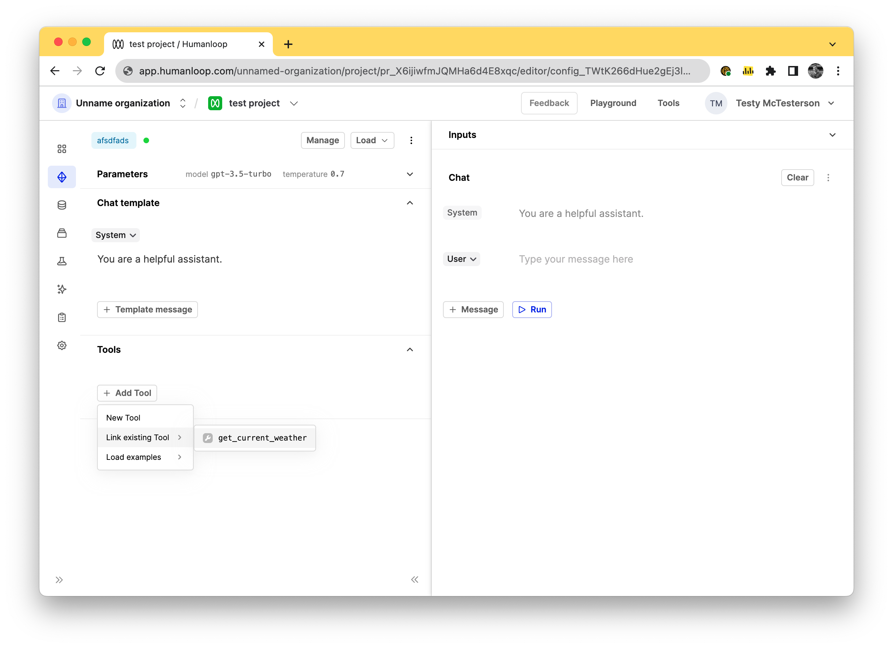
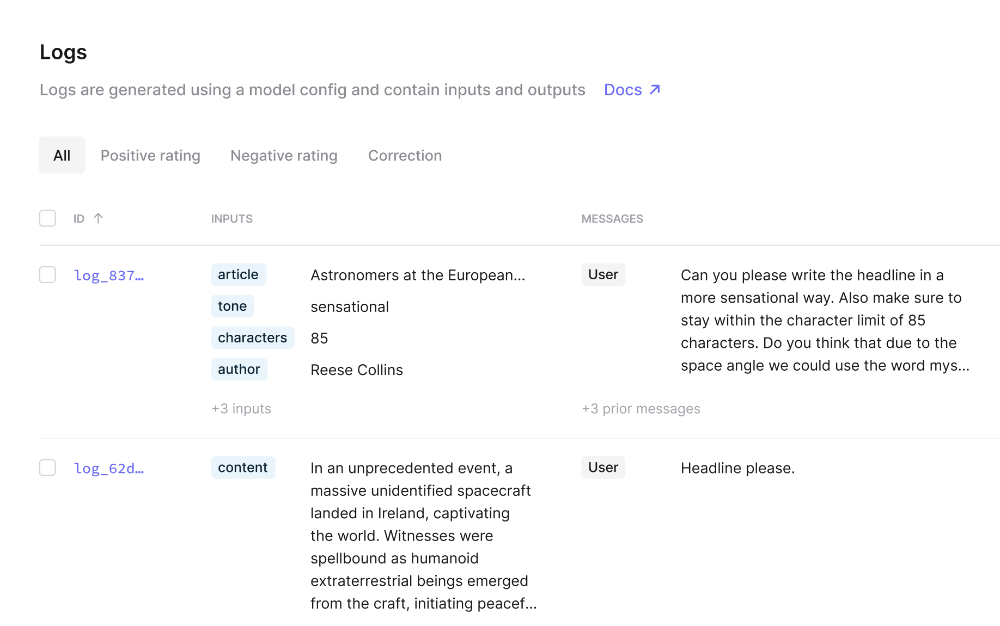
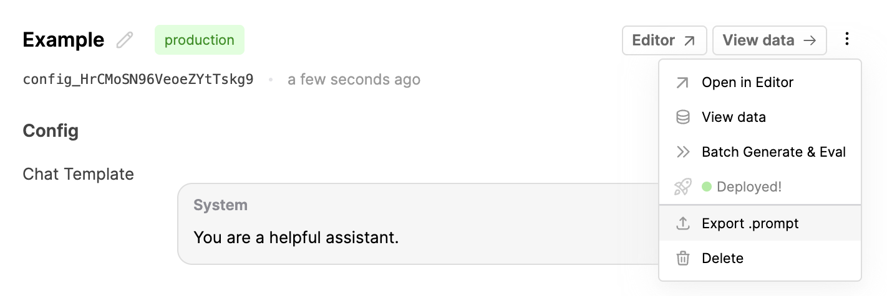
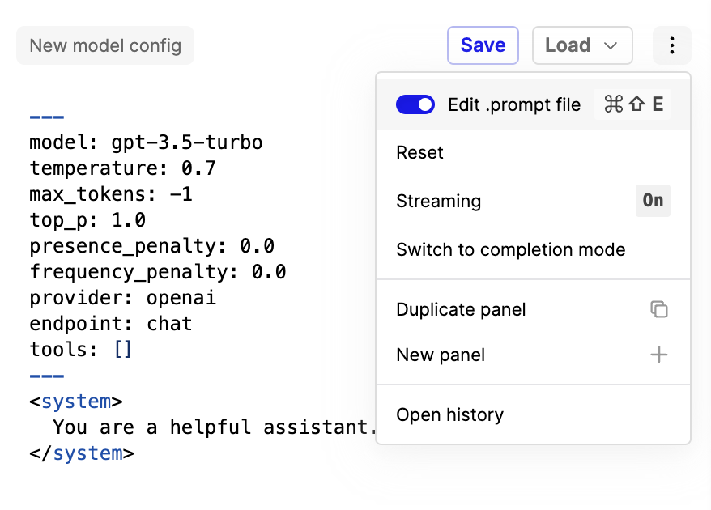

## Human Evaluators

_December 22nd, 2023_

We've introduced a new special type of 'Human' Evaluator to compliment our existing code and AI based Evaluators.

There are many important evaluation use cases that require input from your internal domain experts, or product teams. Typically this is where you would like a gold standard judgement of how your LLM app is performing.

Our new Human Evaluator allows you to trigger a batch evaluation run as normal (from our UI as part of your prompt engineering process, or using our SDK as part of your CI/CD pipeline) and then queues the results ready for a human to provide feedback.

Once completed, the feedback is aggregated to give a top-line summary of how the model is performing. It can also be combined with automatic code and AI evaluators in a single run.

Set up your first Human Evaluator run by following [our guide.](/docs/guides/evaluating-with-human-feedback)

---

## Return inputs flag

_December 22nd, 2023_

We've introduced a `return_inputs` flag on our chat and completion endpoints to improve performance for larger payloads.

As context model windows get increasingly larger, for example [Claude with 200k tokens](https://www.anthropic.com/index/claude-2-1), it's important to make sure our APIs remain performant. A contributor to response times is the size of the response payload being sent over the wire.

When you set this new flag to false, our responses will no longer contain the `inputs` that were sent to the model and so can be significantly smaller. This is the first in a sequence of changes to add more control to the caller around API behaviour.

As always, we welcome suggestions, requests, and feedback should you have any.

---

## Gemini

_December 22nd, 2023_

You can now use Google's latest LLMs, [Gemini](https://blog.google/technology/ai/google-gemini-ai/), in Humanloop.

### Setup

To use Gemini, first go to [https://makersuite.google.com/app/apikey](https://makersuite.google.com/app/apikey) and generate an API key. Then, save this under the "Google" provider on [your API keys page](https://app.humanloop.com/account/api-keys).

Head over to the playground, and you should see `gemini-pro` and `gemini-pro-vision` in your list of models.

You can also now use Gemini through the Humanloop API's `/chat`endpoints.

### Features

Gemini offers support for multi-turn chats, tool calling, and multi-modality.

However, note that while `gemini-pro` supports multi-turn chats and tool calling, it does not support multi-modality. On the other hand, `gemini-pro-vision` supports multi-modality but not multi-turn chats or tool calling. Refer to [Gemini's docs](https://ai.google.dev/models/gemini) for more details.

When providing images to Gemini, we've maintained compatibility with OpenAI's API. This means that when using Humanloop, you can provide images either via a HTTP URL or with a base64-encoded data URL.

---

## Chat sessions in Editor

_December 21st, 2023_

Your chat messages in Editor are now recorded as part of a session so you can more easily keep track of conversations.

After chatting with a saved prompt, go to the sessions tab and your messages will be grouped together.

If you want to do this with the API, it can be as simple as setting the `session_reference_id`– see [docs on sessions](/docs/guides/logging-session-traces).

---

## Environment logs

_December 13th, 2023_

Logs for your deployed prompts will now be tagged with the corresponding [environment](/docs/guides/deploy-to-an-environment).

In your logs table, you can now filter your logs based on environment:

You can now also pass an `environment` tag when using the explicit [/log ](/docs/api-reference/logs/log) endpoint; helpful for use cases such as [orchestrating your own models](/docs/guides/use-your-own-model-provider).

---

## Improved Evaluator UI

_December 12th, 2023_

We've improved the experience of creating and debugging your evaluators.

Now that you can [access any property of the objects you're testing](#llm-evals---improved-data-access) we've cleaned up the debug panel to make easier to view the testcases that you load from a dataset or from your projects.

We've also clarified what the return types are expected as you create your evaluators.

---

## Prompt diffs

_December 12th, 2023_

Following our recent [introduction of our .prompt file](/docs/guides/prompt-file-format), you can now compare your model configs within a project with our new 'diff' view.

As you modify and improve upon your model configs, you might want to remind yourself of the changes that were made between different versions of your model config. To do so, you can now select 2 model configs in your project dashboard and click **Compare** to bring up a side-by-side comparison between them. Alternatively, open the actions menu and click **Compare to deployed**.

This diff compares the .prompt files representing the two model configs, and will highlight any differences such as in the model, hyperparameters, or prompt template.

---

## LLM evals - improved data access

_December 12th, 2023_

In order to help you write better LLM evaluator prompts, you now have finer-grained access to the objects you are evaluating.

It's now possible to access any part of the `log` and `testcase` objects using familiar syntax like `log.messages[0].content`. Use the debug console to help understand what the objects look like when writing your prompts.

---

## Tool linking

_December 5th, 2023_

It's now possible to manage tool definitions globally for your organization and re-use them across multiple projects by linking them to your model configs.

Prior to this change, if you wanted to re-use the same tool definition across multiple model configs, you had to copy and paste the JSON schema snippet defining the name, description and parameters into your Editor for each case. And if you wanted to make changes to this tool, you would have to recall which model configs it was saved to prior and update them inline 1 by 1.

You can achieve this tool re-use by first defining an instance of our new `JsonSchema` tool available as another option in your global `Tools` tab. Here you can define a tool once, such as `get_current_weather(location: string, unit: 'celsius' | 'fahrenheit')`, and then link that to as many model configs as you need within the Editor as shown below.

Importantly, updates to the `get_current_weather` `JsonSchema` tool defined here will then propagate automatically to all the model configs you've linked it to, without having to publish new versions of the prompt.

The old behaviour of defining the tool inline as part of your model config definition is still available for the cases where you do want changes in the definition of the tool to lead to new versions of the model-config.

### Set up the tool

Navigate to the [tools tab](https://app.humanloop.com/hl-test/tools) in your organisation and select the JsonSchema tool card.

With the dialog open, define your tool with `name`, `description`, and `parameters` values. Our guide for using [OpenAI Function Calling in the playground](/docs/guides/create-a-tool-in-the-editor) can be a useful reference in this case.

### Using the tool

In the editor of your target project, link the tool by pressing the `Add Tool` button and selecting your `get_current_weather` tool.

---

## Improved log table UI

_December 4th, 2023_

We've updated how we show logs and datapoints in their respective tables. You can now see the stack of inputs and messages in a cleaner interface rather than having them spread into separate columns.

There will be more updates soon to improve how logs and prompts are shown in tables and the drawers soon, so if you have ideas for improvements please let us know.

---

## Introducing .prompt files

_December 4th, 2023_

We're introducing a .prompt file format for representing model configs in a format that's both human-readable and easy to work with.

For certain use cases it can be helpful for engineers to also store their prompts alongside their app's source code in their favourite version control system. The .prompt file is the appropriate artefact for this.

These .prompt files can be retrieved through both the API and through the Humanloop app.

### Exporting via API

To fetch a .prompt file via the API, make `POST` request to `https://api.humanloop.com/v4/model-configs/{id}/export`, where `{id}` is the ID of the model config (beginning with `config_`).

### Export from Humanloop

You can also export an existing model config as a .prompt file from the app. Find the model config within the project's dashboard's table of model configs and open the actions menu by clicking the three dots. Then click **Export .prompt**. (You can also find this button within the drawer that opens after clicking on on a model config's row).

### Editor

Additionally, we've added the ability to view and edit your model configs in a .prompt file format when in Editor. Press **Cmd-Shift-E** when in editor to swap over to a view of your .prompt file.

More details on our .prompt file format are available [here](/docs/guides/prompt-file-format). We'll be building on this and making it more powerful. Stay tuned.
