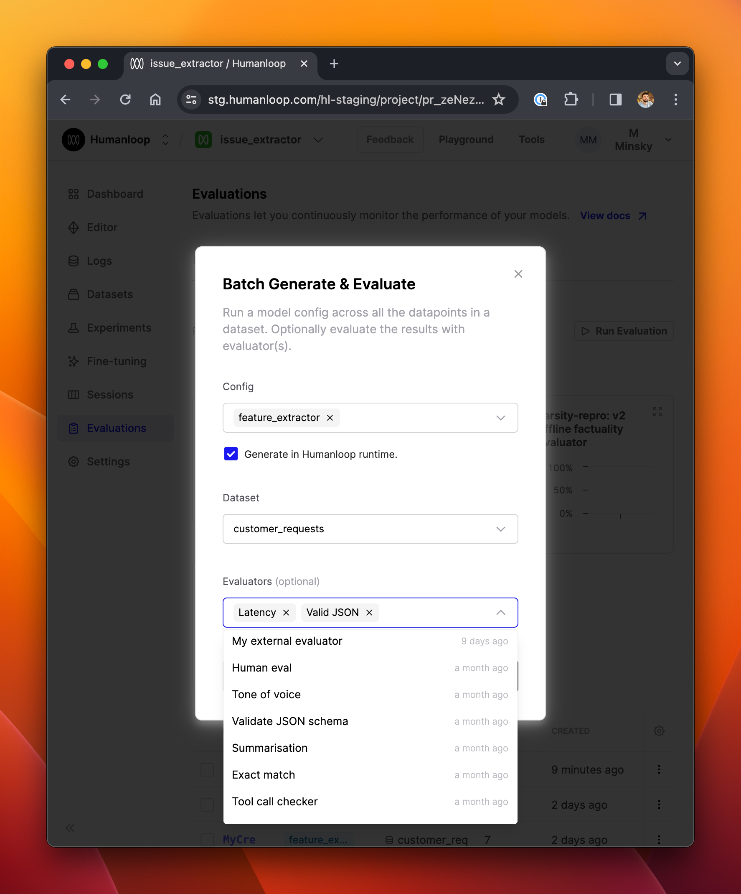
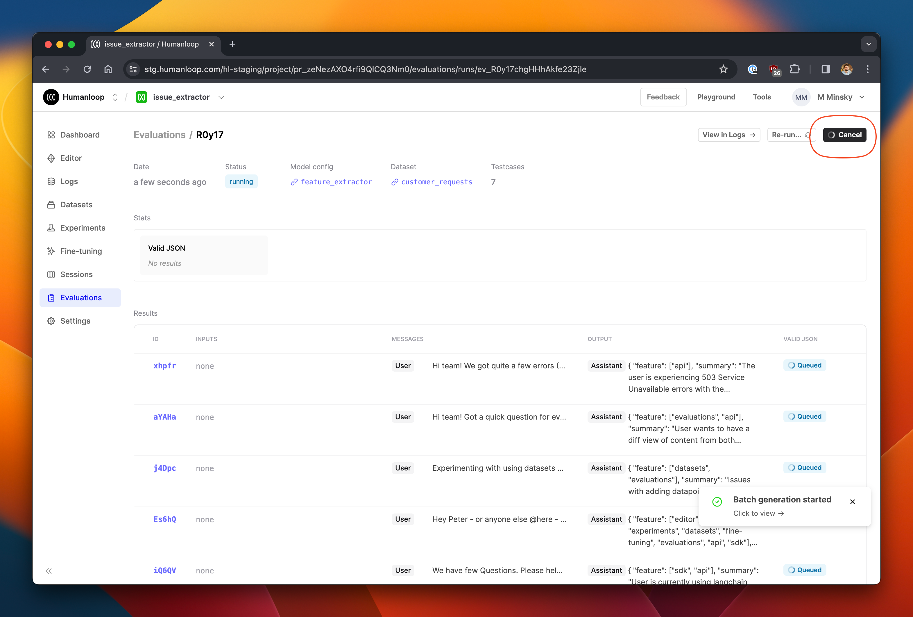

## Add Evaluators to existing runs

_January 30th, 2024_

You can now add an evaluator to any existing evaluation run. This is helpful in situations where you have no need to regenerate logs across a dataset, but simply want to run new evaluators across the existing run. By doing this instead of launching a fresh run, you can the save significant time & costs associated with unnecessarily regenerating logs, especially when working with large datasets.

---

## Improved Evaluation Debug Console

_January 30th, 2024_

We've enhanced the usability of the debug console when creating and modifying evaluators. Now you can more easily inspect the data you are working with, and understand the root causes of errors to make debugging quicker and more intuitive.

On any row in the debug console, click the arrow next to a testcase to inspect the full entity in a slideover panel.

After clicking **Run** to generate a log from a testcase, you can inspect the full log right from the debug console, giving you clearer access to error messages or the model-generated content, as in the example below.

---

## LLM Evaluators

_January 30th, 2024_

We expect this feature to be most useful in the case of creating and debugging LLM evaluators. You can now inspect the log of the LLM evaluation itself right from the debug console, along with the original testcase and model-generated log, as described above.

After clicking **Run** on a testcase in the debug console, you'll see the **LLM Evaluation Log** column populated with a button that opens a full drawer.

This is particularly helpful to verify that your evaluation prompt was correctly populated with data from the underlying log and testcase, and to help understand why the LLM's evaluation output may not have been parsed correctly into the output values.

---

## Tool projects

_January 30th, 2024_

We have upgraded projects to now also work for tools. Tool projects are automatically created for tools you define as part of your model config [in the Editor](/docs/guides/create-a-tool-in-the-editor) as well as tools [managed at organization level](/docs/guides/link-a-jsonschema-tool).

It is now easier to access the logs from your tools and manage different versions like you currently do for your prompts.

### Tool versioning

In the dashboard view, you can see the different versions of your tools. This will soon be expanded to link you to the source config and provide a more comprehensive view of your tool's usage.

### Logs

Any logs submitted via the SDK that relate to these tools will now appear in the Logs view of these projects. You can see this by following our [sessions guide](https://dash.readme.com/project/humanloop/v4.0/docs/logging-session-traces) and logging a new tool via the SDK. This also works natively with online Evaluators, so you can start to layer in observability for the individual non-LLM components of your session

### Offline Evaluations via SDK

You can trigger evaluations on your tools projects similar to how you would for an LLM project with model configs. This can be done by logging to the tool project, creating a dataset, and triggering an evaluation run. A good place to start would be the [Set up evaluations using API](/docs/guides/evaluations-using-api) guide.

---

## Support for new OpenAI Models

_January 30th, 2024_

Following [OpenAI's latest model releases](https://openai.com/blog/new-embedding-models-and-api-updates), you will find support for all the latest models in our **Playground** and **Editor**.

### GPT-3.5-Turbo and GPT-4-Turbo

If your API key has access to the models, you'll see the new release `gpt-4-0125-preview` and `gpt-3.5-turbo-0125` available when working in Playground and Editor. These models are more capable and cheaper than their predecessors - see the OpenAI release linked above for full details.

We also support the new `gpt-4-turbo-preview` model alias, which points to the latest `gpt-4-turbo` model without specifying a specific version.

### Embedding Models

Finally, the new embedding models - `text-embedding-3-small` and `text-embedding-3-large` are also available for use via Humanloop. The `small` model is 5x cheaper than the previous generation `ada-002` embedding model, while the larger model significantly improves performance and maps to a much larger embedding space.

---

## Improved evaluation run launcher

_January 19th, 2024_

We've made some usability enhancements to the launch experience when setting up batch generation & evaluation runs. 

It's now clearer which model configs, datasets and evaluators you've selected. It's also now possible to specify whether you want the logs to be generated in the Humanloop runtime, or if you're going to post the logs from your own infrastructure via the API.

### Cancellable evaluation runs

Occasionally, you may launch an evaluation run and then realise that you didn't configure it quite the way you wanted. Perhaps you want to use a different model config or dataset, or would like to halt its progress for some other reason. 

We've now made evaluation runs cancellable from the UI - see the screenshot below. This is especially helpful if you're running evaluations over large datasets, where you don't want to unnecessarily consume provider credits. 

---

## Faster offline evaluations

_January 12th, 2024_

We've introduced batching to our offline Evaluations to significantly speed up runtime performance and also improved the robustness to things going wrong mid-run.

In addition to our recent [enhancements to the Evaluations API](changelog:evaluation-api-enhancements), we've also made some significant improvements to our underlying orchestration framework which should mean your evaluation runs are now faster and more reliable. In particular, we now **batch generations** across the run - by default in groups of five, being conscious of potential rate limit errors (though this will soon be configurable). 

Each batch runs its generations concurrently, so you should see much faster completion times - especially in runs across larger datasets.

---

## Evaluation API enhancements

_January 11th, 2024_

We've started the year by enhancing our evaluations API to give you more flexibility for self-hosting whichever aspects of the evaluation workflow you need to run in your own infrastructure - while leaving the rest to us!

### Mixing and matching the Humanloop-runtime with self-hosting

Conceptually, evaluation runs have two components:

1. Generation of logs for the datapoints using the version of the model you are evaluating.
2. Evaluating those logs using Evaluators.

Now, using the Evaluations API, Humanloop offers the ability to generate logs either within the Humanloop runtime, or self-hosted (see our [guide on external generations for evaluations](/docs/guides/evaluating-externally-generated-logs)).

Similarly, evaluating of the logs can be performed in the Humanloop runtime (using evaluators that you can define in-app), or self-hosted (see our [guide on self-hosted evaluations](/docs/guides/self-hosted-evaluations)).

It is now possible to mix-and-match self-hosted and Humanloop-runtime logs and evaluations in any combination you wish.

When creating an Evaluation (via the improved UI dialogue or via the API), you can set the new `hl_generated` flag to `False` to indicate that you are posting the logs from your own infrastructure. You can then also include an evaluator of type `External` to indicate that you will post evaluation results from your own infrastructure.

You can now also include multiple evaluators on any run, and these can include a combination of `External` (i.e. self-hosted) and Humanloop-runtime evaluators.
