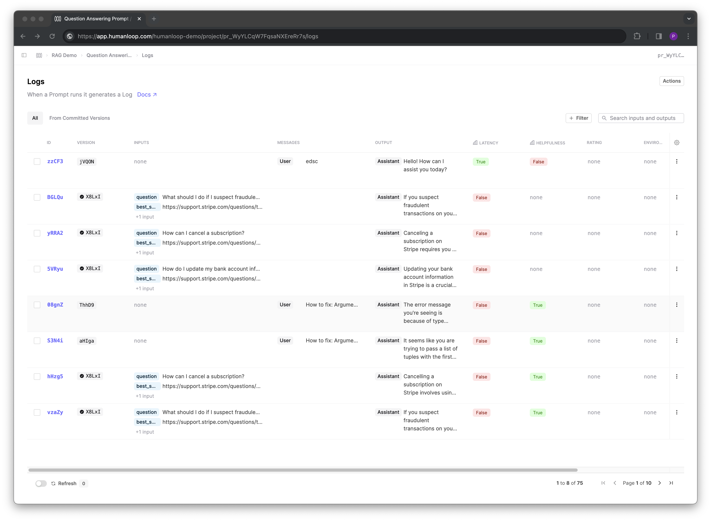
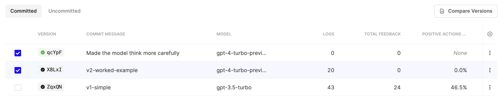
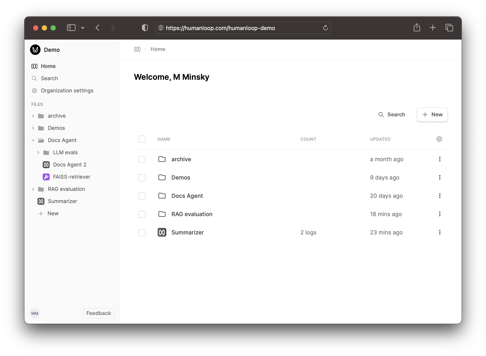

## Mixtral 8x7B

_March 25th, 2024_

Keeping you up to date with the latest open models, we've added support for Mixtral 8x7B to our Editor with a [Replicate integration](https://replicate.com/).

Mixtral 8x7B outperforms LLaMA 2 70B (already supported in Editor) with faster inference, with performance comparable to that of GPT-3.5. More details are available in its [release announcement](https://mistral.ai/news/mixtral-of-experts/).

---

## Additional Replicate models support via API

_March 18th, 2024_

Through the Replicate model provider additional open models can be used by specifying a model name via the API. The model name should be of a similar form as the ref used when calling `replicate.run(ref)` using [Replicate's Python SDK](https://github.com/replicate/replicate-python).

For example, Vicuna, an open-source chatbot model based on finetuning LLaMA can be used with the following model name alongside `provider: "replicate"` in your Prompt version.  
`replicate/vicuna-13b:6282abe6a492de4145d7bb601023762212f9ddbbe78278bd6771c8b3b2f2a13b`

---

## Surfacing uncommitted Versions

_March 18th, 2024_

We now provide the ability to access your uncommitted Prompt Versions and associated Logs.

Adding to our recent changes around the [Commit flow for Versions](https://docs.humanloop.com/changelog/prompts-and-committing-prompt-versions), we've added the ability to view any uncommitted versions in your Versions and Logs tables. This can be useful if you need to recover or compare to a previous state during your Prompt engineering and Evaluation workflows.

Uncommitted Versions are created when you make generations in our Editor without first committing what you are working on. In future, it will also be possible to create uncommitted versions when logging or generating using the API. 

We've added new filter tabs to the Versions and Logs table to enable this:

---

## Improved navigation & sidebar

_March 7th, 2024_

We've introduced a sidebar for easier navigation between your Prompts and Tools. 

As new language models unlock more complex use cases, you'll be setting up and connecting Prompts, Tools, and Evaluators. The new layout better reflects these emerging patterns, and switching between your files is now seamless with the directory tree in the sidebar.

You can also bring up the search dialog with **Cmd+K** and switch to another file using only your keyboard.

---

## Claude 3

_March 6th, 2024_

Introducing same day support for the Claude 3 - Anthropics new industry leading models. Read more about the release [here](https://www.anthropic.com/news/claude-3-family).

The release contains three models in ascending order of capability: _Haiku_, _Sonnet_, and _Opus_. This suite provides users with the different options to balance intelligence, speed, and cost for their specific use-cases.

**Key take aways:**

1. **Performance** - a new leader. The largest of the 3 models, Opus, is claimed to outperform GPT-4 and Gemini Ultra on key benchmarks such as MMLU and Hellaswag. It even reached 84.9% on the Humaneval coding test set (vs GPT-4’s 67%) 🤯
2. **200k context window** with near-perfect recall on selected benchmarks. Opus reports 99% accuracy on the NIAH test, which measures how accurately a model can recall information given to it in a large corpus of data.
3. **Opus has vision**. Anthropic claim that performance here is on par with that of other leading models (ie GPT-4 and Gemini). They say it’s most useful for inputting graphs, slides etc. in an enterprise setting.
4. **Pricing** - as compared to OpenAI:

Opus - $75 (2.5x GPT-4 Turbo)  
Sonnet - $15 (50% of GPT-4 Turbo)  
Haiku - $1.25 (1.6x GPT-3.5)

5. **How you can use it**: The Claude 3 family is now available on Humanloop. Bring your API key to test, evaluate and deploy the publicly available models - Opus and Sonnet.