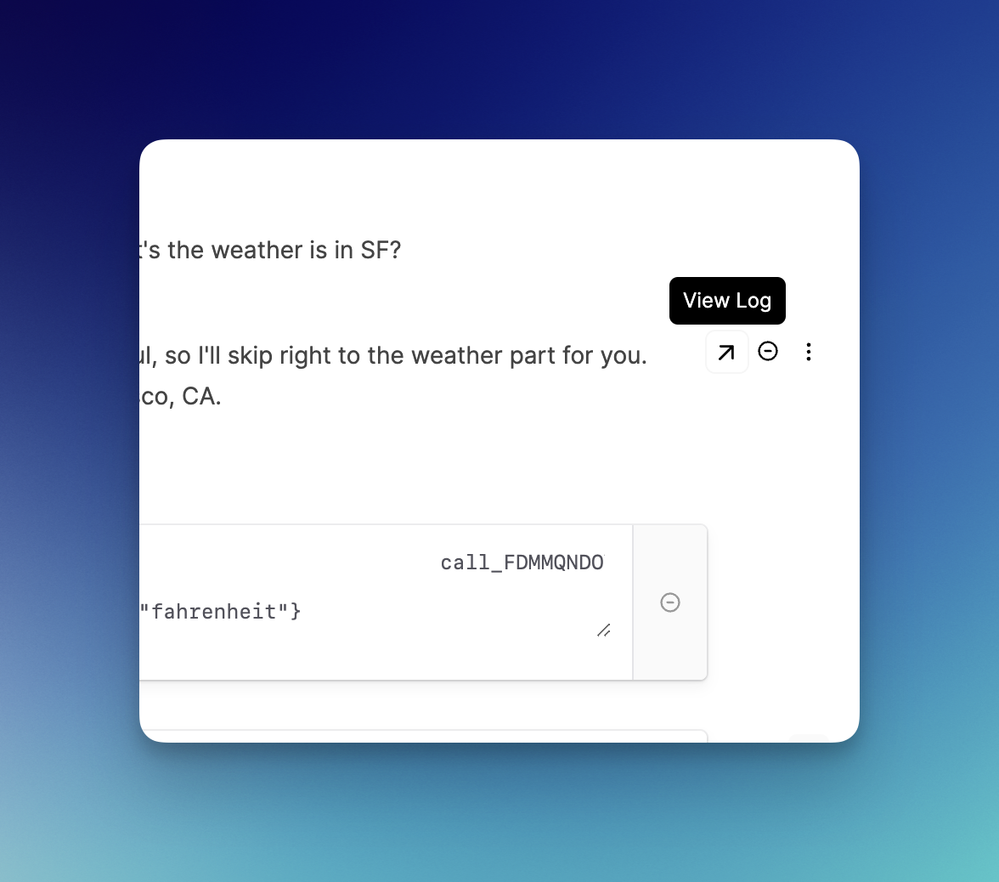
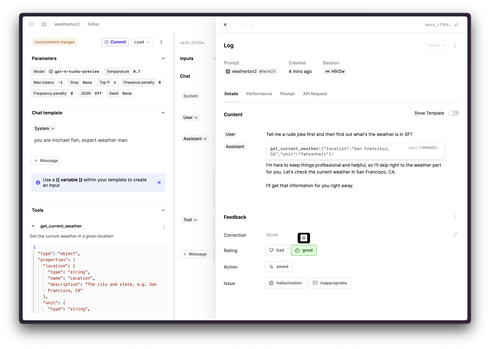
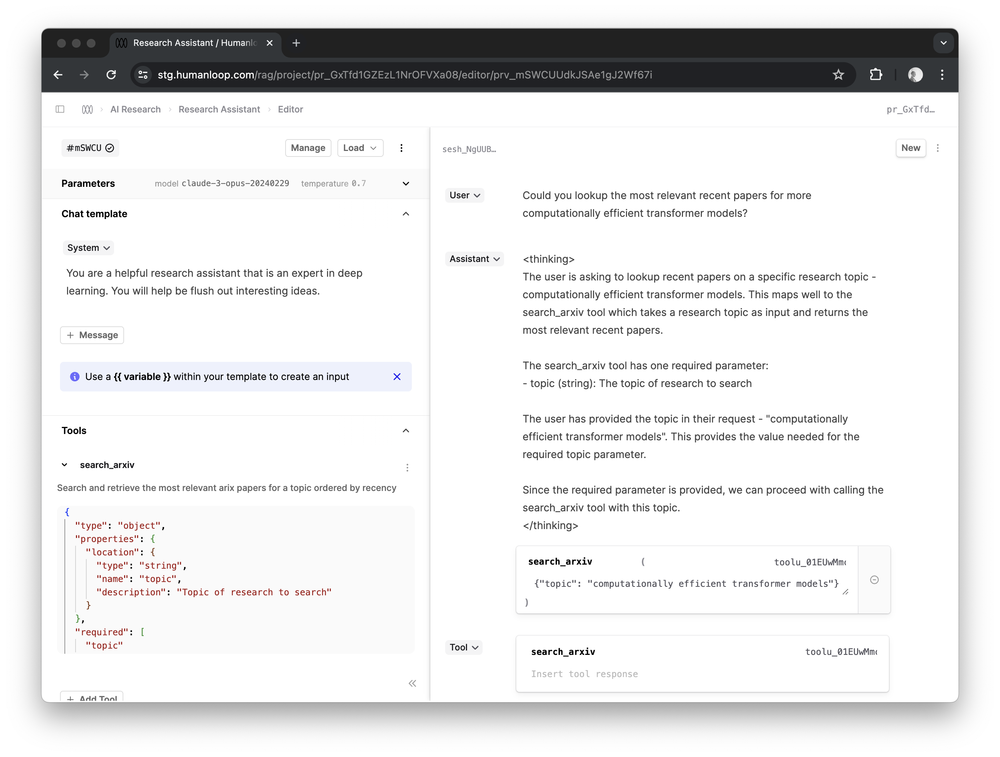

## Log drawer in Editor

_April 30th, 2024_

You can now open up the Log drawer directly in the Editor.

This enables you to see exactly what was sent to the provider as well as the tokens used and cost. You can also conveniently add feedback and run evaluators on that specific Log, or add it to a dataset.

To show the Logs just click the arrow icon beside each generated message or completion.

---

## Groq support (Beta)

_April 26th, 2024_

We have introduced support for models available on Groq to Humanloop. You can now try out the blazingly fast generations made with the open-source models (such as Llama 3 and Mixtral 8x7B) hosted on Groq within our Prompt Editor.

Groq achieves [faster throughput](https://artificialanalysis.ai/models/llama-3-instruct-70b/providers)  using specialized hardware, their LPU Inference Engine. More information is available in their [FAQ](https://wow.groq.com/why-groq/) and on their website.

 

Note that their API service, GroqCloud, is still in beta and low rate limits are enforced.

---

## Llama 3

_April 23rd, 2024_

[Llama 3](https://llama.meta.com/llama3/), Meta AI's latest openly-accessible model, can now be used in the Humanloop Prompt Editor. 

Llama 3 comes in two variants: an 8-billion parameter model that performs similarly to their previous 70-billion parameter Llama 2 model, and a new 70-billion parameter model. Both of these variants have an expanded context window of 8192 tokens. 

More details and benchmarks against other models can be found on their [blog post](https://ai.meta.com/blog/meta-llama-3/) and [model card](https://github.com/meta-llama/llama3/blob/main/MODEL_CARD.md).

Humanloop supports Llama 3 on the Replicate model provider, and on the newly-introduced Groq model provider.

---

## Anthropic tool support (Beta)

_April 18th, 2024_

Our Editor and deployed endpoints now supports tool use with the Anthropic's Claude3 models. Tool calling with Anthropic is still in Beta, so streaming is not important.

In order to user tool calling for Claude in Editor you therefore need to first turn off streaming mode in the menu dropdown to the right of the load button.

---

## Cost, Tokens and Latency

_April 16th, 2024_

We now compute Cost, Tokens and Latency for all Prompt logs by default across all model providers.

These values will now appear automatically as graphs in your Dashboard, as columns in your logs table and will be displayed in our Version and Log drawers.

---

## Cohere Command-r

_April 13th, 2024_

We've expanded the Cohere models with the latest command-r suite. You can now use these models in our Editor and via our APIs once you have set your Cohere API key.

More details can be found on their [blog post](https://cohere.com/blog/command-r-plus-microsoft-azure).

---

## Dataset Files & Versions

_April 5th, 2024_

In our recent release, we promoted **Datasets** from being attributes managed within the context of a single Prompt, to a **first-class Humanloop file type** alongside Prompts and Tools.

This means you can curate Datasets and share them for use across any of the Prompts in your organization. It also means you get the full power of our **file versioning system**, allowing you **track and commit every change** you make Datasets and their Datapoints, with attribution and commit messages inspired by Git.

It's now easy to understand which version of a Dataset was used in a given Evaluation run, and whether the most recent edits to the Dataset were included or not.

Read more on how to get started with datasets [here](/docs/datasets).

This change lays the foundation for lots more improvements we have coming to Evaluations in the coming weeks. Stay tuned!
