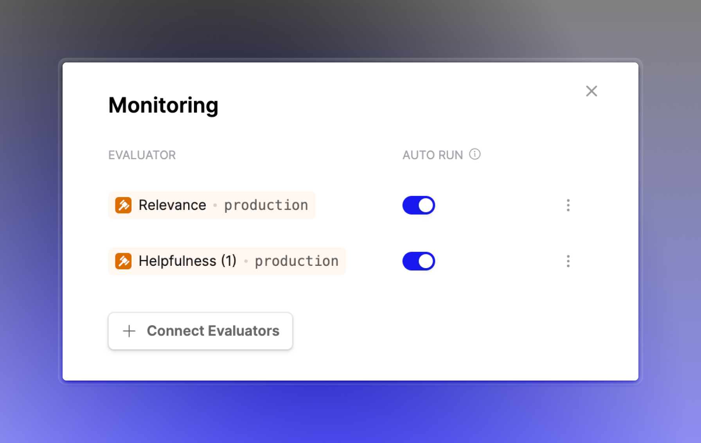
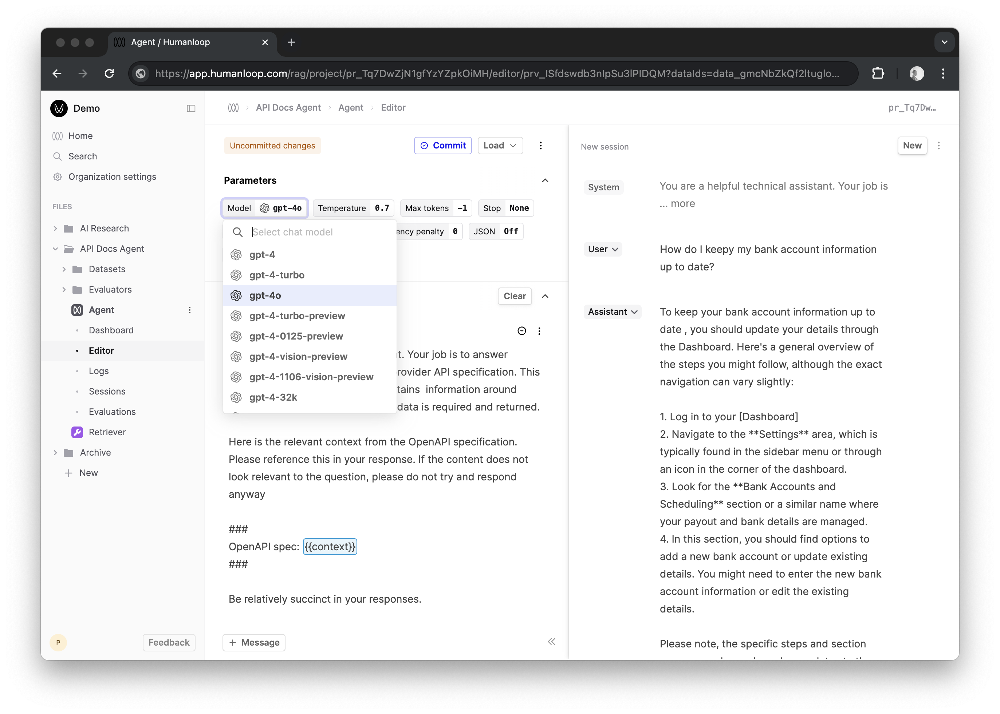

## Azure Model Updates

_May 28th, 2024_

You can now access the latest versions of GPT-4 and GPT-4o hosted on Azure in the Humanloop Editor and via our Chat endpoints.

Once you've configured your Azure key and endpoint in your organization's provider settings, the model versions will show up in the Editor dropown as follows:

For more detail, please see the [API documentation](https://docs.humanloop.com/reference/logs_list) on our Logs endpoints.

---

## Improved Logs Filtering

_May 20th, 2024_

We've improved the ability to filter logs by time ranges. The API logs filter parameters for `start_date` and `end_date` now supports querying with more granularity. Previously the filters were limited to dates, such as **2024-05-22**, now you can use hourly ranges as well, such as **2024-05-22 13:45**.

For more detail, please see the [API documentation](https://docs.humanloop.com/reference/logs_list) on our Logs endpoints.

---

## Monitoring with deployed Evaluators

_May 15th, 2024_

You can now connect deployed Evaluator versions for online monitoring of your Prompts and Tools.

This enables you to update Evaluators for multiple Prompt or Tools when you deploy a new Evaluator version.

---

## GPT-4o

_May 13th, 2024_

Same day support for OpenAIs new GPT4-Omni model! You can now use this within the Humanloop Editor and chat APIs.

Find out more from OpenAI [here](https://openai.com/index/hello-gpt-4o/).

---

## Logs for Evaluators

_May 12th, 2024_

For AI and Code Evaluators, you can now inspect and reference their logs as with Prompts and Tools. This provides greater transparency into how they are being used and improves the ability to debug and improve.

Further improvements to Human Evaluators are coming very soon...

---

## Improved Evaluator management

_May 8th, 2024_

Evaluators are now first class citizens alongside Prompts, Tools and Datasets. This allows for easier re-use, version control and helps with organising your workspace within directories.

You can create a new Evaluator by choosing **Evaluator** in the File creation dialog in the sidebar or on your home page.

### Migration and backwards compatibility

We've migrated all of your Evaluators previously managed within **Prompts > Evaluations > Evaluators** to new Evaluator files. All your existing Evaluation runs will remain unchanged and online Evaluators will continue to work as before. Moving forward you should use the new Evaluator file to make edits and manage versions.
