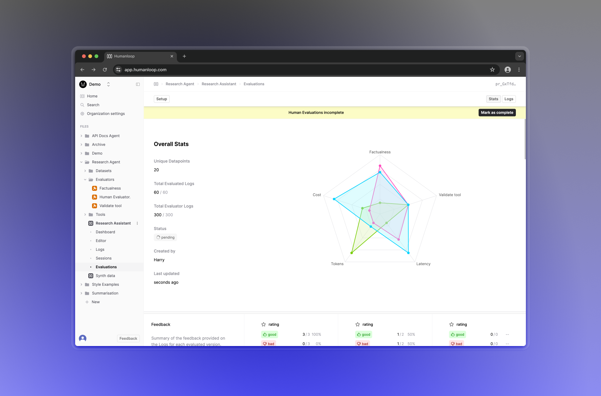
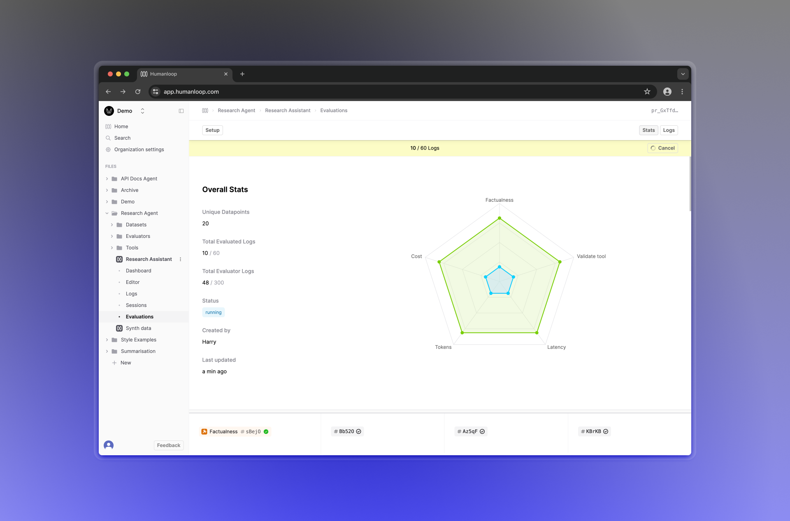
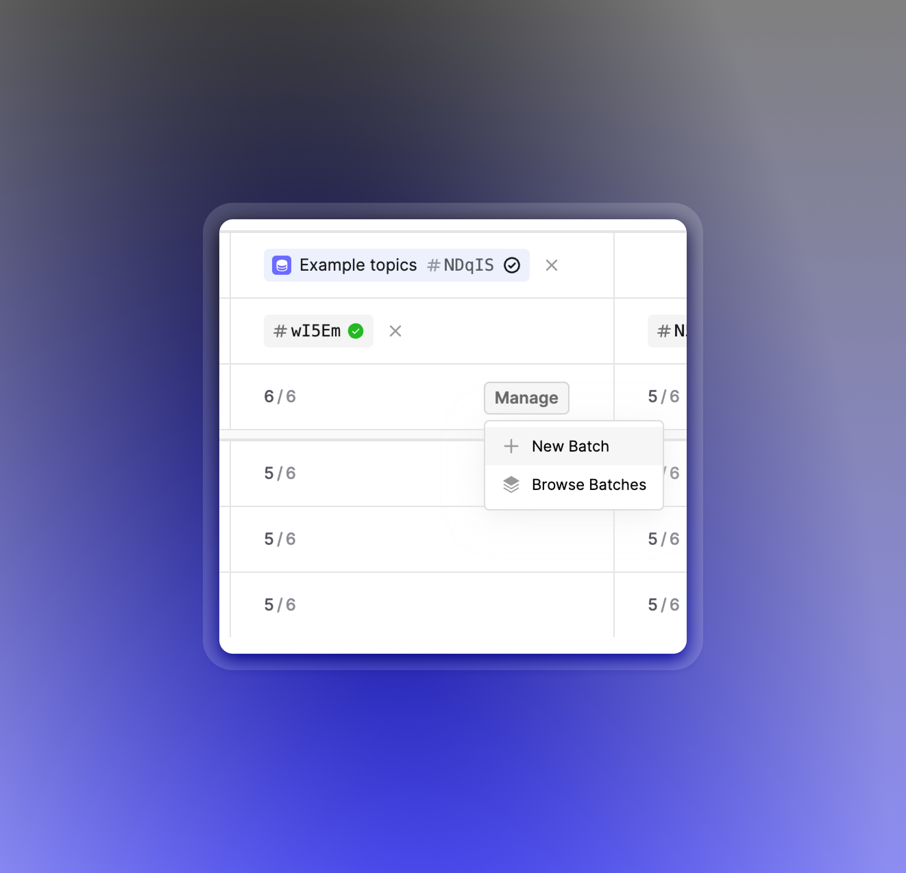

## Gemini 1.5 Flash support

_June 30th, 2024_

Gemini 1.5 Flash is Googles most efficient model to date with a long context window and great latency.

While it’s smaller than 1.5 Pro, it’s highly capable of multimodal reasoning with a 1 million token length context window.

Find out more about Flash's [availability and pricing](https://blog.google/technology/developers/gemini-gemma-developer-updates-may-2024/)

---

## Committing and deploying UX improvements

_June 24th, 2024_

We've made some improvements to the user experience around committing and deploying changes to your evaluators, tools and datasets.

Now, each editor has a consistent and reliable loading and saving experience. You can choose prior versions in the dropdown, making it easier to toggle between versions.

And, as you commit, you'll also get the option to immediately deploy your changes. This reduces the number of steps needed to get your changes live.

Additional bug fixes:

- Fixed the flickering issue on the datasets editor
- Fixed the issue where the evaluator editor would lose the state of the debug drawer on commit.

---

## Claude 3.5 Sonnet support

_June 20th, 2024_

Claude 3.5 Sonnet is now in Humanloop!

Sonnet is the latest and most powerful model from Anthropic.

**2x the speed, 1/5th the cost, yet smarter than Claude 3 Opus.**

Anthropic have now enabled streaming of tool calls too, which is supported in Humanloop now too.

Add your Anthropic key and select Sonnet in the Editor to give it a go.

---

## Prompt and Tool version drawer in Evaluation reports

_June 18th, 2024_

You can now click on the Prompt and Tool version tags within your Evaluation report to open a drawer with details. This helps provide the additional context needed when reasoning with the results without having to navigate awa

---

## Status of Human Evaluators

_June 16th, 2024_

With Humanloop Evaluation Reports, you can leverage multiple Evaluators for comparing your Prompt and Tool variations. Evaluators can be of different types: code, AI or Human and the progress of the report is dependent on collecting all the required judgements. Human judgments generally take longer than the rest and are collected async by members of your team.

To better support this workflow, we've improved the UX around monitoring the status of judgments, with a new progress bar. Your Human Evaluators can now also update the status of the report when they're done.

We've also added the ability to cancel ongoing Evaluations that are pending or running. Humanloop will then stop generating Logs and running Evaluators for this Evaluation report.

---

## Faster Evaluations

_June 10th, 2024_

Following the recent upgrades around Evaluation reports, we've improved the batching and concurrency for both calling models and getting the evaluation results. This has increased the speed of Evaluation report generation by 10x and the reports now update as new batches of logs and evaluations are completed to give a sense of intermediary progress.

---

## Evaluation Comparison Reports

_June 4th, 2024_

We've released Evaluation reports, which allows you to easily compare the performance of your different Prompts or Tools across multiple different [Evaluator](/docs/evaluators) criteria.

This generalises our previous concept of Evaluation runs, extending it with multiple complimentary changes with getting more from your evals. All your existing Evaluation runs have been migrated to Evaluation reports with a single evaluated Prompt or Tool. You can easily extend these existing runs to cover additional Evaluators and Prompts/Tools with out having to regenerate existing logs.

### Feature breakdown

We've introduced a new **stats comparison view**, including a radar chart that gives you a quick overview of how your versions compare across all Evaluators. Below it, your evaluated versions are shown in columns, forming a grid with a row per Evaluator you've selected.

The performance of each version for a given Evaluator is shown in a chart, where bar charts are used for boolean results, while box plots are used for numerical results providing an indication of variance within your Dataset.

Evaluation reports also introduce an **automatic deduplication** feature, which utilizes previous logs to avoid generating new logs for the same inputs. If a log already exists for a given evaluated-version-and-datapoint pair, it will automatically be reused. You can also override this behavior and force the generation of new logs for a report by creating a **New Batch** in the setup panel.

### How to use Evaluation reports

To get started, head over to the Evaluations tab of the Prompt you'd like to evaluate, and click **Evaluate** in the top right.

This will bring you to a page where you can set up your Evaluation, choosing a Dataset, some versions to Evaluate and compare, and the Evaluators you'd like to use.

When you click **Save**, the Evaluation report will be created, and any missing Logs will be generated.

### What's next

We're planning on improving the functionality of Evaluation reports by adding a more comprehensive detailed view, allowing you to get a more in-depth look at the generations produced by your Prompt versions. Together with this, we'll also be improving Human evaluators so you can better annotate and aggregate feedback on your generations.
