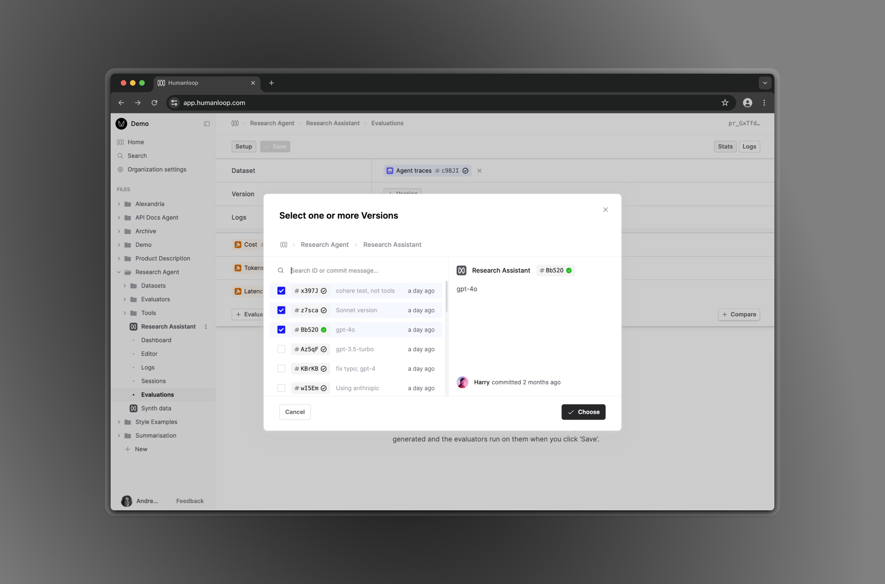

## Select multiple Versions when creating an Evaluation

_July 30th, 2024_

Our Evaluations feature allows you to benchmark Versions of a same File. We've made the form for creating new Evaluations simpler by allowing the selection of multiple in the picker dialog. Columns will be filled or inserted as needed.

As an added bonus, we've made adding and removing columns feel smoother with animations. The form will also scroll to newly-added columns.

---

## Faster log queries

_July 19th, 2024_

You should notice that queries against your logs should load faster and the tables should render more quickly.

We're still making more enhancements so keep an eye for more speed-ups coming soon!

---

## gpt-4o-mini support

_July 18th, 2024_

Latest model from OpenAI, GPT-4o-mini, has been added. It's a smaller version of the GPT-4o model which shows GPT-4 level performance with a model that is 60% cheaper than gpt-3.5-turbo.

- Cost: 15 cents per million input tokens, 60 cents per million output tokens
- Performance: MMLU score of 82%

---

## Enhanced code Evaluators

_July 10th, 2024_

We've introduced several enhancements to our code Evaluator runtime environment to support additional packages, environment variables, and improved runtime output.

### Runtime environment

Our Code Evaluator now logs both `stdout` and `stderr` when executed and environment variables can now be accessed via the `os.environ` dictionary, allowing you to retrieve values such as `os.environ['HUMANLOOP_API_KEY']` or `os.environ['PROVIDER_KEYS']`.

### Python packages

Previously, the selection of Python packages we could support was limited. We are now able to accommodate customer-requested packages. If you have specific package requirements for your eval workflows, please let us know!
