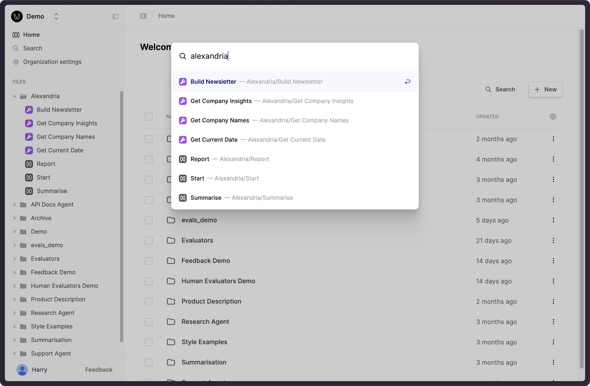

## Get All Deployed Versions via API

_August 30th, 2024_

We've introduced a new Files API in our v5 API resources that lets you query all files simultaneously. This is useful when managing your workflows on Humanloop and you wish to find all files that match specific criteria, such as having a deployment in a specific environment. Some of the supported filters to search with are file name, file type, and deployed environments. If you find there are additional access patterns you'd find useful, please reach out and let us know.

---

## Update Logs API

_August 29th, 2024_

We've introduced the ability to patch Logs for Prompts and Tools. This can come in useful in scenarios where certain characteristics of your Log are delayed that you may want to add later, such as the output, or if you have a process of redacting inputs that takes time.

Note that not all fields support being patched, so start by referring to our [V5 API References](api-reference/prompts). From there, you can submit updates to your previously created logs.

---

## Search files by path

_August 28th, 2024_

We've extended our search interface to include file paths, allowing you to more easily find and navigate to related files that you've grouped under a directory.



Bring up this search dialog by clicking "Search" near the top of the left-hand sidebar, or by pressing `Cmd+K`.

---

## Updated Gemini 1.5 models

_August 24th, 2024_

Humanloop supports the three newly released Gemini 1.5 models.

Start using these improved models by specifying one of the following model names in your Prompts:

- `gemini-1.5-pro-exp-0827` The improved Gemini 1.5 Pro model
- `gemini-1.5-flash-exp-0827` The improved Gemini 1.5 Flash model
- `gemini-1.5-flash-8b-exp-0827` The smaller Gemini 1.5 Flash variant

More details on these models can be viewed [here](https://ai.google.dev/gemini-api/docs/models/experimental-models#available-models).

---

## Custom attributes for Files

_August 20th, 2024_

You can now include custom attributes to determine the unique version of your file definitions on Humanloop. 

This allows you to make the version depend on data custom to your application that Humanloop may not be aware of. 

For example, if there are feature flags or identifiers that indicate a different configuration of your system that may impact the behaviour of your Prompt or Tool.

`attributes` can be submitted via the v5 API endpoints. When added, the attributes are visible on the Version Drawer and in the Editor.


---

## Improved popover UI

_August 16th, 2024_

We've expanded the information shown in the version popover so that it is easier to identify which version you are working with.

This is particularly useful in places like the Logs table and within Evaluation reports, where you may be working with multiple versions of a Prompt, Tool, or Evaluator and need to preview the contents.


---

## Evaluate uncommitted versions

_August 15th, 2024_

You can now evaluate versions without committing them first. This means you can draft a version of a Prompt in the editor and simultaneously evaluate it in the evaluations tab, speeding up your iteration cycle.

This is a global change that allows you to load and use uncommitted versions. Uncommitted versions are created automatically when a new version of a Prompt, Tool, or Evaluator is run in their respective editors or called via the API. These versions will now appear in the version pickers underneath all your committed versions.

To evaluate an uncommitted version, simply select it by using the hash (known as the "version id") when setting up your evaluation.


---

## Human Evaluator upgrades

_August 14th, 2024_

We've made significant upgrades to Human Evaluators and related workflows to improve your ability to gather Human judgments (sometimes referred to as "feedback") in assessing the quality of your AI applications.

Here are some of the key improvements:

- Instead of having to define a limited feedback schema tied to the settings of a specific Prompt, you can now **define your schema with a Human Evaluator file and reuse it across multiple Prompts and Tools** for both monitoring and offline evaluation purposes.
- You are no longer restricted to the default types of `Rating`, `Actions` and `Issues` when defining your feedback schemas from the UI. We've introduced a **more flexible Editor interface supporting different return types** and valence controls.
- We've extended the scope of Human Evaluators so that they can now **also be used with Tools and other Evaluators** (useful for validating AI judgments) in the same way as with Prompts.
- We've **improved the Logs drawer UI for applying feedback** to Logs. In particular, we've made the buttons more responsive.

To set up a Human Evaluator, create a new file. Within the file creation dialog, click on **Evaluator**, then click on **Human**.
This will create a new Human Evaluator file and bring you to its Editor. Here, you can choose a `Return type` for the Evaluator and configure the feedback schema.


You can then reference this Human Evaluator within the `Monitoring` dropdown of Prompts, Tools, and other Evaluators, as well as when configuring reports in their `Evaluations` tab.

We've set up default `Rating` and `Correction` Evaluators that will be automatically attached to all Prompts new and existing. We've migrated all your existing Prompt specific feedback schemas to Human Evaluator files and these will continue to work as before with no disruption.

Check out our updated document for further details on how to use Human Evaluators:

- [Create a Human Evaluator](/docs/evaluation/guides/human-evaluator)
- [Capture End User Feedback](/docs/observability/guides/capture-user-feedback)
- [Run a Human Evaluation](/docs/evaluation/guides/run-human-evaluation)

---

## Evaluations improvements

_August 13th, 2024_

We've made improvements to help you evaluate the components of your AI applications, quickly see issues and explore the full context of each evaluation.


### A clearer Evaluation tab in Logs

We've given the Log drawer's Evaluation tab a facelift. You can now clearly see what the results are for each of the connected Evaluators.

This means that it's now easier to debug the judgments applied to a Log, and if necessary, re-run code/AI Evaluators in-line.


### Ability to re-run Evaluators

We have introduced the ability to re-run your Evaluators against a specific Log. This feature allows you to more easily address and fix issues with previous Evaluator judgments for specific Logs.

You can request a re-run of that Evaluator by opening the menu next to that Evaluator and pressing the "Run Again" option.

### Evaluation popover


If you hover over an evaluation result, you'll now see a popover with more details about the evaluation including any intermediate results or console logs without context switching.


### Updated Evaluator Logs table

The Logs table for Evaluators now supports the functionality as you would expect from our other Logs tables. This will make it easier to filter and sort your Evaluator judgments.

---

## More Code Evaluator packages

_August 7th, 2024_

We have expanded the packages available in the Evaluator Python environment. The new packages we've added are: `continuous-eval`, `jellyfish`, `langdetect`, `nltk`, `scikit-learn`, `spacy`, `transformers`. The full list of packages can been seen in our [Python environment reference](/docs/reference/python-environment).

We are actively improving our execution environment so if you have additional packages you'd like us to support, please do not hesitate to get in touch.

---

## OpenAI Structured Outputs

_August 5th, 2024_

OpenAI have introduced [Structured Outputs](https://openai.com/index/introducing-structured-outputs-in-the-api/) functionality to their API.

This feature allows the model to more reliably adhere to user defined JSON schemas for use cases like information extraction, data validation, and more.

We've extended our `/chat` (in v4) and `prompt/call` (in v5) endpoints to support this feature. There are two ways to trigger Structured Outputs in the API:

1. **Tool Calling:** When defining a tool as part of your Prompt definition, you can now include a `strict=true` flag. The model will then output JSON data that adheres to the tool `parameters` schema definition.

```python
""" Example using our v5 API. """
from humanloop import Humanloop

client = Humanloop(
    api_key="YOUR_API_KEY",
)

client.prompts.call(
    path="person-extractor",
    prompt={
        "model": "gpt-4o",
        "template": [
            {
                "role": "system",
                "content": "You are an information extractor.",
            },
        ],
        "tools": [
            {
                "name": "extract_person_object",
                "description": "Extracts a person object from a user message.",
                # New parameter to enable structured outputs
                "strict": True,
                "parameters": {
                    "type": "object",
                    "properties": {
                        "name": {
                            "type": "string",
                            "name": "Full name",
                            "description": "Full name of the person",
                        },
                        "address": {
                            "type": "string",
                            "name": "Full address",
                            "description": "Full address of the person",
                        },
                        "job": {
                            "type": "string",
                            "name": "Job",
                            "description": "The job of the person",
                        }
                    },
                    # These fields need to be defined in strict mode
                    "required": ["name", "address", "job"],
                    "additionalProperties": False,
                },
            }
        ],
    },
    messages=[
        {
            "role": "user",
            "content": "Hey! I'm Jacob Martial, I live on 123c Victoria street, Toronto and I'm a software engineer at Humanloop.",
        },
    ],
    stream=False,
)

```

2. **Response Format:** We have expanded the `response_format` with option `json_schema` and a request parameter to also include an optional `json_schema` field where you can pass in the schema you wish the model to adhere to.

```python

client.prompts.call(
    path="person-extractor",
    prompt={
        "model": "gpt-4o",
        "template": [
            {
                "role": "system",
                "content": "You are an information extractor.",
            },
        ],
        # New parameter to enable structured outputs
        "response_format": {
            "type": "json_schema",
            "json_schema": {
                "name": "person_object",
                "strict": True,
                "schema": {
                    "type": "object",
                    "properties": {
                        "name": {
                            "type": "string",
                            "name": "Full name",
                            "description": "Full name of the person"
                        },
                        "address": {
                            "type": "string",
                            "name": "Full address",
                            "description": "Full address of the person"
                        },
                        "job": {
                            "type": "string",
                            "name": "Job",
                            "description": "The job of the person"
                        }
                    },
                    "required": ["name", "address", "job"],
                    "additionalProperties": False
                }
            }
        }
    },
    messages=[
        {
            "role": "user",
            "content": "Hey! I'm Jacob Martial, I live on 123c Victoria street, Toronto and I'm a software engineer at Humanloop.",
        },
    ],
    stream=False,
)
```
This new response formant functionality is only supported by the latest OpenAPI model snapshots `gpt-4o-2024-08-06` and `gpt-4o-mini-2024-07-18`.

We will also be exposing this functionality in our Editor UI soon too!

---

## Improved Code Evaluator Debugging

_August 1st, 2024_

We've added the ability to view the Standard Output (Stdout) for your Code Evaluators. 

You can now use `print(...)` statements within your code to output intermediate results to aid with debugging.

The Stdout is available within the Debug console as you iterate on your Code Evaluator:


Additionally, it is stored against the Evaluator Log for future reference:


