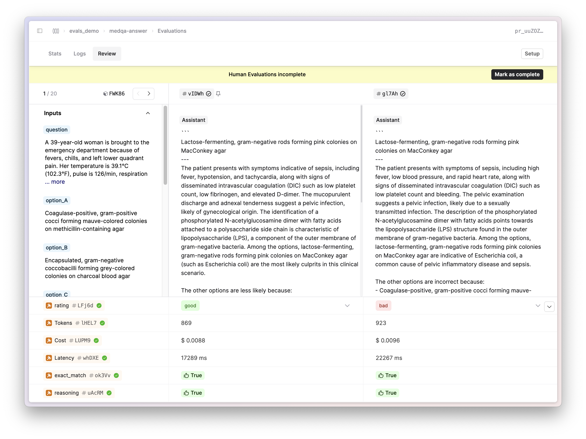
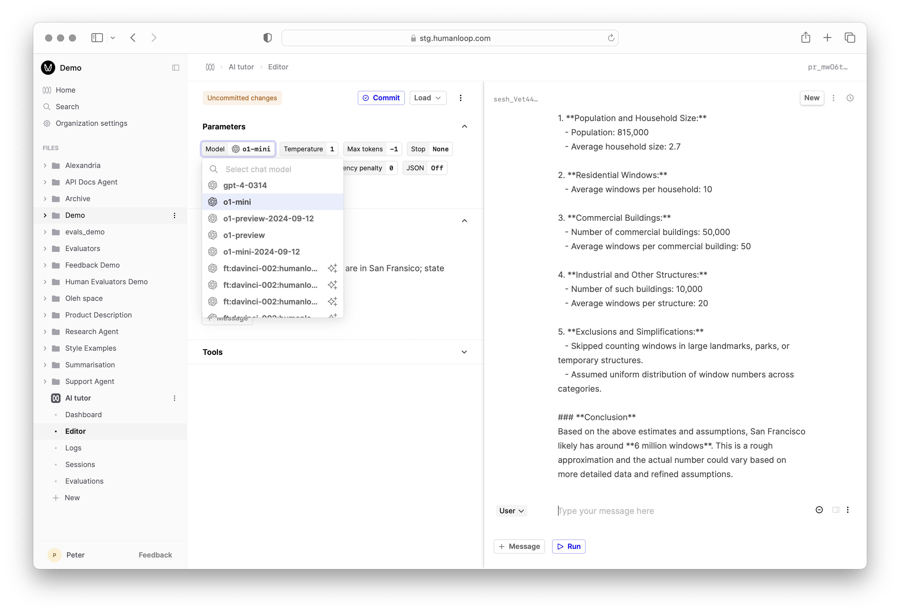

## Evaluations Comparison Mode

_September 25th, 2024_

We've added a side-by-side comparison view to evaluations on Humanloop. This new view enables domain experts to view multiple outputs side-by-side and provide judgments with easy-to-use, configurable controls. 



To start using this new view, choose a File and click on the Evaluations submenu. Select the eval you want to view and navigate to the Review tab. This is particularly useful when trying to compare and contrast the outputs from different versions of your AI apps when providing relative judgements.

---

## Bedrock support for Llama models

_September 20th, 2024_

We've added support for Llama models through our AWS Bedrock integration.


You can now select Llama models in the model selection dropdown in the Prompt Editor and start using them in your Prompts.
Humanloop supports tool calling for Llama 3.1 models, helping you to build more powerful AI applications.

---

## Evaluation Names

_September 17th, 2024_

You can now name your Evaluations in the UI and via the API. This is helpful for more easily identifying the purpose of your different Evaluations, especially when multiple teams are running different experiments.


In the API, pass in the `name` field when creating your Evaluation to set the name. Note that names must be unique for all Evaluations for a specific file. In the UI, navigate to your Evaluation and you will see an option to rename it in the header.

---

## Introducing Flows

_September 15th, 2024_

We've added a new key building block to our app with the first release of Flows. This release focuses on improving the code-first workflows for evaluating more complex AI applications like RAG and Agent-based apps.

Flows allow you to version your whole AI application on Humanloop (as opposed to just individual Prompts and Tools) and allows you to log and evaluate the full trace of the important processing steps that occur when running your app. 

See our [cookbook tutorial](https://github.com/humanloop/humanloop-cookbook/blob/main/tutorials/rag/evaluate-rag-flow.ipynb) for examples on how to use Flows in your code. 


**What's next**

We'll soon be extending support for allowing Evaluators to access all Logs inside a trace. 
Additionally, we will build on this by adding UI-first visualisations and management of your Flows.

We'll sunset Sessions in favour of Flows in the near future. Reach out to us for guidance on how to migrate your Session-based workflows to Flows.

---

## Bedrock support for Anthropic models

_September 13th, 2024_

We've introduced a Bedrock integration on Humanloop, allowing you to use Anthropic's models via the Bedrock API, leveraging your AWS-managed infrastructure.


To set this up, head to the API Keys tab in your Organization settings [here](https://app.humanloop.com/account/api-keys). Enter your AWS credentials and configuration.


Once you've set up your Bedrock keys, you can select the Anthropic models in the model selection dropdown in the Prompt Editor and start using them in your Prompts.

---

## OpenAI o1

_September 10th, 2024_

We added same day support for OpenAI's new models, the o1 series. Unlike their predecessors, the o1 models have been designed to spend more time thinking before they respond. 
In practise this means that when you call the API, time and tokens are spent doing chain-of-thought reasoning before you receive a response back.



Read more about this new class of models in OpenAI's [release note](https://openai.com/index/introducing-openai-o1-preview/) and their [documentation](https://platform.openai.com/docs/guides/reasoning). 

These models are still in Beta and don't yet support streaming or tool use, the temperature has to be set to 1 and there are specific rate limits in place.

---

## Evaluations CICD Improvements

_September 5th, 2024_

We've expanded our [evaluations API](https://humanloop.com/docs/v5/api-reference/evaluations/get-stats) to include new fields that allow you to more easily check on progress and render summaries of your Evaluations directly in your deployment logs.

The stats response now contains a `status` you can poll and `progess` and `report` fields that you can print:

```
⏳ Evaluation Progress
Total Logs: 40/40
Total Judgments: 120/120


📊 Evaluation Results for evals_demo/answer-flow 
+------------------------+---------------------------+---------------------------+
|             Version id | flv_xo7ZxnkkvcFcDJ9pwSrA9 | flv_foxO18ZHEgxQmwYJO4bR1 |
+------------------------+---------------------------+---------------------------+
|                Created |    2024-09-01 14:50:28    |    2024-09-02 14:53:24    |
+------------------------+---------------------------+---------------------------+
|             Evaluators |                           |                           |
+------------------------+---------------------------+---------------------------+
| evals_demo/exact_match |            0.8            |            0.65           |
| evals_demo/levenshtein |            7.5            |            33.5           |
|   evals_demo/reasoning |            0.3            |            0.05           |
+------------------------+---------------------------+---------------------------+


Navigate to Evaluation:  https://app.humanloop.com/evaluations/evr_vXjRgufGzwuX37UY83Lr8
❌ Latest score [0.05] below the threshold [0.5] for evaluator evals_demo/reasoning.
❌ Regression of [-0.25] for evaluator evals_demo/reasoning

```


See how you can leverage Evaluations as part of your CICD pipeline to test for regressions in your AI apps in our reference [example](https://github.com/humanloop/humanloop-cookbook/blob/main/tutorials/rag/evaluate_rag_cicd.py). 
