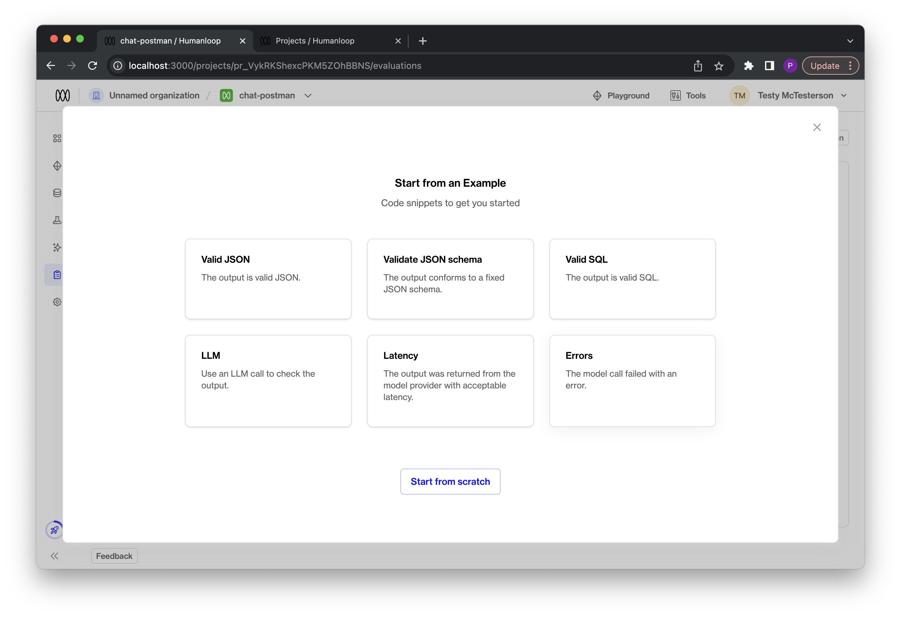

## Improved error handling

We've unified how errors returned by model providers are handled and enabled error monitoring using [eval functions](/docs/guides/evaluate-your-model).

A common production pain point we see is that hosted SOTA language models can still be flaky at times, especially at real scale. With this release, Humanloop can help users better understand the extent of the problem and guide them to different models choices to improve reliability.

### Unified errors

Our users integrate the Humanloop `/chat` and `/completion` API endpoints as a unified interface into all the popular model providers including OpenAI, Anthropic, Azure, Cohere, etc. Their Humanloop projects can then be used to manage model experimentation, versioning, evaluation and deployment.

Errors returned by these endpoints may be raised by the model provider's system. With this release we've updated our API to map all the error behaviours from different model providers to a unified set of [error response codes](/api-reference/errors#http-error-codes).

We've also extended our error responses to include more details of the error with fields for `type`, `message`, `code` and `origin`. The `origin` field indicates if the error originated from one of the integrated model providers systems, or directly from Humanloop.

For example, for our `/chat ` endpoint where we attempt to call OpenAI with an invalid setting for `max_tokens`, the message returned is that raised by OpenAI and the origin is set to OpenAI.

```json
{
  "type": "unprocessable_entity_error",
  "message": "This model's maximum context length is 4097 tokens. However, you requested 10000012 tokens (12 in the messages, 10000000 in the completion). Please reduce the length of the messages or completion.",
  "code": 422,
  "origin": "OpenAI"
}
```

### Monitor model reliability with evals

With this release, all errors returned from the different model providers are now persisted with the corresponding input data as datapoints on Humanloop. Furthermore this error data is made available to use within [evaluation functions](/docs/guides/evaluate-your-model).

You can now turn on the **Errors** eval function, which tracks overall error rates of the different model variations in your project. Or you can customise this template to track more specific error behaviour.


