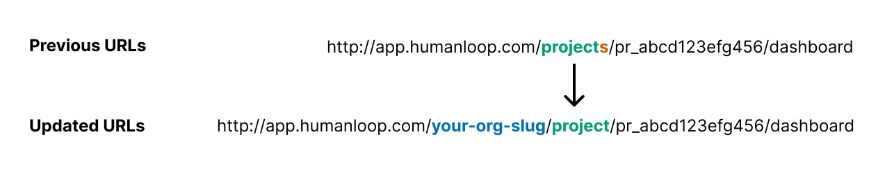
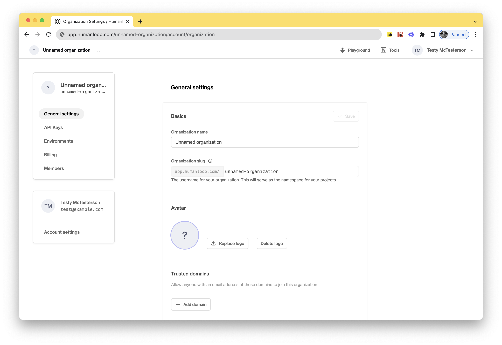

## Organization slug in URLs

We have altered routes specific to your organization to include the organization slug. The organization slug is a unique value that was derived from your organization name when your organization was created.

For project paths we've dropped the `projects` label in favour of a more specific `project` label. 

An example of what this looks like can be seen below:

<Check title="Existing bookmarks and links will continue to work">
When a request is made to one of the legacy URL paths, we'll redirect it to the corresponding new path. Although the legacy routes are still supported, we encourage you to update your links and bookmarks to adopt the new naming scheme.
</Check>

### Updating your organization slug

The organization slug can be updated by organization administrators. This can be done by navigating to the [general settings](https://app.humanloop.com/account/organization) page. Please exercise caution when changing this, as it will affect the URLs across the organization. 

