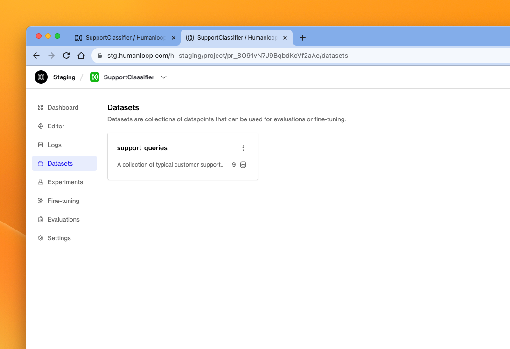
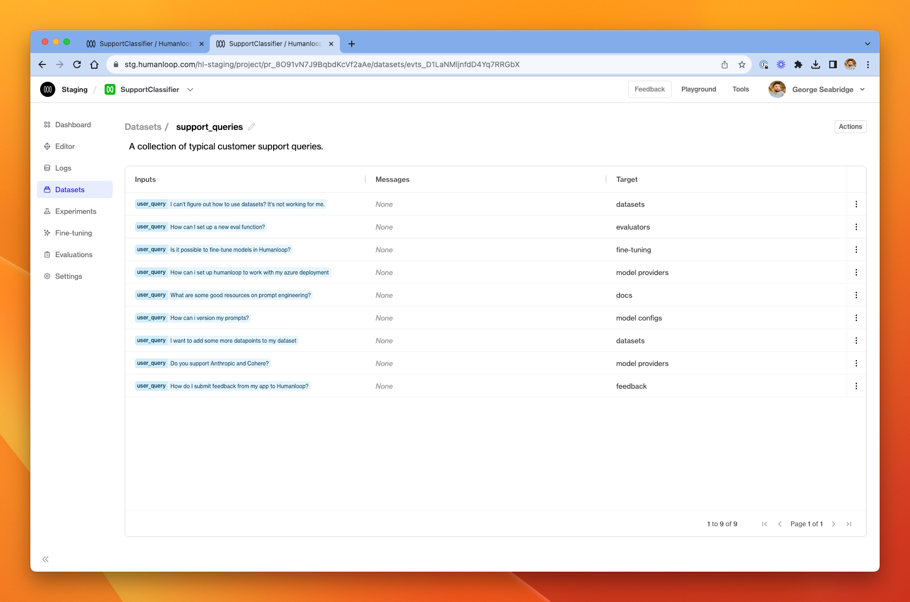

## Datasets

We've introduced **Datasets** to Humanloop. Datasets are collections of **Datapoints**, which represent input-output pairs for an LLM call.

We recently released **Datasets** in our Evaluations beta, by the name **Evaluation Testsets**. We're now promoting the concept to a first-class citizen within your projects. If you've previously been using testsets in the evaluations beta, you'll see that your testsets have now automatically migrated to datasets.

Datasets can be created via CSV upload, converting from existing Logs in your project, or by API requests.

See our [guides on datasets](/docs/guides/datasets), which show how to upload from CSV and perform a batch generation across the whole dataset.

Clicking into a dataset, you can explore its datapoints.

A dataset contains a collection of prompt variable **inputs** (the dynamic values which are interpolated into your model config prompt template at generation-time), as well as a collection of **messages** forming the chat history, and a **target** output with data representing what we expect the model to produce when it runs on those inputs.

Datasets are useful for evaluating the behaviour of you model configs across a well-defined collection of test cases. You can use datasets to check for regressions as you iterate your model configs, knowing that you are checking behaviour against a deterministic collection of known important examples.

Datasets can also be used as collections of input data for **fine-tuning** jobs.
