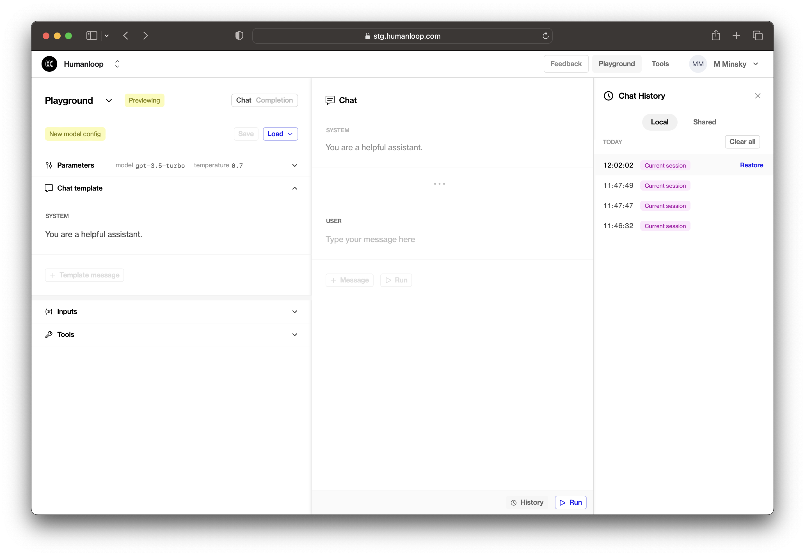

## Local editor history

The Humanloop playground and editor now save history locally as you make edits, giving you complete peace of mind that your precisely-crafted prompts will not be lost due to an accidental page reload or navigating away.

Local history entries will be saved as you use the playground (e.g. as you modify your model config, make generations, or add messages). These will be visible under the **Local** tab within the history side panel. Local history is saved to your browser and is only visible to you.

Our shared history feature, where all playground generations are saved, has now been moved under the **Shared** tab in the history side panel.