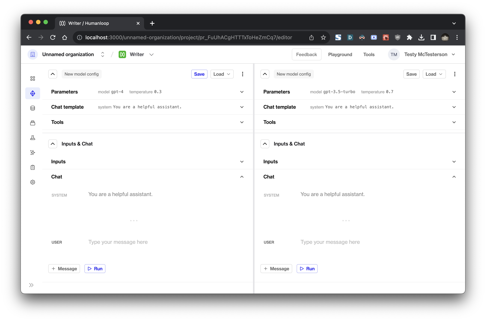
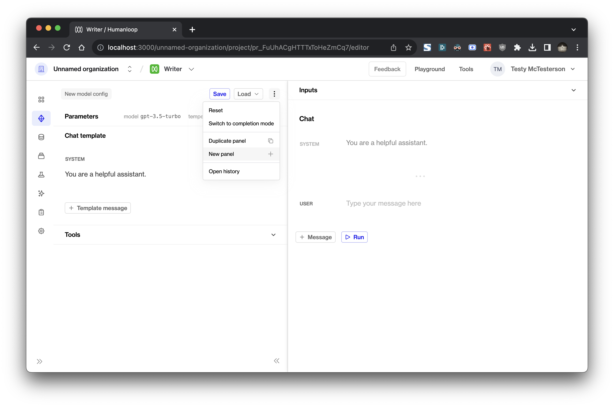
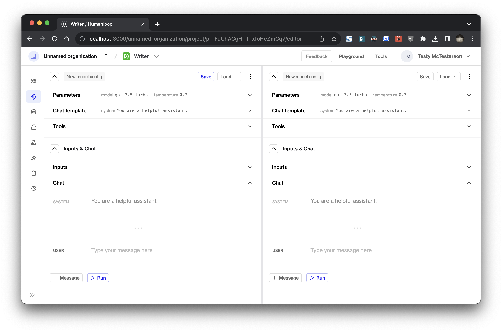
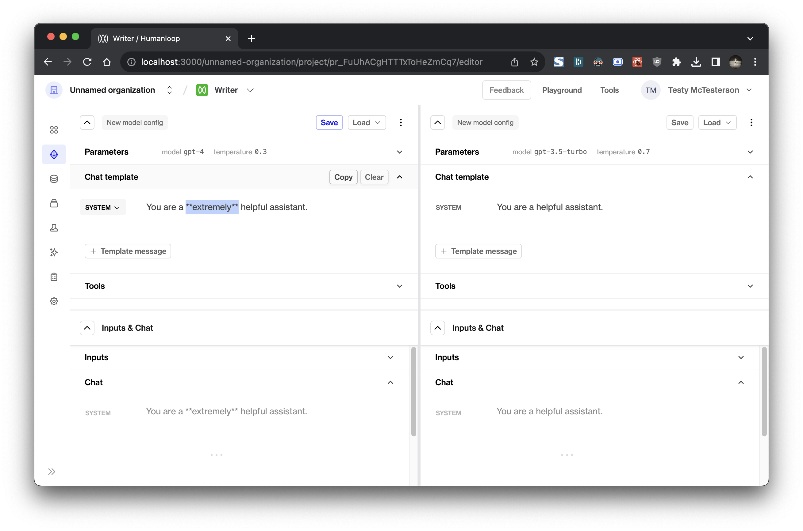
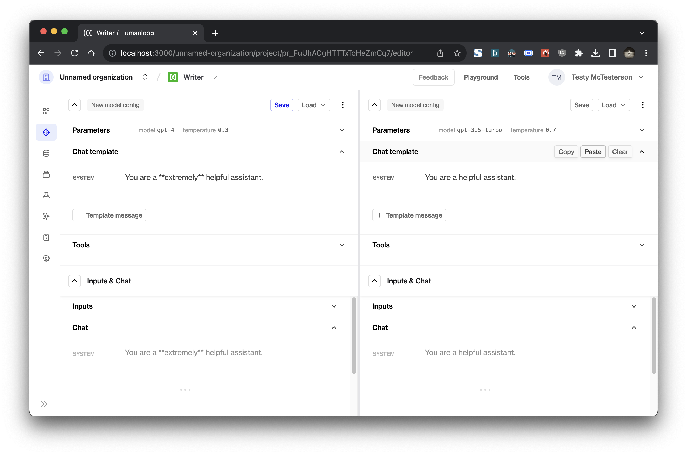
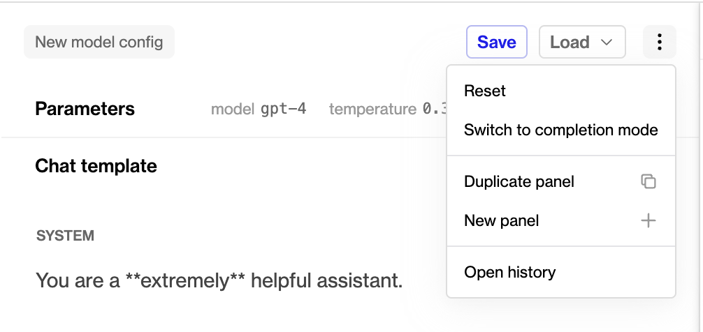

## Comparison mode in Editor

You can now compare generations across Model Configs and inputs in Editor!

### Quick start

To enter comparison mode, click **New panel** in the dropdown menu adds a new blank panel to the right. 

**Duplicate panel** adds a new panel containing the same information as your current panel.

[

Each panel is split into two section: a Model Config section at the top and an Inputs & Chat section at the bottom. These can be collapsed and resized to suit your experimentation.

If you've made changes in one panel, you can copy the changes you've made using the **Copy** button in the subsection's header and paste it in the target panel using its corresponding **Paste** button.

### Other changes

Our recently-introduced local history has also been upgraded to save your full session even when you have multiple panels open.

The toggle to completion mode and the button to open history have now been moved into the new dropdown menu.

