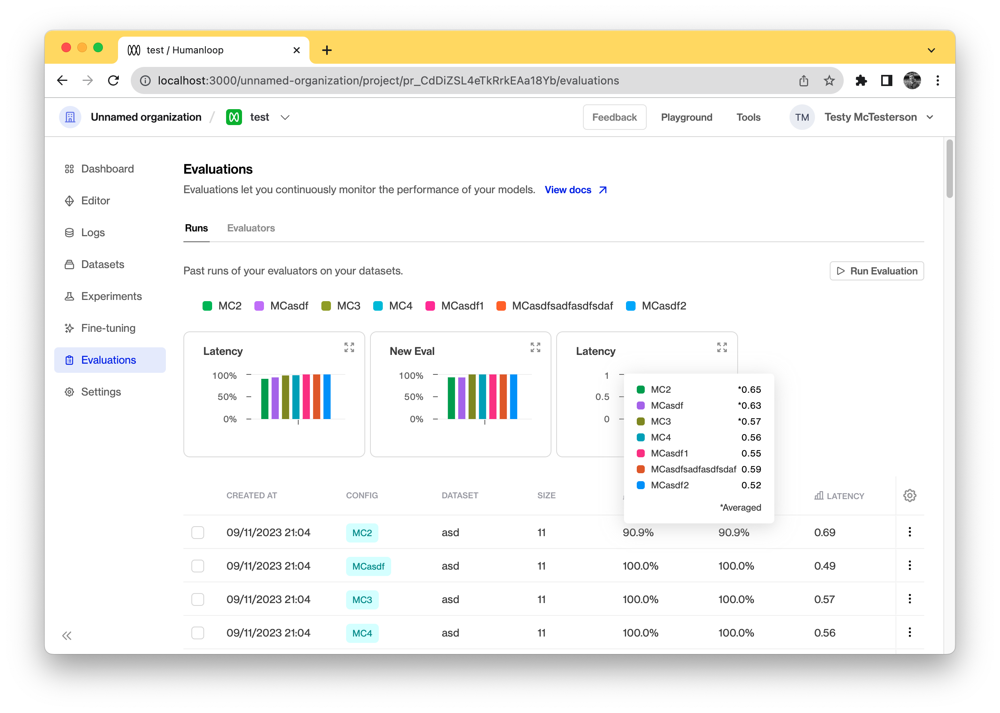
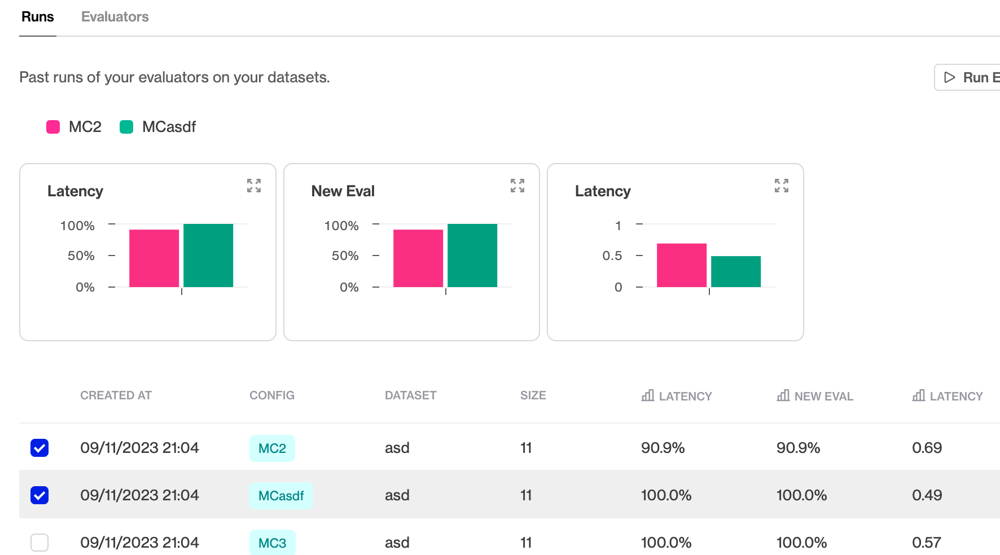
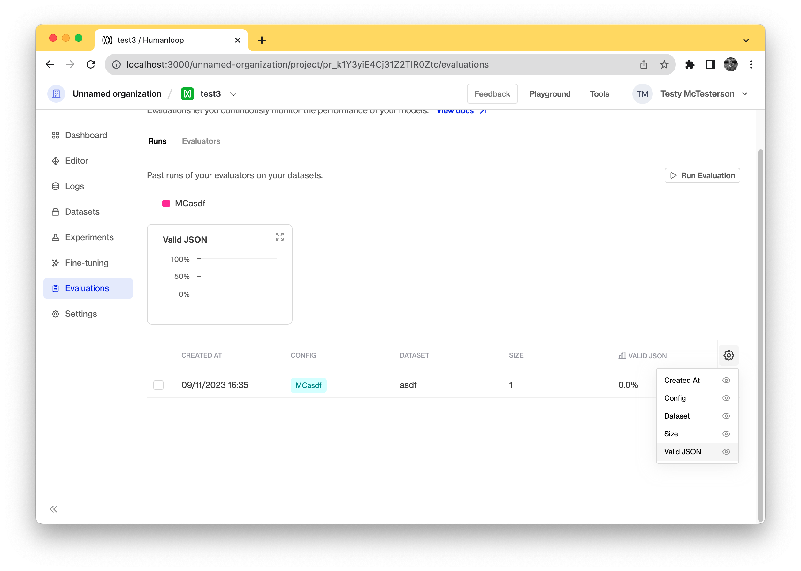

## Evaluation comparison charts

We've added comparison charts to the evaluation runs page to help you better compare your evaluation results. These can be found in the evaluations run tab for each of your projects. 

### Comparing runs

You can use this to compare specific evaluation runs by selecting those in the runs table. If you don't select any specific rows the charts show an averaged view of all the previous runs for all the evaluators. 

### Hiding a chart

To hide a chart for a specific evaluator you can hide the column in the table and it will hide the corresponding chart. 

