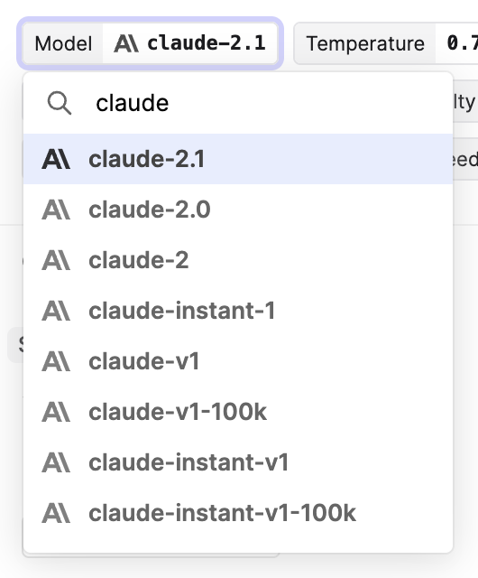

## Claude 2.1

Today, Anthropic released its latest model, **Claude 2.1**, and we've added support for it in the Humanloop app.

The new model boasts a 200K context window and a reported 2x decrease in hallucination rates.

Additionally, this model introduces tool use to the line-up of Anthropic models. The feature is presently in beta preview, and we'll be adding support for it to Humanloop in the coming days.

Read more about Claude 2.1 in the [official release notes](https://www.anthropic.com/index/claude-2-1).
