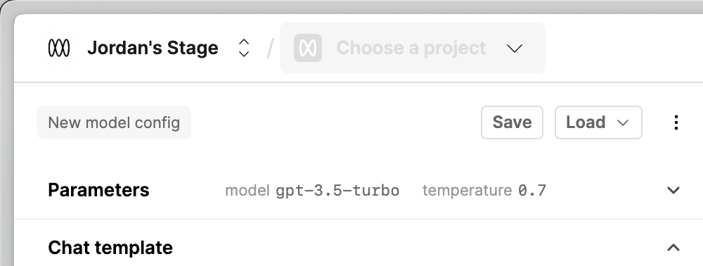
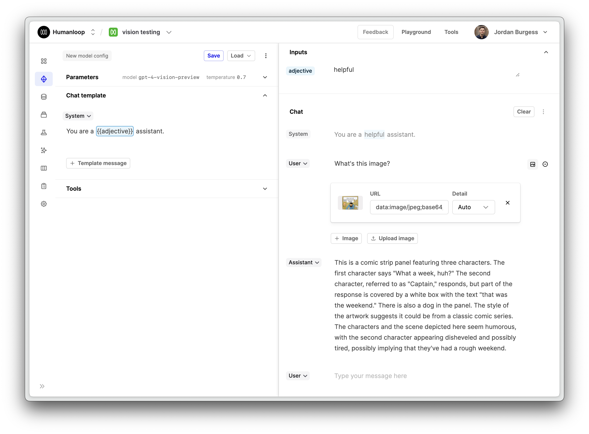

## Quality-of-life app improvements

We've been shipping some quality-of-life "little big things" to improve your every day usage of the platform.

### Project switcher throughout the app

We've added the project switcher throughout the app so its easier to jump between Projects from anywhere

### We've tidied up the Editor

With all the new capabilities and changes (tools, images and more) we need to keep a tight ship to stop things from becoming too busy.

We're unifying how we show all your logged generations, in the editor, and in the logs and sessions. We've also changed the font to Inter to be legible at small font sizes. 

### No more accidental blank messages

We've also fixed issues where empty messages would get appended to the chat.

### We've improved keyboard navigation

The keyboard shortcuts have been updated so its now easier to navigate in the log tables (up/down keys), and to run generations in Editor (cmd/ctrl + enter). 

## Thanks for all your requests and tips. Please keep the feedback coming!