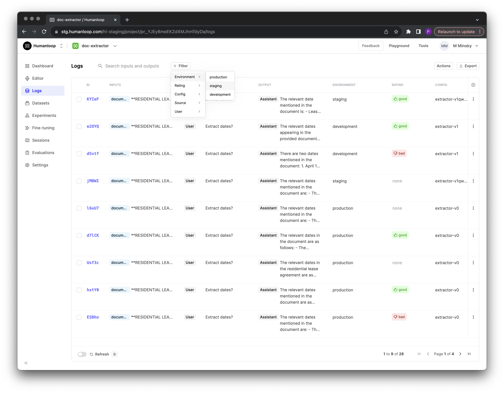

## Environment logs

Logs for your deployed prompts will now be tagged with the corresponding [environment](/docs/guides/deploy-to-an-environment).

In your logs table, you can now filter your logs based on environment:

You can now also pass an `environment` tag when using the explicit [/log ](/docs/api-reference/logs/log) endpoint; helpful for use cases such as [orchestrating your own models](/docs/guides/use-your-own-model-provider).
