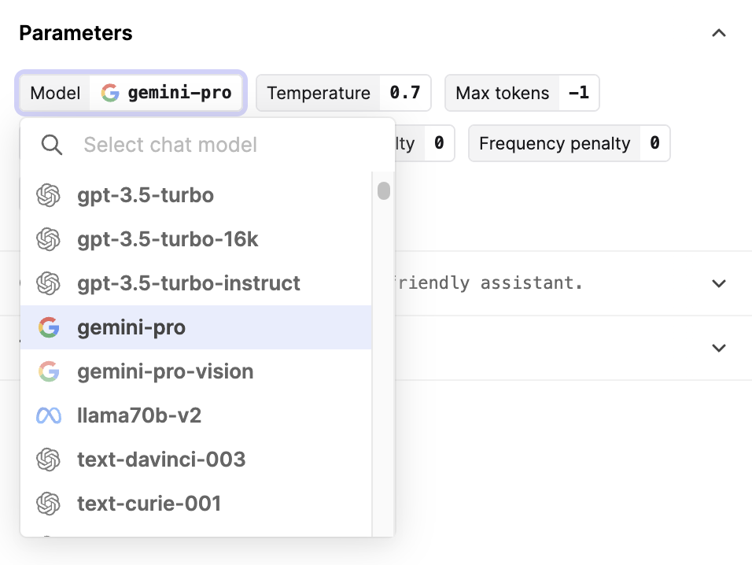

## Human Evaluators

We've introduced a new special type of 'Human' Evaluator to compliment our existing code and AI based Evaluators.

There are many important evaluation use cases that require input from your internal domain experts, or product teams. Typically this is where you would like a gold standard judgement of how your LLM app is performing.

Our new Human Evaluator allows you to trigger a batch evaluation run as normal (from our UI as part of your prompt engineering process, or using our SDK as part of your CI/CD pipeline) and then queues the results ready for a human to provide feedback.

Once completed, the feedback is aggregated to give a top-line summary of how the model is performing. It can also be combined with automatic code and AI evaluators in a single run.

Set up your first Human Evaluator run by following [our guide.](/docs/guides/evaluating-with-human-feedback)

## Return inputs flag

We've introduced a `return_inputs` flag on our chat and completion endpoints to improve performance for larger payloads.

As context model windows get increasingly larger, for example [Claude with 200k tokens](https://www.anthropic.com/index/claude-2-1), it's important to make sure our APIs remain performant. A contributor to response times is the size of the response payload being sent over the wire.

When you set this new flag to false, our responses will no longer contain the `inputs` that were sent to the model and so can be significantly smaller. This is the first in a sequence of changes to add more control to the caller around API behaviour.

As always, we welcome suggestions, requests, and feedback should you have any.

## Gemini

You can now use Google's latest LLMs, [Gemini](https://blog.google/technology/ai/google-gemini-ai/), in Humanloop.

### Setup

To use Gemini, first go to [https://makersuite.google.com/app/apikey](https://makersuite.google.com/app/apikey) and generate an API key. Then, save this under the "Google" provider on [your API keys page](http://app.humanloop.com/account/api-keys).

Head over to the playground, and you should see `gemini-pro` and `gemini-pro-vision` in your list of models.

You can also now use Gemini through the Humanloop API's `/chat`endpoints.

### Features

Gemini offers support for multi-turn chats, tool calling, and multi-modality.

However, note that while `gemini-pro` supports multi-turn chats and tool calling, it does not support multi-modality. On the other hand, `gemini-pro-vision` supports multi-modality but not multi-turn chats or tool calling. Refer to [Gemini's docs](https://ai.google.dev/models/gemini) for more details.

When providing images to Gemini, we've maintained compatibility with OpenAI's API. This means that when using Humanloop, you can provide images either via a HTTP URL or with a base64-encoded data URL.
