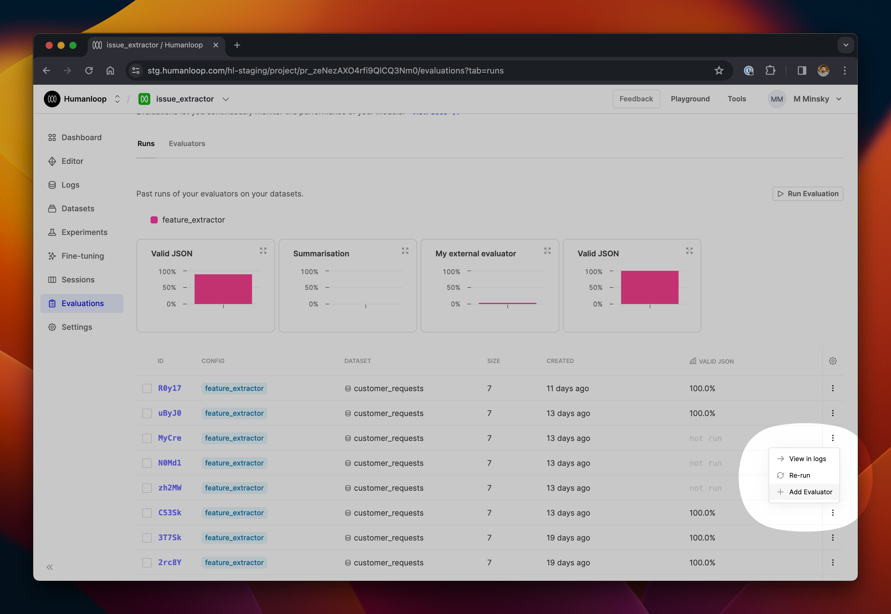
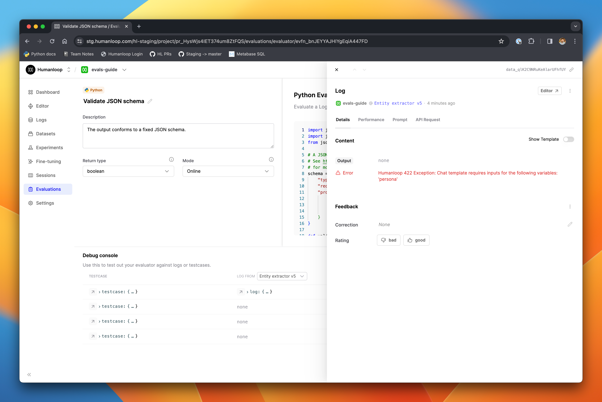
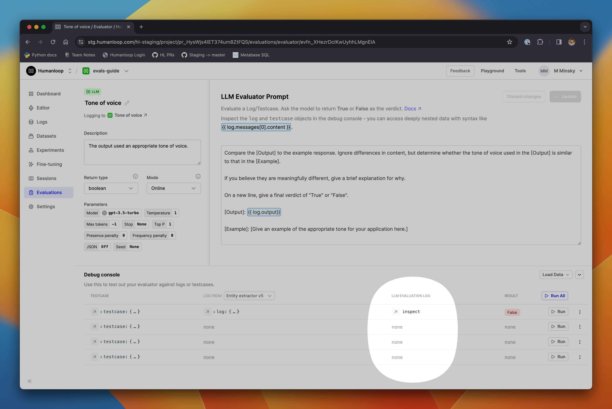
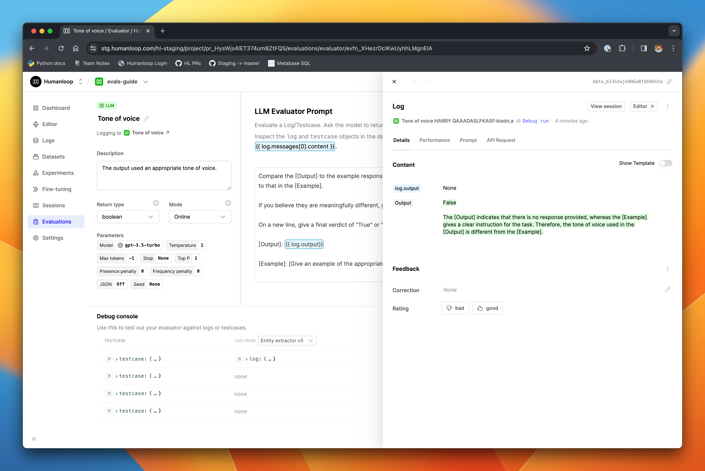
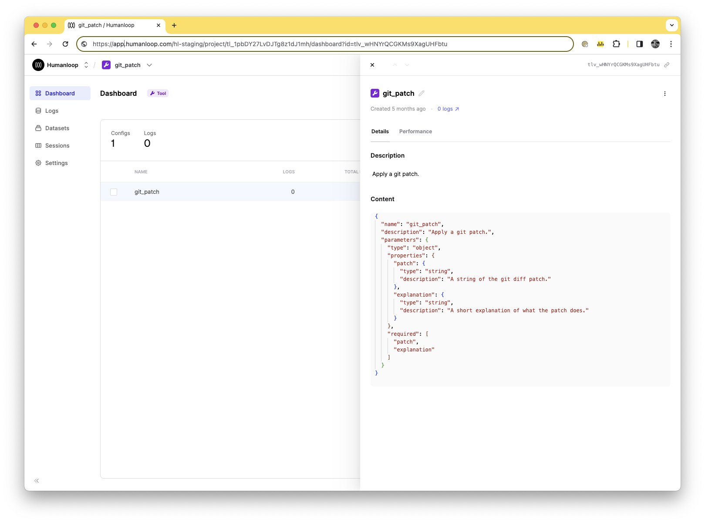
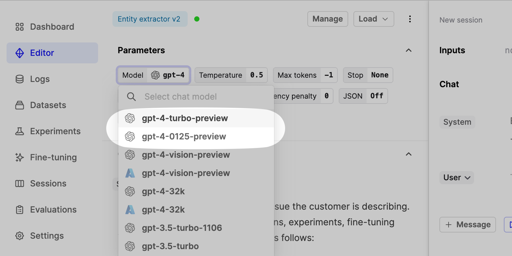

## Add Evaluators to existing runs

You can now add an evaluator to any existing evaluation run. This is helpful in situations where you have no need to regenerate logs across a dataset, but simply want to run new evaluators across the existing run. By doing this instead of launching a fresh run, you can the save significant time & costs associated with unnecessarily regenerating logs, especially when working with large datasets.

## Improved Evaluation Debug Console

We've enhanced the usability of the debug console when creating and modifying evaluators. Now you can more easily inspect the data you are working with, and understand the root causes of errors to make debugging quicker and more intuitive.

On any row in the debug console, click the arrow next to a testcase to inspect the full entity in a slideover panel.

After clicking **Run** to generate a log from a testcase, you can inspect the full log right from the debug console, giving you clearer access to error messages or the model-generated content, as in the example below.

## LLM Evaluators

We expect this feature to be most useful in the case of creating and debugging LLM evaluators. You can now inspect the log of the LLM evaluation itself right from the debug console, along with the original testcase and model-generated log, as described above.

After clicking **Run** on a testcase in the debug console, you'll see the **LLM Evaluation Log** column populated with a button that opens a full drawer.

This is particularly helpful to verify that your evaluation prompt was correctly populated with data from the underlying log and testcase, and to help understand why the LLM's evaluation output may not have been parsed correctly into the output values.

## Tool projects

We have upgraded projects to now also work for tools. Tool projects are automatically created for tools you define as part of your model config [in the Editor](/docs/guides/create-a-tool-in-the-editor) as well as tools [managed at organization level](/docs/guides/link-a-jsonschema-tool).

It is now easier to access the logs from your tools and manage different versions like you currently do for your prompts.

### Tool versioning

In the dashboard view, you can see the different versions of your tools. This will soon be expanded to link you to the source config and provide a more comprehensive view of your tool's usage.

### Logs

Any logs submitted via the SDK that relate to these tools will now appear in the Logs view of these projects. You can see this by following our [sessions guide](https://dash.readme.com/project/humanloop/v4.0/docs/logging-session-traces) and logging a new tool via the SDK. This also works natively with online Evaluators, so you can start to layer in observability for the individual non-LLM components of your session

### Offline Evaluations via SDK

You can trigger evaluations on your tools projects similar to how you would for an LLM project with model configs. This can be done by logging to the tool project, creating a dataset, and triggering an evaluation run. A good place to start would be the [Set up evaluations using API](/docs/guides/evaluations-using-api) guide.

## Support for new OpenAI Models

Following [OpenAI's latest model releases](https://openai.com/blog/new-embedding-models-and-api-updates), you will find support for all the latest models in our **Playground** and **Editor**.

### GPT-3.5-Turbo and GPT-4-Turbo

If your API key has access to the models, you'll see the new release `gpt-4-0125-preview` and `gpt-3.5-turbo-0125` available when working in Playground and Editor. These models are more capable and cheaper than their predecessors - see the OpenAI release linked above for full details.

We also support the new `gpt-4-turbo-preview` model alias, which points to the latest `gpt-4-turbo` model without specifying a specific version.

### Embedding Models

Finally, the new embedding models - `text-embedding-3-small` and `text-embedding-3-large` are also available for use via Humanloop. The `small` model is 5x cheaper than the previous generation `ada-002` embedding model, while the larger model significantly improves performance and maps to a much larger embedding space.
