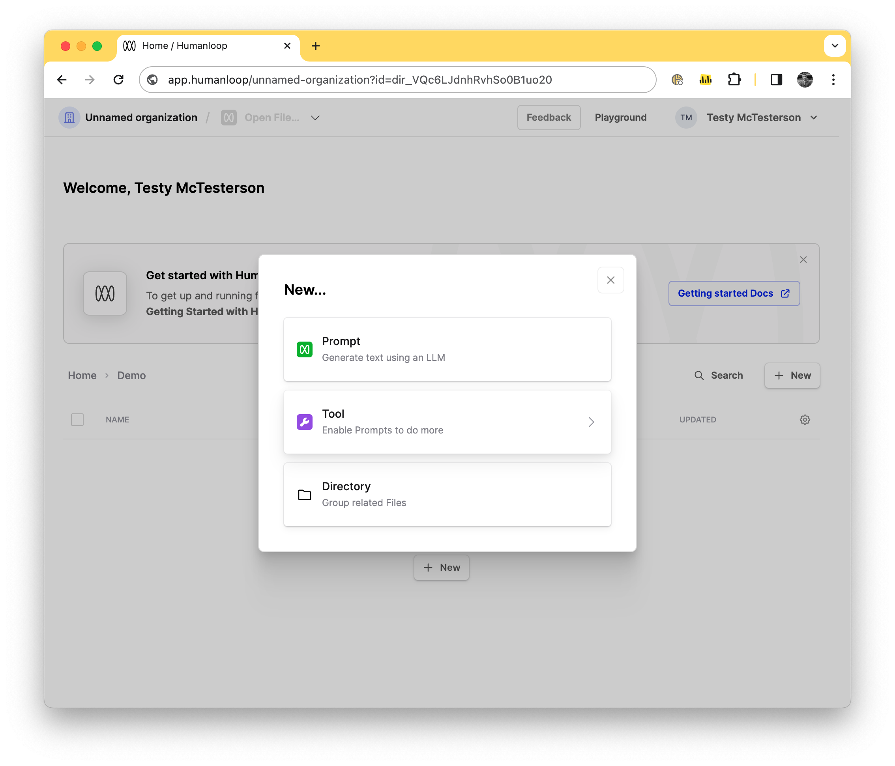
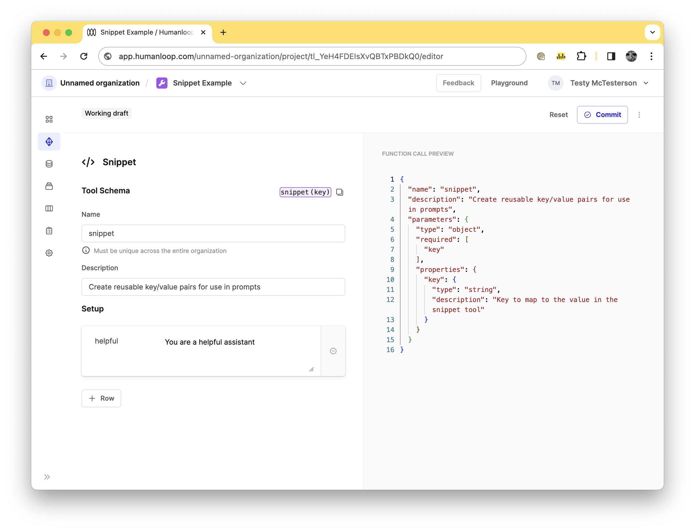
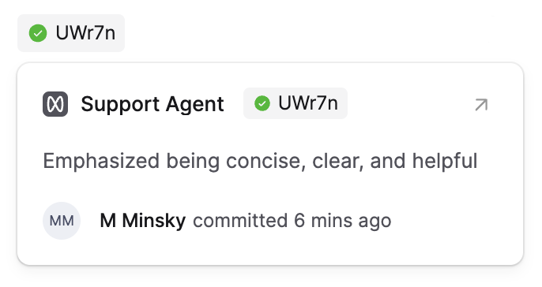
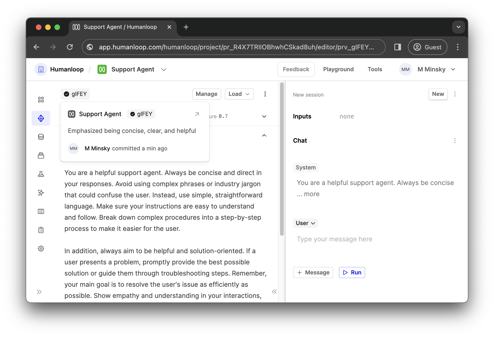
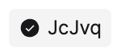
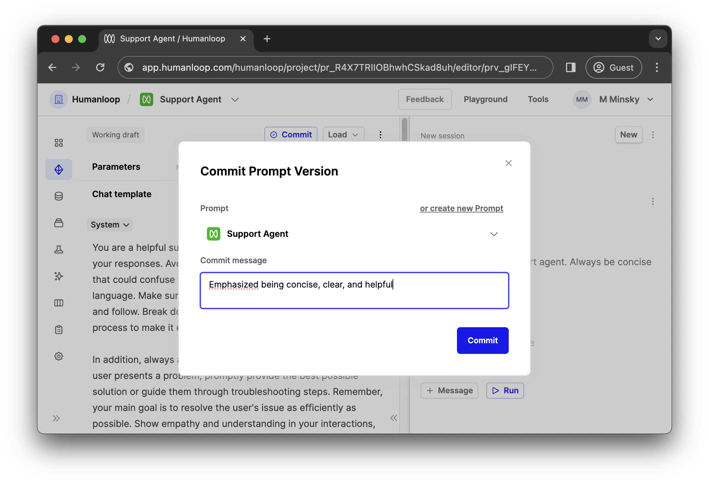

## New Tool creation flow

You can now create Tools in the same way as you create Prompts and Directories. This is helpful as it makes it easier to discover Tools and easier to quickly create new ones. 

To create a new Tool simply press the New button from the directory of your choice and select one of our supported Tools, such as JSON Schema tool for function calling or our Pinecone tool to integrate with your RAG pipelines.

## Tool editor and deployments
You can now manage and edit your Tools in our new Tool Editor. This is found in each Tool file and lets you create and iterate on your tools. As well, we have introduced deployments to Tools, so you can better control which versions of a tool are used within your Prompts.

### Tool Editor

This replaces the previous Tools section which has been removed. The editor will let you edit  any of the tool types that Humanloop supports (JSON Schema, Google, Pinecone, Snippet, Get API) and commit new Versions. 

### Deployment

Tools can now be deployed. You can pick a version of your Tool and deploy it. When deployed it can be used and referenced in a Prompt editor.

And example of this, if you have a version of a Snippet tool with the signature `snippet(key)` with a key/value pair of "_helpful_"/"_You are a helpful assistant_". You decide you would rather change the value to say "_You are a funny assistant_", you can commit a version of the Tool with the updated key. This wont affect any of your prompts that reference the Snippet tool until you Deploy the second version, after which each prompt will automatically start using the funny assistant prompt.

## Prompt labels and hover cards

We've rolled out a unified label for our Prompt Versions to allow you to quickly identify your Prompt Versions throughout our UI. As we're rolling out these labels across the app, you'll have a consistent way of interacting with and identifying your Prompt Versions.

The labels show the deployed status and short ID of the Prompt Version. When you hover over these labels, you will see a card that displays the commit message and authorship of the committed version.

You'll be able to find these labels in many places across the app, such as in your Prompt's deployment settings, in the Logs drawer, and in the Editor.

As a quick tip, the color of the checkmark in the label indicates that this is a version that has been deployed. If the Prompt Version has not been deployed, the checkmark will be black. 

## Committing Prompt Versions

Building on our terminology improvements from Project -> Prompt, we've now updated Model Configs -> Prompt Versions to improve consistency in our UI. 

This is part of a larger suite of changes to improve the workflows around how entities are managed on Humanloop and to make them easier to work with and understand. We will also be following up soon with a new and improved major version of our API that encapsulates all of our terminology improvements.

In addition to just the terminology update, we've improved our Prompt versioning functionality to now use `commits` that can take `commit messages`, where you can describe how you've been iterating on your Prompts. 

We've removed the need for names (and our auto-generated placeholder names) in favour of using explicit commit messages.  

We'll continue to improve the version control and file types support over the coming weeks. 

Let us know if you have any questions around these changes!