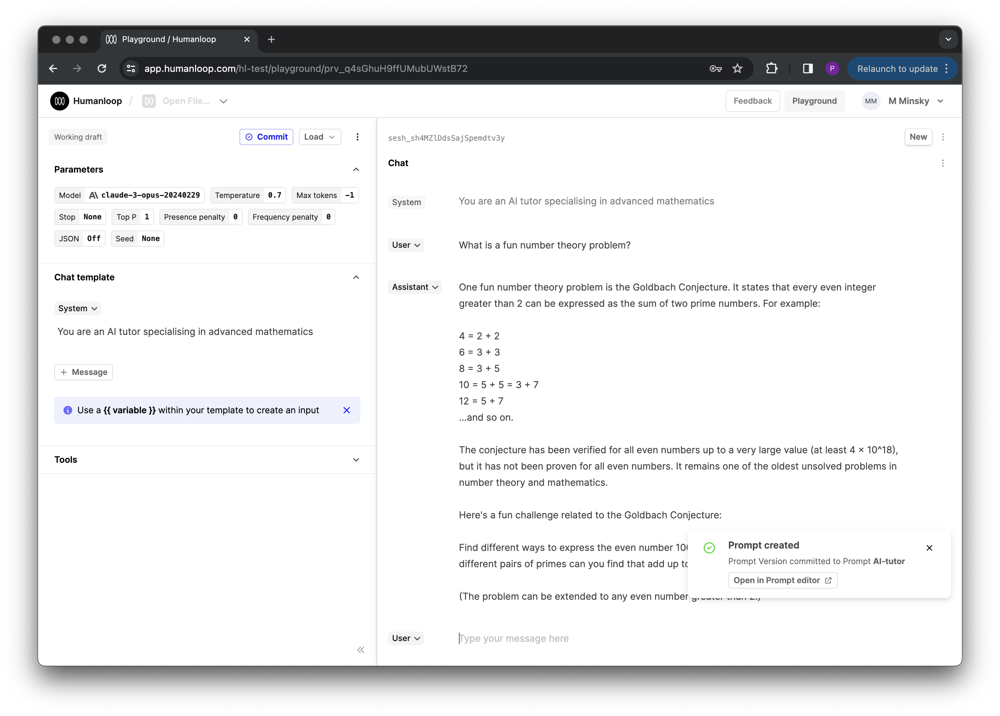

## Claude 3

Introducing same day support for the Claude 3 - Anthropics new industry leading models. Read more about the release [here](https://www.anthropic.com/news/claude-3-family).

The release contains three models in ascending order of capability: _Haiku_, _Sonnet_, and _Opus_. This suite provides users with the different options to balance intelligence, speed, and cost for their specific use-cases.

## **Key take aways**

1. **Performance** - a new leader. The largest of the 3 models, Opus, is claimed to outperform GPT-4 and Gemini Ultra on key benchmarks such as MMLU and Hellaswag. It even reached 84.9% on the Humaneval coding test set (vs GPT-4’s 67%) 🤯
2. **200k context window** with near-perfect recall on selected benchmarks. Opus reports 99% accuracy on the NIAH test, which measures how accurately a model can recall information given to it in a large corpus of data.
3. **Opus has vision**. Anthropic claim that performance here is on par with that of other leading models (ie GPT-4 and Gemini). They say it’s most useful for inputting graphs, slides etc. in an enterprise setting.
4. **Pricing** - as compared to OpenAI:

Opus - $75 (2.5x GPT-4 Turbo)  
Sonnet - $15 (50% of GPT-4 Turbo)  
Haiku - $1.25 (1.6x GPT-3.5)

5. **How you can use it**: The Claude 3 family is now available on Humanloop. Bring your API key to test, evaluate and deploy the publicly available models - Opus and Sonnet.