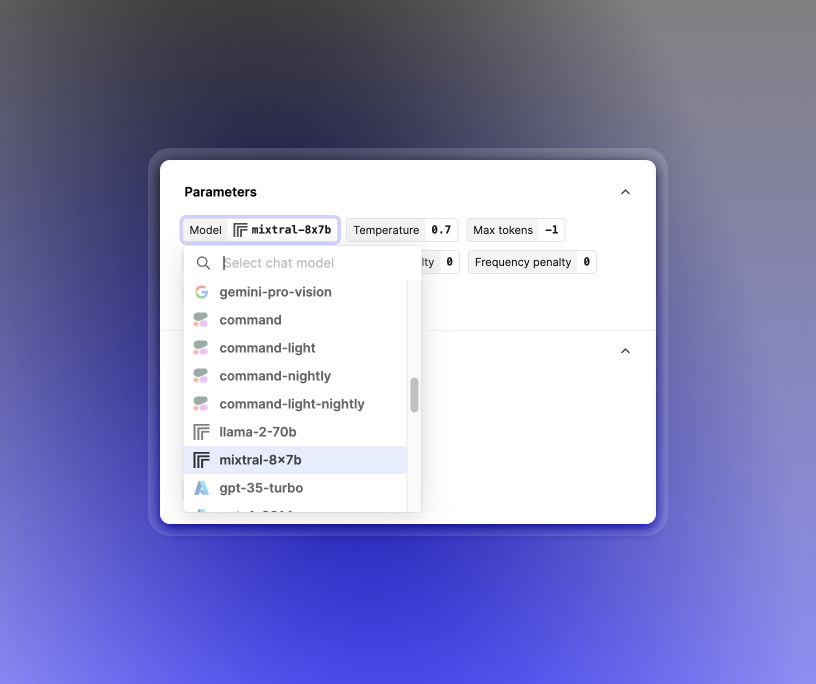

## Mixtral 8x7B

Keeping you up to date with the latest open models, we've added support for Mixtral 8x7B to our Editor with a [Replicate integration](https://replicate.com/).

Mixtral 8x7B outperforms LLaMA 2 70B (already supported in Editor) with faster inference, with performance comparable to that of GPT-3.5. More details are available in its [release announcement](https://mistral.ai/news/mixtral-of-experts/).

## Additional Replicate models support via API

Through the Replicate model provider additional open models can be used by specifying a model name via the API. The model name should be of a similar form as the ref used when calling `replicate.run(ref)` using [Replicate's Python SDK](https://github.com/replicate/replicate-python).

For example, Vicuna, an open-source chatbot model based on finetuning LLaMA can be used with the following model name alongside `provider: "replicate"` in your Prompt version.  
`replicate/vicuna-13b:6282abe6a492de4145d7bb601023762212f9ddbbe78278bd6771c8b3b2f2a13b`