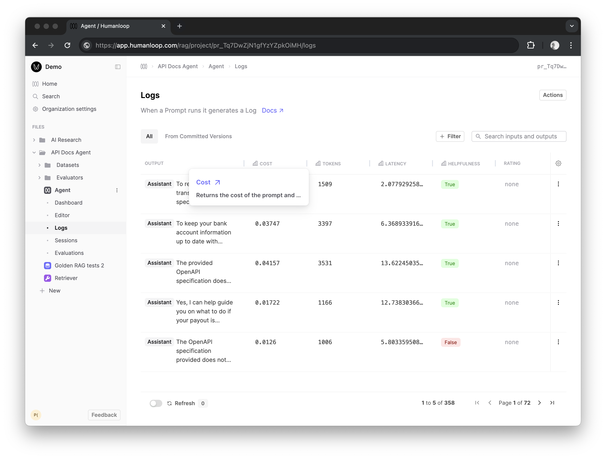

## Cost, Tokens and Latency

We now compute Cost, Tokens and Latency for all Prompt logs by default across all model providers.

These values will now appear automatically as graphs in your Dashboard, as columns in your logs table and will be displayed in our Version and Log drawers.

