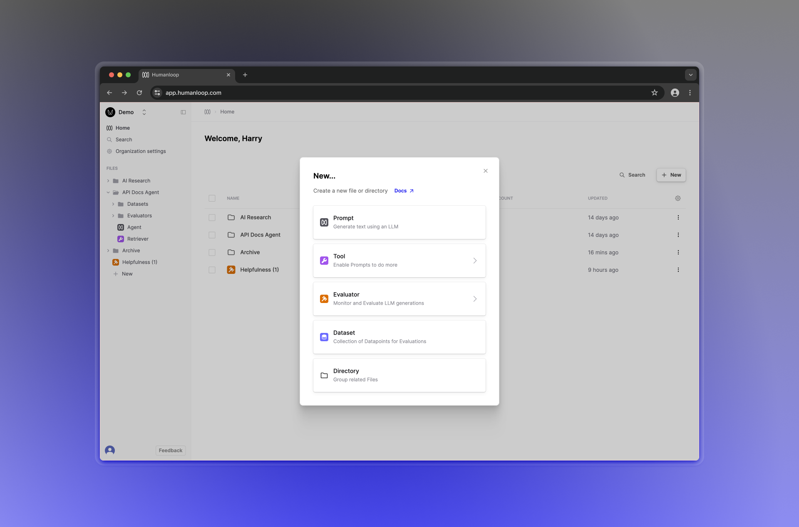

## Improved Evaluator management

Evaluators are now first class citizens alongside Prompts, Tools and Datasets. This allows for easier re-use, version control and helps with organising your workspace within directories.

You can create a new Evaluator by choosing **Evaluator** in the File creation dialog in the sidebar or on your home page.

### Migration and backwards compatibility

We've migrated all of your Evaluators previously managed within **Prompts > Evaluations > Evaluators** to new Evaluator files. All your existing Evaluation runs will remain unchanged and online Evaluators will continue to work as before. Moving forward you should use the new Evaluator file to make edits and manage versions.
