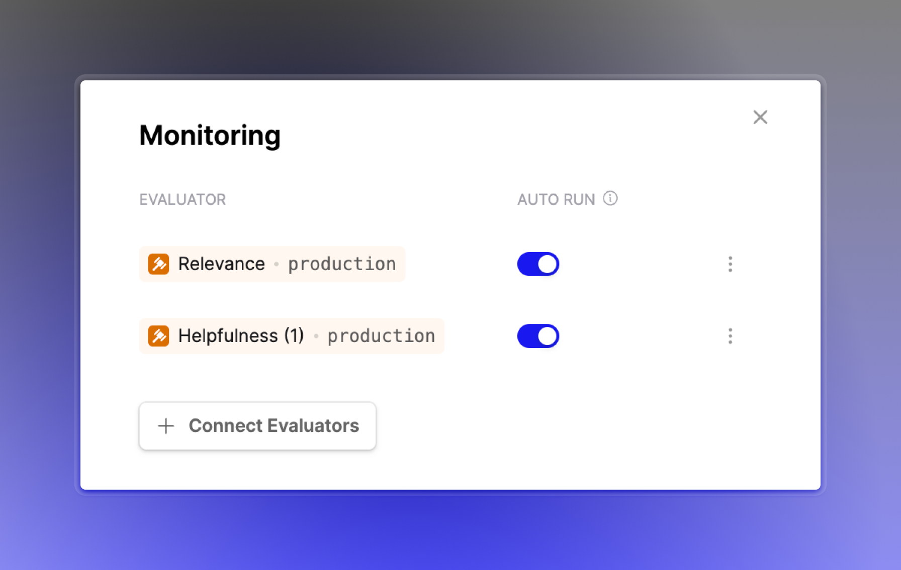

## Monitoring with deployed Evaluators

You can now connect deployed Evaluator versions for online monitoring of your Prompts and Tools.

This enables you to update Evaluators for multiple Prompt or Tools when you deploy a new Evaluator version.

